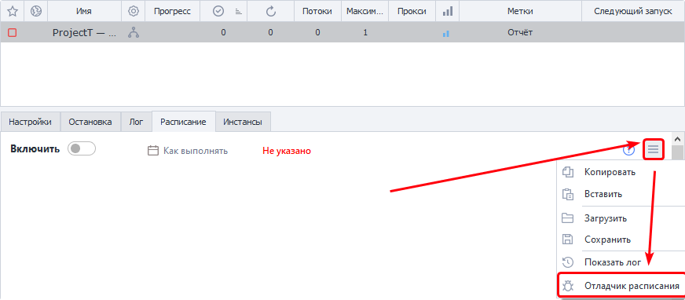
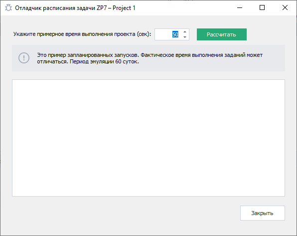

---
sidebar_position: 3
title: "Отладчик расписания"
description: ""
date: "2025-09-10"
converted: true
originalFile: "Отладчик расписания.txt"
targetUrl: "https://zennolab.atlassian.net/wiki/spaces/RU/pages/547520519"
---
import DisclaimerNotice from '@site/src/components/DisclaimerNotice';

<DisclaimerNotice />

> 🔗 **[Оригинальная страница](https://zennolab.atlassian.net/wiki/spaces/RU/pages/547520519)** — Источник данного материала

_______________________________________________  

## Общая информация

:::info Информация
Отладчик расписания позволяет рассчитать приблизительное время выполнения заданий и посмотреть примерный ход выполнения проекта по расписанию.
:::

Чтобы вызвать отладчик, необходимо зайти в меню расписания проекта и выбрать пункт “Отладчик расписания”.

:::tip Совет
Советуем не пренебрегать отладчиком расписания, ведь это уверенность в том, что все будет выполнено, как задумано!
:::

## Работа с отладчиком расписания

**Шаг 1.** Чтобы отладчик мог показать более правдоподобный ход выполнения задания, нужно указать в секундах примерное время однократного выполнения проекта. Чем точнее указано время, тем более точными будут расчеты.

Open Отладчик расписания.png

**Шаг 2.** После указания времени выполнения проекта нужно нажать кнопку “Рассчитать” и подождать несколько секунд, пока отладчик отобразит примерный ход выполнения проекта по заданному расписанию от начала планируемого запуска до конца выполнения проекта или завершения периода эмуляции.

Open Отладчик расписания 2.png

После проведенного расчета отладчик покажет данные хода выполнения проекта в формате: **дата выполнения — время выполнения — количество предпринятых попыток.** С помощью полученных данных можно увидеть, как будет работать расписание проекта и понять, правильно ли настроены его интервалы и повторения выполнения.

Следует помнить, что при непосредственном выполнении задания по расписанию время выполнения проекта может варьироваться и отличаться от ранее заданного значения в отладчике. Таким образом, отладчик показывает только примерный ход выполнения проекта.

