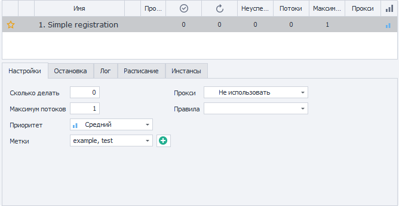

:::info **Пожалуйста, ознакомьтесь с [*Правилами использования материалов на данном ресурсе*](../../../Disclaimer).**
:::

> 🔗 **[Оригинальная страница](https://zennolab.atlassian.net/wiki/spaces/RU/pages/851574897)** — Источник данного материала

_______________________________________________  
# Настройки

  

## Описание

В данной вкладке настраивается количество выполнений и потоков, использование прокси.

  

## Сколько делать

Количество повторений.
Проект выполнится столько раз сколько указано в этом поле.

`-1` (минус один) - бесконечное число повторений. Проект будет выполняться бесконечное число раз, пока Вы его не остановите (кнопкой [❗→ Стоп](https://zennolab.atlassian.net/wiki/spaces/RU/pages/851116136#%D0%A1%D1%82%D0%BE%D0%BF "https://zennolab.atlassian.net/wiki/spaces/RU/pages/851116136#%D0%A1%D1%82%D0%BE%D0%BF") или установив 0 повторений (ноль) вместо -1), либо пока не наступит одно из условий остановки из [❗→ соответствующей вкладки](https://zennolab.atlassian.net/wiki/spaces/RU/pages/852885665 "https://zennolab.atlassian.net/wiki/spaces/RU/pages/852885665").

## Максимум потоков

Количество одновременно запускаемых потоков для проекта.

:::note На заметку
Ниже в статье будет несколько примеров объясняющих связь настроек “Сколько делать” и “Максимум потоков”.
:::

## Приоритет

Здесь можно установить приоритет шаблона.
Приоритетные потоки могут прерывать запрос на инстанс менее приоритетных потоков (если включена [❗→ соответствующая настройка](https://zennolab.atlassian.net/wiki/spaces/RU/pages/809074766#%D0%9F%D1%80%D0%B8%D0%BE%D1%80%D0%B8%D1%82%D0%B5%D1%82%D0%BD%D1%8B%D0%B5-%D0%BF%D0%BE%D1%82%D0%BE%D0%BA%D0%B8-%D0%BF%D1%80%D0%B5%D1%80%D1%8B%D0%B2%D0%B0%D1%8E%D1%82-%D0%B7%D0%B0%D0%BF%D1%80%D0%BE%D1%81%D1%8B-%D0%BC%D0%B5%D0%BD%D0%B5%D0%B5-%D0%BF%D1%80%D0%B8%D0%BE%D1%80%D0%B8%D1%82%D0%B5%D1%82%D0%BD%D1%8B%D1%85-%D0%BF%D0%BE%D1%82%D0%BE%D0%BA%D0%BE%D0%B2 "https://zennolab.atlassian.net/wiki/spaces/RU/pages/809074766#%D0%9F%D1%80%D0%B8%D0%BE%D1%80%D0%B8%D1%82%D0%B5%D1%82%D0%BD%D1%8B%D0%B5-%D0%BF%D0%BE%D1%82%D0%BE%D0%BA%D0%B8-%D0%BF%D1%80%D0%B5%D1%80%D1%8B%D0%B2%D0%B0%D1%8E%D1%82-%D0%B7%D0%B0%D0%BF%D1%80%D0%BE%D1%81%D1%8B-%D0%BC%D0%B5%D0%BD%D0%B5%D0%B5-%D0%BF%D1%80%D0%B8%D0%BE%D1%80%D0%B8%D1%82%D0%B5%D1%82%D0%BD%D1%8B%D1%85-%D0%BF%D0%BE%D1%82%D0%BE%D0%BA%D0%BE%D0%B2")).

## Метки

Метки позволяют группировать проекты. Задать можно сразу несколько меток.

Можно выбрать как уже существующие (из выпадающего списка)[1] так и добавить новые (с помощью кнопки “+”)[2]

Скриншот

## Прокси

Должен ли проект использовать прокси из встроенного [❗→ ZennoProxyChecker](https://zennolab.atlassian.net/wiki/spaces/RU/pages/475365507 "https://zennolab.atlassian.net/wiki/spaces/RU/pages/475365507")?

- **Не использовать** - выполнение без прокси, с реальным IP-адресом.
- **Если возможно** - если в ProxyChecker есть «живые» прокси, то проект выполнится с их использованием, если прокси отсутствуют - то без них.
- **Использовать (без удаления)** - прокси в проекте используются без удаления из списка «живых» прокси в ProxyChecker. Если подходящего прокси нет, то проект будет ожидать пока он появится.
- **Использовать** - прокси в проекте используются с удалением из списка «живых» прокси в ProxyChecker. Если подходящего прокси нет, то проект будет ожидать пока он появится.

## Правила

Выбор правила или правил, по которым берётся прокси из списка «живых» прокси, применяемых для проекта. [❗→ Правила](https://zennolab.atlassian.net/wiki/spaces/RU/pages/848560252 "https://zennolab.atlassian.net/wiki/spaces/RU/pages/848560252") создаются в ProxyChecker.

  

## Запуск шаблона в многопоточном режиме

ZennoPoster Standard и Pro позволяет запускать одновременно несколько потоков выполнения для проекта.

Что такое поток и есть ли ограничения по ним?

Поток - это отдельная единица выполнения, для которой выделяется отдельный браузер, отдельное набор данных ([❗→ переменные](https://zennolab.atlassian.net/wiki/spaces/RU/pages/735608872 "https://zennolab.atlassian.net/wiki/spaces/RU/pages/735608872"), [❗→ списки](https://zennolab.atlassian.net/wiki/spaces/RU/pages/534053375 "https://zennolab.atlassian.net/wiki/spaces/RU/pages/534053375"), [❗→ таблицы](https://zennolab.atlassian.net/wiki/spaces/RU/pages/735903776 "https://zennolab.atlassian.net/wiki/spaces/RU/pages/735903776")) и т.п. 
Можно сравнить поток с человеком, выполняющим определенный набор действий в браузере. Выполнение в несколько потоков равносильно выполнению действий несколькими людьми.

**Ограничения на количество потоков:**
В ZennoPoster Lite доступен только один поток.
Standard - 5 потоков.
Pro - нет ограничений.

Для этого необходимо в настройке “Максимум потоков” указать желаемое их количество, а в настройке “Сколько делать” количество повторений.
Возможно ещё придётся нажать кнопку [❗→ Старт](https://zennolab.atlassian.net/wiki/spaces/RU/pages/851116136#%D0%A1%D1%82%D0%B0%D1%80%D1%82 "https://zennolab.atlassian.net/wiki/spaces/RU/pages/851116136#%D0%A1%D1%82%D0%B0%D1%80%D1%82") в Главном меню (если проект находится в [❗→ статусе](https://zennolab.atlassian.net/wiki/spaces/RU/pages/853737528#%D0%A1%D1%82%D0%B0%D1%82%D1%83%D1%81 "https://zennolab.atlassian.net/wiki/spaces/RU/pages/853737528#%D0%A1%D1%82%D0%B0%D1%82%D1%83%D1%81") “Остановлен”).

:::warning Внимание
Не стоит сразу же пытаться выполнить проект в 100 потоков!Каждый поток потребляет ресурсы компьютера - RAM, CPU, обращение к жёсткому диску (интенсивность потребления зависит логики от шаблона и сайта с которым он работает).Одновременный запуск большого количества потоков может привести к зависанию как программы, так и операционной системы в целом (или даже к её аварийному завершению).
:::

### Пример №1

*Сколько делать* - 60  
*Максимум потоков* - 1

*Результат*: запускается один поток и последовательно, один за одним, выполняет 60 повторений. Если одно выполнение занимает минуту, то, соответственно, на все выполнения, в данных условиях, будет потрачено 60 минут.

### Пример №2

*Сколько делать* - 60  
*Максимум потоков - 10

*Результат*: одновременно запускается 10 потоков, которые работают параллельно. Если одно выполнение длится минуту, то в этом случае на 60 выполнений нужно будет не 60 минут, а всего 6 (т.к. теперь за одну минуту делается сразу 10 выполнений)!

### Пример №3

*Сколько делать* - `-1` (минус один)  
*Максимум потоков* - 10

*Результат*: одновременно запускается 10 потоков, которые будут выполняться до тех пор пока Вы не остановите проект (кнопкой [❗→ Стоп](https://zennolab.atlassian.net/wiki/spaces/RU/pages/851116136#%D0%A1%D1%82%D0%BE%D0%BF "https://zennolab.atlassian.net/wiki/spaces/RU/pages/851116136#%D0%A1%D1%82%D0%BE%D0%BF") или установив 0 повторений (ноль) вместо `-1` в *Сколько делать*, после чего работающие потоки завершат выполнения, а новые не будут стартовать).

* * *

## Полезные ссылки

- [❗→ Основные понятия](https://zennolab.atlassian.net/wiki/spaces/RU/pages/475693086 "https://zennolab.atlassian.net/wiki/spaces/RU/pages/475693086")
- [❗→ Главное меню](https://zennolab.atlassian.net/wiki/spaces/RU/pages/851116136 "https://zennolab.atlassian.net/wiki/spaces/RU/pages/851116136")
- [❗→ Таблица проектов](https://zennolab.atlassian.net/wiki/spaces/RU/pages/853737528 "https://zennolab.atlassian.net/wiki/spaces/RU/pages/853737528")
- [❗→ Сайд-меню](https://zennolab.atlassian.net/wiki/spaces/RU/pages/852787297/- "https://zennolab.atlassian.net/wiki/spaces/RU/pages/852787297/-")

