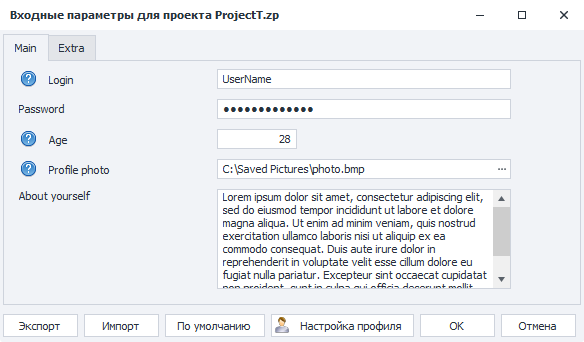
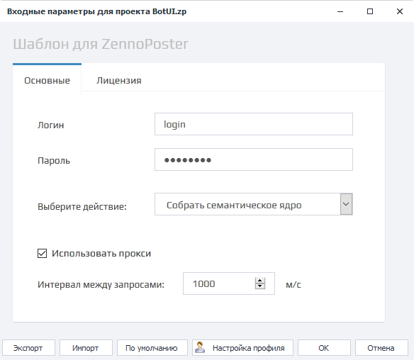

---
sidebar_position: 4
title: "Входные настройки ZennoPoster"
description: ""
date: "2025-09-10"
converted: true
originalFile: "Входные настройки ZennoPoster.txt"
targetUrl: "https://zennolab.atlassian.net/wiki/spaces/RU/pages/1846051204/ZennoPoster"
---
:::info **Пожалуйста, ознакомьтесь с [*Правилами использования материалов на данном ресурсе*](../Disclaimer).**
:::

> 🔗 **[Оригинальная страница](https://zennolab.atlassian.net/wiki/spaces/RU/pages/1846051204/ZennoPoster)** — Источник данного материала

_______________________________________________  
# Входные настройки (ZennoPoster)

  

## Описание

Входные настройки служат для передачи данных в шаблон. 
Это могут быть пути к файлам, строка текста, многострочный текст, числа, сервисы по работе с капчей или СМС, выпадающие списки и др.

В ZennoPoster существует два типа входных настроек - классические и интерфейс бота (BotUI).

:::note На заметку
Если Вы разработчик шаблонов, то более подробно о типах данных и о том, как создавать входные настройки можно почитать в статье Входные настройки проекта (классические настройки) и Интерфейс бота (BotUI)
:::

Примеры настроек

Классические настройки

Интерфейс бота (BotUI)

  

## Кнопки управления

### Экспорт

Позволяет сохранить в файл текущие установленные значения настроек.

Так же сохранённые настройки можно загружать с помощью [❗→ bat файлов](https://zennolab.atlassian.net/wiki/spaces/RU/pages/1940979747/bat "https://zennolab.atlassian.net/wiki/spaces/RU/pages/1940979747/bat").

### Импорт

С помощью этой функции можно загрузить настройки из файла (перед этим их нужно сохранить с помощью кнопки “Экспорт”).

### По умолчанию

Сброс всех настроек до значений по умолчанию (те, которые были выставлены разработчиком шаблона)

### Настройки профиля

При клике по данной кнопке откроется окно настроек генерации профиля, в котором можно изменить национальность, пол, возраст и формулу генерации логина. 
Более подробно о каждом из этих пунктов можно прочитать в статье [❗→ "Профиль" раздел "Вкладка-пользователь"](https://zennolab.atlassian.net/wiki/spaces/RU/pages/483426308#%D0%92%D0%BA%D0%BB%D0%B0%D0%B4%D0%BA%D0%B0-%D0%BF%D0%BE%D0%BB%D1%8C%D0%B7%D0%BE%D0%B2%D0%B0%D1%82%D0%B5%D0%BB%D1%8C "https://zennolab.atlassian.net/wiki/spaces/RU/pages/483426308#%D0%92%D0%BA%D0%BB%D0%B0%D0%B4%D0%BA%D0%B0-%D0%BF%D0%BE%D0%BB%D1%8C%D0%B7%D0%BE%D0%B2%D0%B0%D1%82%D0%B5%D0%BB%D1%8C") 

### OK

Сохранить и применить все внесённые изменения.

### Отмена

Не сохранять внесённые изменения.

  

## Важное примечание

Входные настройки считываются только один раз при старте потока!

Если Вы измените настройки во время выполнения потока то это никак на последнем не отразится, пока не начнётся новое выполнение. 

Давайте рассмотрим на примере: у проекта во входных настройках можно задать ФИО и дату рождения. Пользователь заполняет эти данные и запускает шаблон, последний стартует и начинает выполнять работу.
Представим, что пользователь ошибся и задал не те данные, он повторно открывает настройки у уже работающего шаблона и вносит новые данные. Все потоки, которые стартовали до изменения настроек, будут работать со старыми значениями. Новые значения будут подхвачены проектом только для тех потоков, которые будут запущены после изменений.

  

## Полезные ссылки

- [❗→ Входные настройки проекта](https://zennolab.atlassian.net/wiki/spaces/RU/pages/534020594 "https://zennolab.atlassian.net/wiki/spaces/RU/pages/534020594")
- [❗→ Интерфейс бота](https://zennolab.atlassian.net/wiki/spaces/RU/pages/725352539 "https://zennolab.atlassian.net/wiki/spaces/RU/pages/725352539")

