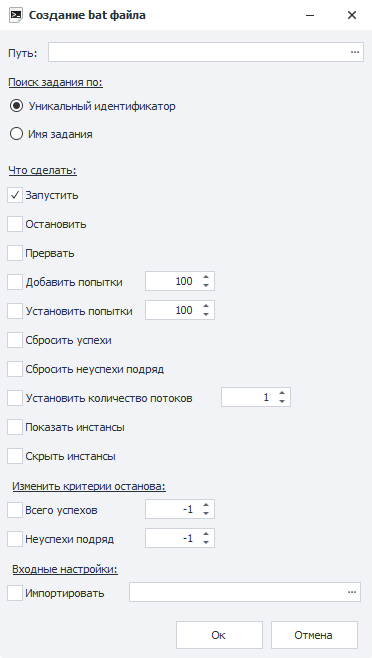
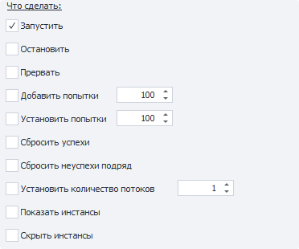

---
sidebar_position: 3
title: "Создать bat файл"
description: ""
date: "2025-09-10"
converted: true
originalFile: "Создать bat файл.txt"
targetUrl: "https://zennolab.atlassian.net/wiki/spaces/RU/pages/1940979747/bat"
---
:::info **Пожалуйста, ознакомьтесь с [*Правилами использования материалов на данном ресурсе*](../Disclaimer).**
:::

> 🔗 **[Оригинальная страница](https://zennolab.atlassian.net/wiki/spaces/RU/pages/1940979747/bat)** — Источник данного материала

_______________________________________________  
# Создать bat файл

  

## Описание

Для каждого добавленного в ZennoPoster проекта есть возможность создать bat файл, с помощью которого можно запускать и останавливать шаблон, добавлять попытки, изменять количество потоков, задавать новые входные настройки и др.

Можно выбрать одновременно несколько пунктов.

:::warning Внимание
bat файлы не работают в DEMO версии программы.
:::

  

## Как создать?

В [❗→ таблице проектов](https://zennolab.atlassian.net/wiki/spaces/RU/pages/853737528 "https://zennolab.atlassian.net/wiki/spaces/RU/pages/853737528") кликнуть ПКМ по проекту и из [❗→ контекстного меню](https://zennolab.atlassian.net/wiki/spaces/RU/pages/852885672 "https://zennolab.atlassian.net/wiki/spaces/RU/pages/852885672") выбрать пункт “Создать bat файл”.

  

## Путь

Тут нужно указать путь, куда будет сохранён bat файл.

## Поиск задания по

В данном пункте необходимо выбрать по какому признаку bat файл будет искать проект.

**Уникальный идентификатор** - у каждого добавленного в ZennoPoster проекта есть уникальный идентификатор (пример - `81ca46b9-8eaa-94e3-92be-33b22ba4ca1a`). 
*ВНИМАНИЕ*: при каждом добавлении проекта генерируется новый идентификатор. Если Вы несколько раз добавите и удалите один и тот же шаблон в программу, то каждый раз будет создан новый id.

**Имя задания** - поиск шаблона будет произведён по его имени.
Если в таблице проектов будет добавлено несколько проектов с одинаковым именем, то настройки будут применены к первому, который будет найден.

## Что сделать

**Запустить, Остановить, Прервать** - подробнее в статье про [❗→ Контекстное меню](https://zennolab.atlassian.net/wiki/spaces/RU/pages/852885672 "https://zennolab.atlassian.net/wiki/spaces/RU/pages/852885672").

**Добавить попытки** - к текущим попыткам выполнения будет добавлено указанное здесь количество.

**Установить попытки** - для выбранного шаблона будет установлено указанное здесь количество попыток выполнения.

**Сбросить успехи\неуспехи подряд** - сброс количества [не]успешных выполнений.

**Установить количество потоков** - задаёт число потоков для шаблона.

**Показать\скрыть инстанс -** данные опции позволяют запустить отображение инстансев у работающих потоков.

## Изменить критерии останова

Позволяет задать условия, при наступлении которых шаблон прекратит работу. Аналогично функциям из [❗→ вкладки Остановка](https://zennolab.atlassian.net/wiki/spaces/RU/pages/852885665 "https://zennolab.atlassian.net/wiki/spaces/RU/pages/852885665").

## Входные настройки

**Импортировать** - тут нужно указать путь к файлу, где находится файл с сохранёнными входными настройками.
Как сохранить настройки описано в статье [❗→ Входные настройки](https://zennolab.atlassian.net/wiki/spaces/RU/pages/1846051204 "https://zennolab.atlassian.net/wiki/spaces/RU/pages/1846051204") 

  

## Полезные ссылки

- [❗→ Контекстное меню](https://zennolab.atlassian.net/wiki/spaces/RU/pages/852885672 "https://zennolab.atlassian.net/wiki/spaces/RU/pages/852885672")
- [❗→ Таблица проектов](https://zennolab.atlassian.net/wiki/spaces/RU/pages/853737528 "https://zennolab.atlassian.net/wiki/spaces/RU/pages/853737528")
- [❗→ Входные настройки](https://zennolab.atlassian.net/wiki/spaces/RU/pages/1846051204 "https://zennolab.atlassian.net/wiki/spaces/RU/pages/1846051204")

