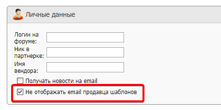
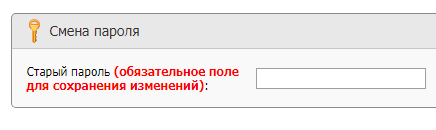

---
sidebar_position: 2
title: "ZennoBox"
description: ""
date: "2025-09-15"
converted: true
originalFile: "ZennoBox.txt"
targetUrl: "https://zennolab.atlassian.net/wiki/spaces/RU/pages/495386651/ZennoBox"
---
import DisclaimerNotice from '@site/src/components/DisclaimerNotice';

<DisclaimerNotice />

> 🔗 **[Оригинальная страница](https://zennolab.atlassian.net/wiki/spaces/RU/pages/495386651/ZennoBox)** — Источник данного материала

_______________________________________________  
# ZennoBox

  

## Описание

ZennoBox - это фича-программа, с помощью которой Вы сможете продавать свои проекты людям, у которых нет ZennoPoster. 
По сути, это ZennoPoster, привязанный к конкретным проектам, которые купит пользователь у Вас и (или) у других продавцов. Данное решение полезно, если Вы хотите [❗→ продавать свои проекты](https://zennolab.atlassian.net/wiki/spaces/RU/pages/494895200 "https://zennolab.atlassian.net/wiki/spaces/RU/pages/494895200") людям, которые не знакомы с миром ZP.

## Как работает для покупателя

Человек покупает у Вас проект, Вы в административной панели [❗→ выписываете проект](https://zennolab.atlassian.net/wiki/spaces/RU/pages/494895200 "https://zennolab.atlassian.net/wiki/spaces/RU/pages/494895200") на его имя и оплачиваете небольшую комиссию. Этот человек скачивает ZennoBox (бесплатно), после установки у него уже будет загружен Ваш проект, который Вы ему продали.

## Как создать свой проект для продажи

Для продажи проектов Вам хватит Lite версии. Максимальное количество потоков, на которых можно будет запустить Ваш проект в ZennoBox равно максимальному количеству потоков Вашей версии ZennoPoster (ограничение: максимальное количество потоков для ZennoBox на все проекты: 20).

1. Нужно добавить в свой проект статический блок [❗→ Входные настройки](https://zennolab.atlassian.net/wiki/spaces/RU/pages/534020594 "https://zennolab.atlassian.net/wiki/spaces/RU/pages/534020594") и установить параметры, которые смогут изменять покупатели Вашего проекта.
2. Необходимо отправить Вашему покупателю [ссылку на регистрацию](https://userarea.zennolab.com/ru/Registration.aspx "https://userarea.zennolab.com/ru/Registration.aspx") в нашей системе, если он ещё не зарегистрирован.
3. Перейти к своей учётной записи в административной панеле на вкладку **Боты**, и [❗→ продать ему Ваши проекты](https://zennolab.atlassian.net/wiki/spaces/RU/pages/494895200 "https://zennolab.atlassian.net/wiki/spaces/RU/pages/494895200") на тот e-mail, на который зарегистрировался Ваш покупатель.
4. После этого Ваш покупатель сможет скачать ZennoBox, в котором автоматически отобразятся проданные ему проекты.

:::note На заметку
Подробную инструкцию по продаже ботов Вы можете найти в статье Продажа ботов
:::

## Экономия

Продавая сразу несколько проектов одному человеку одновременно, комиссия за второй и остальные проекты сильно уменьшается.

## Комиссия

Комиссия взимается для того, чтобы:

- большие проекты не попадали в паблик бесплатно;
- компенсация нам за возможность пользоваться ZennoPoster не покупая его;
- оплачивать обслуживание серверов ProxyChecker и систем защиты ботов от копирования.

### При продаже одного проекта

Комиссия составляет $10 с каждой продажи одного проекта. 

### При продаже нескольких проектов одновременно

Если Вы продаёте одному человеку сразу несколько проектов, то второй и следующие проекты будут добавлять по $2 к стоимости общей комиссии (пример: при продаже одновременно 5 проектов комиссия составит $18 = $10 + $2 + $2 + $2 + $2).

### При продаже проекта с плагинами

Если проект содержит [❗→ Плагины](https://zennolab.atlassian.net/wiki/spaces/RU/pages/475365697 "https://zennolab.atlassian.net/wiki/spaces/RU/pages/475365697"), то комиссия за него будет составлять $12, независимо от количества вложенных плагинов.

## Удобство

Сколько бы покупатель ни приобрёл ботов, у Вас или (и) у других людей, все они будут просто отображаться у него в программе, готовые к запуску. Ничего дополнительно скачивать не нужно.

## Апдейты

При обновлении Вашего проекта в админке, у пользователя он будет обновлён автоматически.

Если захотите продать апдейт то нужно будет создать новый проект и продавать его отдельно.

## Возврат средств (Refund)

Вы можете в течение 30 дней сделать возврат денежных средств на баланс личного кабинета, которые были заплачены в качестве комиссии при выписке шаблона. Покупатель в свою очередь потеряет возможность пользоваться шаблоном.

:::note На заметку
Инструкцию о том, как сделать возврат можно найти в статье Продажа проектов.
:::

## Ограничения

### Потоки

Количество максимальных потоков ZennoBox будет ограничено в зависимости от того, какая у Вас версия программы:

- Lite - 1 поток
- Standart - 5
- Pro - 20

### Одновременная работа с ZennoPoster

Нельзя одновременно запускать ZennoPoster и ZennoBox на одном компьютере (даже под разными учётными записями)! Они будут конфликтовать друг с другом!

## Скрыть email продавца

:::warning Внимание
Будьте аккуратны, так как ранее выписанные проекты могут перестать работать: они будут перенесены в новую директорию и если у проекта (-ов) есть сопутствующие файлы, то их нужно будет вручную переместить.
:::

При продаже шаблона у покупателя по пути `C:\Documents\ZennoLab\ZennoBox\PurchasedProducts `создаётся директория, в качестве её имени по умолчанию используется email продавца. Если Вы по какой-то причине не хотите показывать свой email, то можете изменить это поведение в [Личном кабинете, во вкладке *Профиль](https://userarea.zennolab.com/lk/userarea/Profile.aspx "https://userarea.zennolab.com/lk/userarea/Profile.aspx"). 

Для этого отметьте настройку “Не отображать email продавца шаблонов”:

После включения данной опции вместо email будет использоваться zennolab id, который имеет вид 45d82355-ft57-98ac-aaaa-9cb010d87qcf9@zennolab.com

Для сохранения изменений необходимо ввести свой пароль в соответствующее поле и нажать кнопку “Сохранить”

  

## Полезные ссылки

- [❗→ Продажа ботов](https://zennolab.atlassian.net/wiki/spaces/RU/pages/494895200 "https://zennolab.atlassian.net/wiki/spaces/RU/pages/494895200")
- [❗→ Плагины](https://zennolab.atlassian.net/wiki/spaces/RU/pages/475365697 "https://zennolab.atlassian.net/wiki/spaces/RU/pages/475365697")
- [❗→ Проект в проекте (Вложенные проекты)](https://zennolab.atlassian.net/wiki/spaces/RU/pages/489291822 "https://zennolab.atlassian.net/wiki/spaces/RU/pages/489291822")