:::info **Пожалуйста, ознакомьтесь с [*Правилами использования материалов на данном ресурсе*](../Disclaimer).**
:::

> 🔗 **[Оригинальная страница](https://zennolab.atlassian.net/wiki/spaces/RU/pages/494895200)** — Источник данного материала

_______________________________________________  
# Продажа проектов (ботов)

  

## Добавляем бота для продажи

- Необходимо зайти в Личный кабинет, раздел **Боты**, вкладка **Мои проекты**:

- Добавить имя проекта (под этим именем проект будет отображаться в панели продаж и в ZennoBox у покупателя)
- Выбрать файл проекта на компьютере

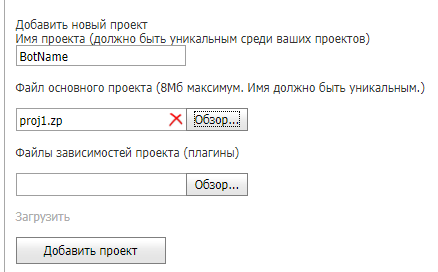

### Загрузка плагинов

Если добавляемый проект содержит [❗→ Плагины](https://zennolab.atlassian.net/wiki/spaces/RU/pages/475365697 "https://zennolab.atlassian.net/wiki/spaces/RU/pages/475365697"), то их надо загрузить отдельно. 
Для этого:

- выберите необходимые для загрузки плагины.

 - можно выбрать как сразу несколько плагинов, так и добавлять их по очереди.
Чтобы увидеть список добавленных плагинов, достаточно навести курсор на поле ввода:

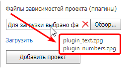

 - Чтобы удалить добавленные плагины, нажмите на крестик в правой части поля ввода.

- Нажмите кнопку **Загрузить**

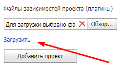

 - После успешной загрузки появится список с именами добавленных плагинов:

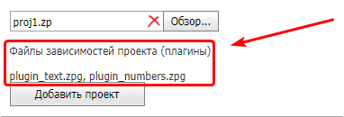

:::warning Внимание
Плагины не должны быть зашифрованы, т.к. их повторное шифрование невозможно. То есть, вы не сможете перепродать плагин, который купили сами.
:::

### Загрузка бота в систему

После того, как выбран файл проекта (и плагины, если таковые нужны) нажимаем кнопку **Добавить проект**.

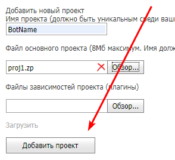

Если всё прошло успешно, Ваш бот появится в списке:

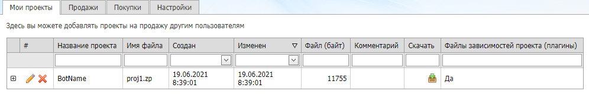

  

## Продаём бота

Перейдите на вкладку **Продажи** к пункту **Продать проекты**:

### Кому

Нужно указать email или ZennoLab ID покупателя

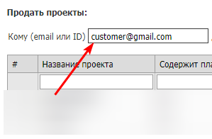

### Платформа запуска

Выбрать платформу, для которой продаётся проект: **ZennoBox**, **ZennoPoster** или **ZennoBox и** **ZennoPoster**

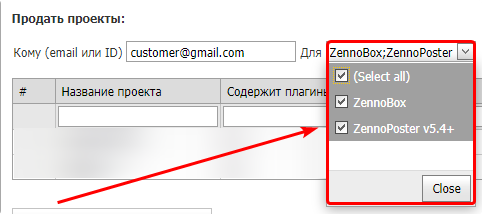

### Подписка

При включении данной настройки шаблон у пользователя будет работать до указанной даты, по её наступлении пользователь не сможет запустить проект.
Вы всегда сможете бесплатно продлить действие подписки ранее проданного проекта (как это сделать описано ниже, в секции FAQ).

:::warning Внимание
Дата указывается НЕ включительно. Иными словами, если Вы выписали проект до 03.03, то при наступлении 3-го марта шаблон перестанет работать, а в лог будет выведено сообщение: Подписка просрочена. Подписка действительна до: &lt;тут\_дата&gt;.
:::

### Выбор проекта (-ов) и их продажа

Затем необходимо из списка загруженных проектов выбрать те, которые Вы сейчас хотите продать и нажать кнопку **Продать проекты**.

:::note На заметку
При выборе проектов на кнопке Продать проекты автоматически будет отображаться сумма комиссии, которая будет снята с Вашего баланса.
:::

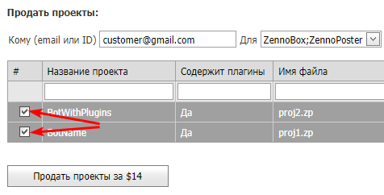

Если всё прошло успешно, то в таблице **Ваши продажи** (в верхней части вкладки **Продажи**) появится новая запись:

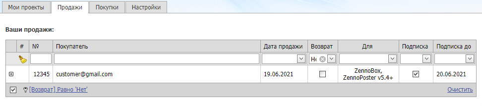

Готово! Ваш бот продан.

  

## Обновляем бота

Обновление бота производится на вкладке **Мои проекты**.

- Нажмите на карандаш у обновляемого бота.

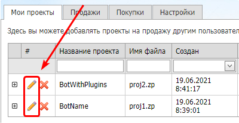

- Выберите файл проекта (1) и нажмите кнопку **Загрузить** (2)
- Если проект использует плагины (3), то необходимо выбрать плагины и так же нажать **Загрузить** (4)
- Если всё было сделано правильно, то вместо поля ввода и кнопки **Загрузить** отобразится имя загруженного (-ых) файла (-ов)

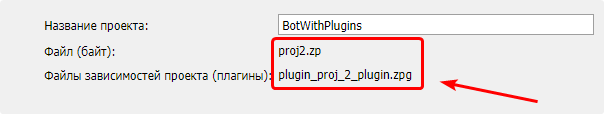

- После того, как обновлённые файлы загружены в систему необходимо нажать кнопку в виде зелёной галки (5)

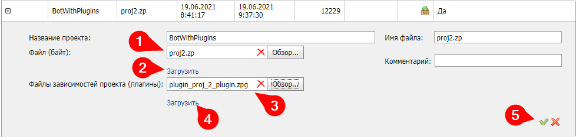

После того, как Вы обновите бота, Ваши клиенты увидят в ZennoPoster или ZennoBox такую картину:

Это означает, что обновление к ним придёт в течении 5-10 минут и бот будет снова доступен к использованию.

Готово! Ваш бот обновлён.

  

## FAQ

### Как отменить продажу проекта?

Развернуть ответ

**ВНИМАНИЕ!** Если refund происходит в течение 30-ти дней, с момента продажи проекта, то на Ваш баланс вернётся комиссия, которую Вы заплатили во время этой продажи.

Если же прошло больше 30-ти дней с момента продажи, то комиссия возвращена не будет!

После отмены продажи проекты у покупателя перестанут работать!

Сделать это можно в разделе *Боты, вкладка *Продажи, в секции *Управление продажами самый первый пункт - *Сделать refund… Номер продажи можно посмотреть в таблице *Ваши продажи:

### Как продлить подписку?

Развернуть ответ

Продлить ранее выписанную подписку можно на той же вкладке, где осуществляется продажа ботов, только в разделе **Управление продажами**.

Продлить можно либо на определённое количество дней, либо до определённой даты. 
Номер продажи можно найти в таблице **Ваши продажи**, колонка **№**:

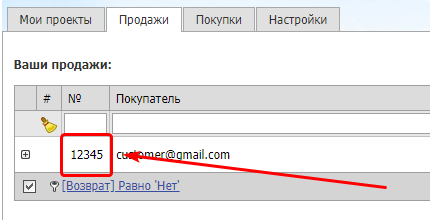

### Как высчитывается комиссия при продаже проектов?

Развернуть ответ

**При продаже одного проекта**

Комиссия составляет $10 с каждой продажи одного проекта. 

**При продаже нескольких проектов одновременно**

Если Вы продаёте одному человеку сразу несколько проектов, то второй и следующие проекты будут добавлять по $2 к стоимости общей комиссии (пример: при продаже одновременно 5 проектов комиссия составит $18 = $10 + $2 + $2 + $2 + $2).

**При продаже проекта с плагинами**

Если проект содержит [❗→ Плагины](https://zennolab.atlassian.net/wiki/spaces/RU/pages/475365697 "https://zennolab.atlassian.net/wiki/spaces/RU/pages/475365697"), то комиссия за него будет составлять $12, независимо от количества вложенных плагинов.
Если Вы продаёте одному человеку сразу несколько проектов с плагинами, то комиссия рассчитывается так же, как и при продаже нескольких проектов без плагинов: первый $12, остальные по $2.

### Где находятся купленные проекты?

Развернуть ответ

Директорию загрузки проектов можно узнать в настройках ZennoPoster (не ProjectMaker): вкладка *Другое=&gt;[❗→ *Настройка директории загрузки проектов](https://zennolab.atlassian.net/wiki/spaces/RU/pages/808779861/ZennoPoster#%D0%9D%D0%B0%D1%81%D1%82%D1%80%D0%BE%D0%B9%D0%BA%D0%B0-%D0%B4%D0%B8%D1%80%D0%B5%D0%BA%D1%82%D0%BE%D1%80%D0%B8%D0%B8-%D0%B7%D0%B0%D0%B3%D1%80%D1%83%D0%B7%D0%BA%D0%B8-%D0%BF%D1%80%D0%BE%D0%B5%D0%BA%D1%82%D0%BE%D0%B2 "https://zennolab.atlassian.net/wiki/spaces/RU/pages/808779861/ZennoPoster#%D0%9D%D0%B0%D1%81%D1%82%D1%80%D0%BE%D0%B9%D0%BA%D0%B0-%D0%B4%D0%B8%D1%80%D0%B5%D0%BA%D1%82%D0%BE%D1%80%D0%B8%D0%B8-%D0%B7%D0%B0%D0%B3%D1%80%D1%83%D0%B7%D0%BA%D0%B8-%D0%BF%D1%80%D0%BE%D0%B5%D0%BA%D1%82%D0%BE%D0%B2").

### Как правильно продать проект, если используются вложенные проекты?

Развернуть ответ

Если в Вашем шаблоне подключаются другие шаблоны, с помощью функции [❗→ Проект в проекте](https://zennolab.atlassian.net/wiki/spaces/RU/pages/489291822 "https://zennolab.atlassian.net/wiki/spaces/RU/pages/489291822"), то вложенные проекты размещайте в той же директории, что и основной проект или в одной из его поддиректорий. А путь указывайте с помощью макроса `{ -Project.Directory- }`

### Как передать вспомогательные файлы (списки, таблицы и т.д.)?

Развернуть ответ

Передать подобные файлы через Личный кабинет нельзя. Их придётся передавать покупателю напрямую. А во [❗→ входных настройках](https://zennolab.atlassian.net/wiki/spaces/RU/pages/534020594 "https://zennolab.atlassian.net/wiki/spaces/RU/pages/534020594") предусмотреть выбор этих файлов.

