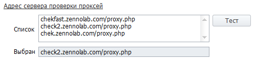
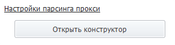
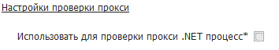

---
sidebar_position: 2
title: "Настройки ProxyChecker"
description: ""
date: "2025-09-10"
converted: true
originalFile: "Настройки ProxyChecker.txt"
targetUrl: "https://zennolab.atlassian.net/wiki/spaces/RU/pages/848560318/ProxyChecker"
---
:::info **Пожалуйста, ознакомьтесь с [*Правилами использования материалов на данном ресурсе*](../Disclaimer).**
:::

> 🔗 **[Оригинальная страница](https://zennolab.atlassian.net/wiki/spaces/RU/pages/848560318/ProxyChecker)** — Источник данного материала

_______________________________________________  
# Настройки ProxyChecker

:::info Информация
Данная статья скопирована из справки по ZennoProxyChecker, т.к. настройки идентичны в обеих программах. Оригинал - [❗→ Основные настройки](https://zennolab.atlassian.net/wiki/spaces/RU/pages/534020624). Внутри данной статьи могут встретиться скриншоты, внутренние ссылки на справку и другие вещи, которые относятся к ZennoProxyChecker.
:::

Оглавление

  

## Адрес сервера проверки проксей

Выбор сервера проверки прокси из списка адресов.

### Список

URL адреса, которые программа использует для проверки прокси. 
По умолчанию здесь указаны три адреса, но Вы можете добавить свои.

### Кнопка Тест

После её нажатия программа последовательно будет проверять адреса из **Списка** выше на работоспособность.
Завершится тест, когда будет найден первый рабочий сервер проверки. Или когда кончатся адреса в списке.

### Выбран

Здесь будет указан адрес, с помощью которого будут проверяться все прокси на предмет того живы они или нет.
Сюда попадает первый рабочий адрес из **Списка**.

  

## Настройки поведения

### Считать неанонимные прокси мёртвыми

Программа будет фильтровать неанонимные прокси и выдавать только анонимные.

### Удалить прокси при закрытии программы

Очистка списка прокси при закрытии программы.

### Число потоков на процесс

Задаёт число потоков, используемых для проверки.

:::warning Внимание
Для применения изменений нужно перезапустить программу.
:::

  

## Настройки парсинга прокси

Здесь Вы можете добавить новые и отредактировать существующие структуры для парсинга прокси (фактически, структура - это регулярные выражения).
Чтобы перейти в *конструктор парсинга, нажмите кнопку **Открыть конструктор.**

### Конструктор структур парсинга прокси

#### Вкладка “Список структур”

По умолчанию здесь уже внесены 2 регулярных выражения.
Также, вы можете использовать свои собственные регулярные выражения, нажав кнопку **Добавить (1)** или **Удалить (2)**. 

На некоторых сайтах может встретиться своя разметка прокси, поэтому, при необходимости, можно создать свою структуру парсинга практически для любого вида и протестировать на конкретном источнике с помощью тестера. С помощью кнопки **Справка по полям структур (3)** можно получить описание используемых полей.

#### Вкладка “Тестировать источник”

**Адрес источника** - тут нужно указать адрес сайта, с которого будет происходить парсинг проксей.

**Выбранная структура** - необходимо выбрать добавленное ранее условие для парсинга из вкладки *Список структур*.

Далее, нажмите кнопку **Тест** и запустится тестирование.

В окне *Результат теста*, вы увидите полученные в соответствии с условиями парсинга прокси.

:::warning Внимание
После закрытия окна Конструктора или нажатии кнопки отмена, результаты парсинга не сохраняются.
:::

  

## Настройки автопоиска

### Подробный лог работы автопоиска

Поставив здесь галочку, вы будете видеть подробный отчет о работе **ZennoProxyChecker** в режиме автопоиска.

### Останавливать, если в очереди на проверку более XXX прокси

При превышении данного количества прокси в очереди, автопоиск будет остановлен.

### Останавливать, если в базе более XXX прокси

При превышении данного количества прокси в базе, автопоиск будет остановлен.

### Останавливать, если в базе более XXX источников

При превышении данного количества источников, автопоиск будет остановлен.

### Настройки источников по-умолчанию

Здесь указываются настройки, которые будут применены ко всем вновь добавленным источникам. Подробнее о функциях и настройках данного можно прочитать в статье [❗→ Настройки источников](https://zennolab.atlassian.net/wiki/spaces/RU/pages/1892876309 "https://zennolab.atlassian.net/wiki/spaces/RU/pages/1892876309") 

  

## Настройки проверки прокси

### Использовать для проверки прокси .NET процесс

Если параметр установлен, то прокси будут проверяться с помощью .NET реализации CheckingProcessor (требуется перезапуск).

  

## Полезные ссылки

- [❗→ Работа с прокси](https://zennolab.atlassian.net/wiki/spaces/RU/pages/534086266 "https://zennolab.atlassian.net/wiki/spaces/RU/pages/534086266")
- [❗→ Настройки источников](https://zennolab.atlassian.net/wiki/spaces/RU/pages/1892876309 "https://zennolab.atlassian.net/wiki/spaces/RU/pages/1892876309")
