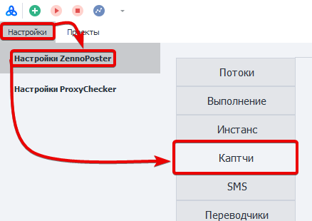
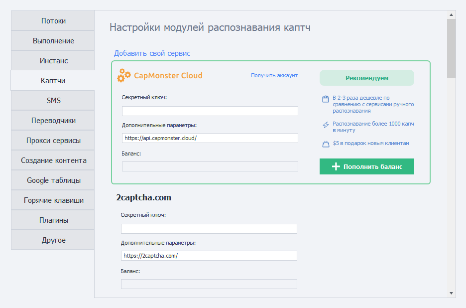
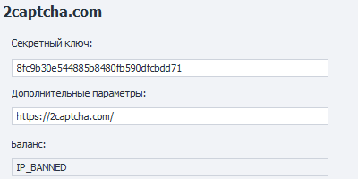
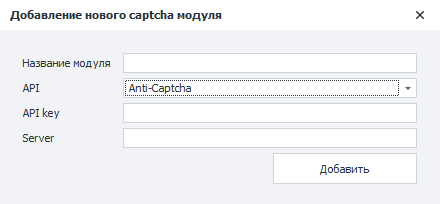

---
sidebar_position: 4
title: "Капчи"
description: ""
date: "2025-09-10"
converted: true
originalFile: "Капчи.txt"
targetUrl: "https://zennolab.atlassian.net/wiki/spaces/RU/pages/808845385"
---
:::info **Пожалуйста, ознакомьтесь с [*Правилами использования материалов на данном ресурсе*](../Disclaimer).**
:::

> 🔗 **[Оригинальная страница](https://zennolab.atlassian.net/wiki/spaces/RU/pages/808845385)** — Источник данного материала

_______________________________________________  
# Капчи

  

## Описание

**Капча** — это автоматически генерируемый тест-проверка, является ли пользователь человеком или компьютером. Часто представляет собой искаженную надпись из букв и/или цифр. Они могут быть написаны в различных цветовых сочетаниях с применением шума, искривления, наложения дополнительных линий или произвольных фигур.

На изображении ниже показаны некоторые примеры капч:


Встречаются и другие виды, где надо не просто ввести символы с картинки, а произвести какое-то действие - найти автобусы, пальмы, автомобили и другие предметы; решить пазл; расставить предметы в определённом порядке или рассортировать их.

Примерами таких капч являются Recaptcha, Funcaptcha, hCaptcha и др.

  

## Для чего это используется?

Данные сервисы предназначены для того, чтобы не вводить капчи вручную.

ZennoPoster позволяет решать капчи самостоятельно (если речь о простых текстовых капчах), для этого в [❗→ экшене распознавания капч](https://zennolab.atlassian.net/wiki/spaces/RU/pages/534053026 "https://zennolab.atlassian.net/wiki/spaces/RU/pages/534053026") достаточно выбрать модуль MonkeyEnter.dll. Но это может стать трудоёмкой задачей если речь идёт о сотнях или даже тысячах капч! А если проект работает круглосуточно и капча может появится в любое время? Вот тут-то нам и придут на помощь сервисы.

  

## Как открыть это окно?

### ProjectMaker

- Через верхнее меню **Редактирование=&gt;Настройки=&gt;Каптчи**.


- Через [❗→ Стартовую страницу](https://zennolab.atlassian.net/wiki/spaces/RU/pages/735608964 "https://zennolab.atlassian.net/wiki/spaces/RU/pages/735608964")


### ZennoPoster

**Настройки=&gt;Настройки ZennoPoster=&gt;Каптчи**




### Внешний вид окна настроек




  

## Как подключиться?

### Секретный ключ

Чаще всего для работы с сервисом необходим так называемый API ключ - уникальная строка из случайных символов, благодаря которой сервис может Вас идентифицировать. Пример такого ключа - ```8fc9b30e544885b8480fb590dfcbdd71```

Для получения API ключа перейдите на сайт подходящего сервиса. Ознакомьтесь с ценами и условиями. Если Вы определились с выбором, пройдите простую регистрацию в сервисе и получите свой API ключ в личном кабинете капча сервиса.

### Логин и пароль

Некоторые сервисы вместо API ключа используют логин и пароль, которые были использованы при регистрации, для идентификации пользователя.

### Дополнительные параметры 

URL адрес для приёма API-запросов. Установлен по умолчанию. Если не установлен, то его необходимо уточнить у разработчиков выбранного сервиса.

:::warning Внимание
Не меняйте без необходимости значение данного поля!
:::

### Баланс

После ввода API ключа или пары логин\пароль в данном поле появится Ваш текущий баланс на сервисе. 


Также в данном поле могут отображаться ошибки (не для всех сервисов). Например - IP\_BANNED, ERROR\_WRONG\_USER\_KEY и др.




:::warning Внимание
Если после ввода API ключа данное поле остаётся пустым, значит произошла какая-то ошибка. Возможные варианты - введён неправильный ключ (пара логин\пароль), неполадки у сервиса, Ваш ключ был забанен.
:::

### Доступные сервисы

- [CapMonster Cloud](https://capmonster.cloud/ "https://capmonster.cloud/") - Рекомендуемый 
- [2captcha.com](https://2captcha.com/ "https://2captcha.com/")
- [Anti-Captcha.com](https://anti-captcha.com/ "https://anti-captcha.com/")
- [BypassCaptcha.com](http://bypasscaptcha.com/ "http://bypasscaptcha.com/")
- [CaptchaBot.com](http://captchabot.com/ "http://captchabot.com/") - Больше не работает
- [CheapCaptcha.com](https://cheapcaptcha.com/ "https://cheapcaptcha.com/")
- [DeathByCaptcha.com](https://deathbycaptcha.com/ "https://deathbycaptcha.com/")
- [DeCaptcher.com](http://decaptcher.com/ "http://decaptcher.com/")
- [ImageDecoders.com](http://imagedecoders.com/ "http://imagedecoders.com/")
- [Imagetyperz.com](http://imagetyperz.com/ "http://imagetyperz.com/")
- [Jsdati.com](https://www.jsdati.com/ "https://www.jsdati.com/")
- http://RIPCaptcha.com - Больше не работает
- [RuCaptcha.com](https://rucaptcha.com/ "https://rucaptcha.com/")
- http://Ruokuai.com - Больше не работает
- http://Uuwise.com - Больше не работает
- [CapMonster2](https://zennolab.com/ru/products/capmonster/ "https://zennolab.com/ru/products/capmonster/")

  

## Добавление нового модуля

:::info Информация
Добавлено в 7.3.0.0
:::

:::warning Внимание
Только для простых текстовых капч.
:::

Начиная с версии ZennoPoster 7.3.0.0 Вы можете добавить собственный сервис распознавания каптч на основе API популярных сервисов.

Для этого необходимо перейти на страницу **Настроек** и выбрать пункт **Добавить свой сервис**.


Перед Вами появится окно для ввода данных нового сервиса:




### Название модуля

Тут надо указать имя Вашего модуля. 

:::warning Внимание
Максимум 20 символов.
:::

### API

Тут необходимо выбрать API на основе которого будет создан Ваш модуль.

### API-key

API ключ от сервиса. 

То же, что и поле **Секретный ключ** для сервисов по умолчанию (описано выше).

### Server

URL адрес, куда будут отсылаться запросы.

:::note На заметку
Если Вы не уверены, что вводить в то или иное поле, проконсультируйтесь с поставщиком услуг.
:::

### Отправка капч на свой модуль

После добавления модуля Вы можете его выбрать в экшене [❗→ Распознать капчу](https://zennolab.atlassian.net/wiki/spaces/RU/pages/534053026 "https://zennolab.atlassian.net/wiki/spaces/RU/pages/534053026").


### Удаление модуля

Чтобы убрать созданный модуль из программы необходимо удалить два файла:

- `c:\Users\USERNAME\AppData\Roaming\ZennoLab\Configs\ИмяМодуля.dll.config`
- `c:\Users\USERNAME\AppData\Roaming\ZennoLab\CustomModules\Captcha\ИмяМодуля.dll`

`USERNAME` - тут необходимо вставить имя Вашего пользователя в операционной системе

:::warning Внимание
ZennoPoster и ProjectMaker лучше выключить в момент удаления этих файлов.
:::

## Полезные ссылки

- [❗→ Распознать каптчу](https://zennolab.atlassian.net/wiki/spaces/RU/pages/534053026 "https://zennolab.atlassian.net/wiki/spaces/RU/pages/534053026")
- [❗→ Распознать Recaptcha](https://zennolab.atlassian.net/wiki/spaces/RU/pages/534053033/ReCaptcha "https://zennolab.atlassian.net/wiki/spaces/RU/pages/534053033/ReCaptcha")
- [Страница для тестирования разных видов капч](https://lessons.zennolab.com/captchas/ "https://lessons.zennolab.com/captchas/")
