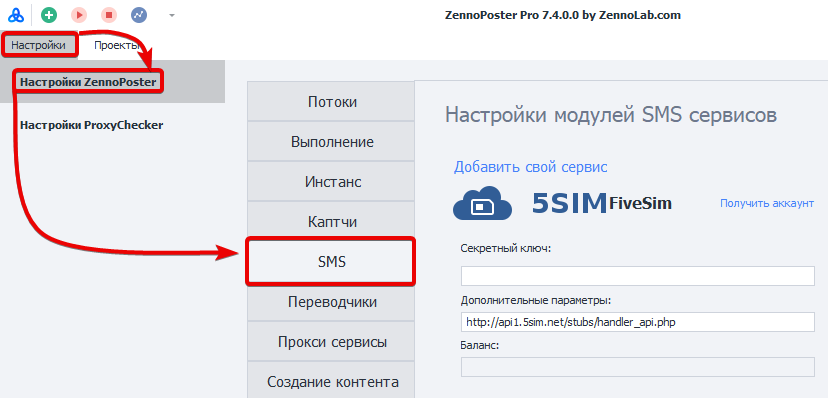
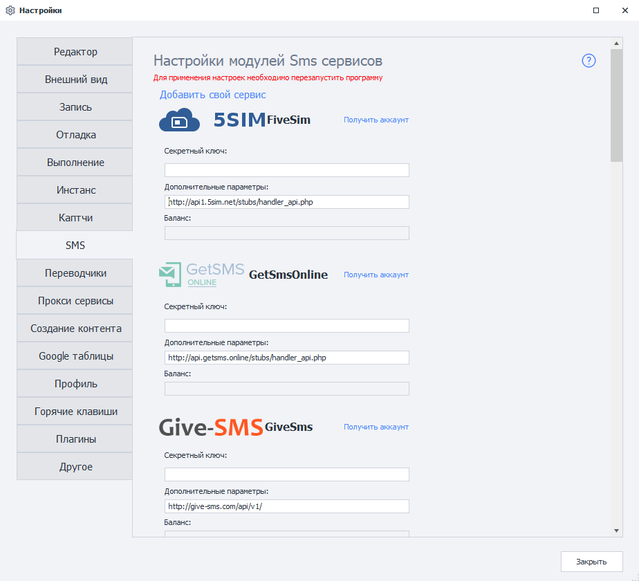
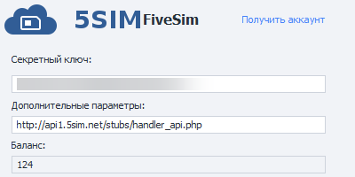
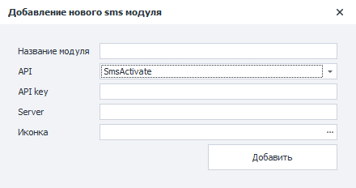
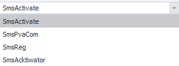
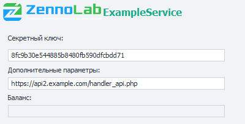
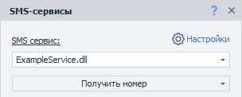

---
sidebar_position: 5
title: "SMS-сервисы"
description: ""
date: "2025-09-10"
converted: true
originalFile: "SMS-сервисы.txt"
targetUrl: "https://zennolab.atlassian.net/wiki/spaces/RU/pages/809074773/SMS-"
---
:::info **Пожалуйста, ознакомьтесь с [*Правилами использования материалов на данном ресурсе*](../Disclaimer).**
:::

> 🔗 **[Оригинальная страница](https://zennolab.atlassian.net/wiki/spaces/RU/pages/809074773/SMS-)** — Источник данного материала

_______________________________________________  
# SMS-сервисы

  

## Для чего это используется?

Некоторые ресурсы для подтверждения регистрации требуют ввода номера мобильного телефона, на который отправляется проверочный код. И этот код, затем, необходимо ввести на сайте. Вот как раз для таких случаев и существуют SMS сервисы. А ZennoPoster, в свою очередь, старается максимально упростить работу с ними.

  

## Как открыть это окно?

### ProjectMaker

- Через верхнее меню **Редактирование=&gt;Настройки=&gt;SMS**.

- Через [❗→ Стартовую страницу](https://zennolab.atlassian.net/wiki/spaces/RU/pages/735608964 "https://zennolab.atlassian.net/wiki/spaces/RU/pages/735608964")

### ZennoPoster

**Настройки=&gt;Настройки ZennoPoster=&gt;SMS**

### Внешний вид окна настроек

  

## Как подключиться?

### Секретный ключ

Для работы с сервисом необходим так называемый API ключ - уникальная строка из случайных символов, благодаря которой сервис может Вас идентифицировать. Пример такого ключа - `8fc9b30e544885b8480fb590dfcbdd71`

Для получения API ключа перейдите на сайт подходящего сервиса. Ознакомьтесь с ценами и условиями. Если Вы определились с выбором, пройдите простую регистрацию в сервисе и получите свой API ключ в личном кабинете сервиса.

### Дополнительные параметры

URL адрес для приёма API-запросов. Установлен по умолчанию. Если не установлен, то его необходимо уточнить у разработчиков выбранного сервиса.

:::warning Внимание
Не меняйте без необходимости значение данного поля!
:::

### Баланс

После ввода API ключа в данном поле появится Ваш текущий баланс на сервисе.

:::warning Внимание
Если после ввода API ключа данное поле остаётся пустым, значит произошла какая-то ошибка. Возможные варианты - введён не правильный API ключ, неполадки у сервиса, Ваш ключ был забанен.
:::

### Доступные сервисы

:::info Информация
ZennoPoster 7.4.0.0
:::

<table>
<tr>
<td>

- [5sim.net](http://5sim.net/ "http://5sim.net/")
- [getsms.online](http://getsms.online/ "http://getsms.online/")
- [give-sms.com](http://give-sms.com/ "http://give-sms.com/")
- [simsms.org](http://simsms.org/ "http://simsms.org/")
- [sms-acktiwator.ru](http://sms-acktiwator.ru/ "http://sms-acktiwator.ru/")
- [sms-activate.ru](http://sms-activate.ru/ru/ "http://sms-activate.ru/ru/")
- [smshub.org](https://smshub.org/ "https://smshub.org/")

</td>
<td>

- [smska.net](http://smska.net/ "http://smska.net/")
- [smspva.com](http://smspva.com/ "http://smspva.com/")
- [sms-reg.com](http://sms-reg.com/ "http://sms-reg.com/")
- [smsvk.net](http://smsvk.net/ "http://smsvk.net/")
- [vak-sms.com](http://vak-sms.com/ "http://vak-sms.com/")
- [virtualsms.ru](http://virtualsms.ru/ "http://virtualsms.ru/")

</td>
</tr>
</table>

  

## Добавление нового сервиса

:::info Информация
Добавлено в 7.2.1.0
:::

Начиная с версии ZennoPoster 7.2.1.0 у Вас появилась возможность добавить в программу пользовательский сервис приёма SMS, на основе API популярных сервисов.

Для этого необходимо перейти на страницу **Настроек** и выбрать пункт **Добавить свой сервис**.

Перед Вами появится окно для ввода данных нового сервиса:

### Название модуля

Тут надо указать имя нового сервиса.

:::warning Внимание
Максимум 20 символов.
:::

### API

Тут необходимо выбрать API на основе которого будет создан Ваш модуль.

### API-key

API ключ от сервиса.

То же, что и поле **Секретный ключ** для встроенных сервисов (описано выше).

### Server

URL адрес, куда будут отсылаться запросы.

### Иконка

Указанная картинка будет отображаться в **Настройках**.

Доступные форматы: `jpg, bmp, gif, png`

:::note На заметку
Если Вы не уверены, что вводить в то или иное поле, проконсультируйтесь с поставщиком услуг.
:::

### Работа с добавленным сервисом

После добавления сервиса Вы можете его выбрать в [❗→ экшене работы с SMS сервисами](https://zennolab.atlassian.net/wiki/spaces/RU/pages/486539308/SMS "https://zennolab.atlassian.net/wiki/spaces/RU/pages/486539308/SMS") и работать с ним точно так же как и со встроенными сервисами

### Удаление модуля

Чтобы убрать созданный модуль из программы необходимо удалить два файла:

- `c:\Users\USERNAME\AppData\Roaming\ZennoLab\Configs\ИмяМодуля.dll.config`
- `c:\Users\USERNAME\AppData\Roaming\ZennoLab\CustomModules\Sms\ИмяМодуля.dll`

`USERNAME` - тут необходимо вставить имя Вашего пользователя в операционной системе

:::warning Внимание
ZennoPoster и ProjectMaker лучше выключить в момент удаления этих файлов.
:::

## Полезные ссылки

- [❗→ Экшен для работы с SMS сервисами](https://zennolab.atlassian.net/wiki/spaces/RU/pages/486539308 "https://zennolab.atlassian.net/wiki/spaces/RU/pages/486539308")