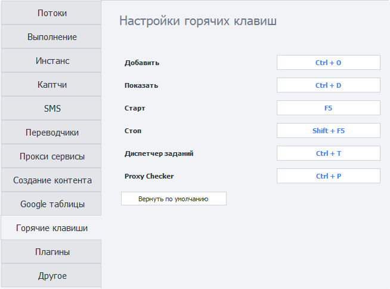

---
sidebar_position: 10
title: "Горячие клавиши ZennoPoster"
description: ""
date: "2025-09-10"
converted: true
originalFile: "Горячие клавиши ZennoPoster.txt"
targetUrl: "https://zennolab.atlassian.net/wiki/spaces/RU/pages/809107528/ZennoPoster"
---
:::info **Пожалуйста, ознакомьтесь с [*Правилами использования материалов на данном ресурсе*](../Disclaimer).**
:::

> 🔗 **[Оригинальная страница](https://zennolab.atlassian.net/wiki/spaces/RU/pages/809107528/ZennoPoster)** — Источник данного материала

_______________________________________________  
# Горячие клавиши ZennoPoster

## Описание

**Добавить** (`Ctrl + O` ) - открывает окно добавления нового проекта в программу.

**Показать** (`Ctrl + D` ) - открывает вкладку [❗→ Инстансы](https://zennolab.atlassian.net/wiki/spaces/RU/pages/853803144 "https://zennolab.atlassian.net/wiki/spaces/RU/pages/853803144") для выделенного проекта.

**Старт** (`F5`) - запуск выделенного проекта.

**Стоп** (`Shift + F5` ) - остановка выделенного проекта.

**Диспетчер заданий** (`Ctrl + T` ) - открывает окно [❗→ Диспетчера заданий](https://zennolab.atlassian.net/wiki/spaces/RU/pages/851116198 "https://zennolab.atlassian.net/wiki/spaces/RU/pages/851116198").

**Proxy Checker** (`Ctrl + P` ) - открывает окно управления [❗→ Proxy Checker'а](https://zennolab.atlassian.net/wiki/spaces/RU/pages/851705960 "https://zennolab.atlassian.net/wiki/spaces/RU/pages/851705960").

  

## Переназначение клавиш

Чтобы установить новую комбинацию достаточно кликнуть по интересующему Вас сочетанию и зажать желаемую комбинацию клавиш на клавиатуре

Пример

  

## Вернуть по умолчанию

С помощью данной кнопки можно вернуть значения клавиш на изначальные.
