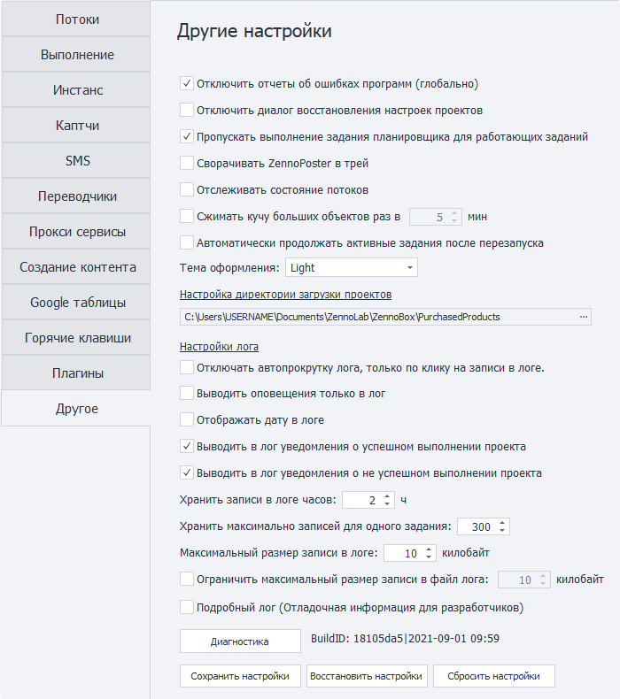
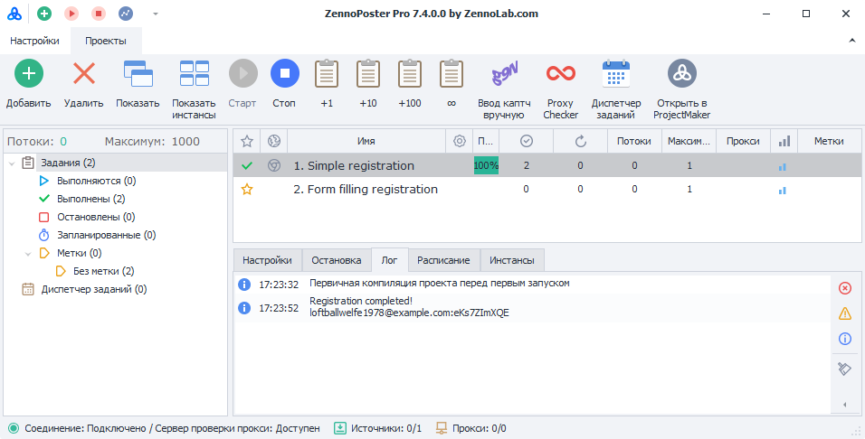
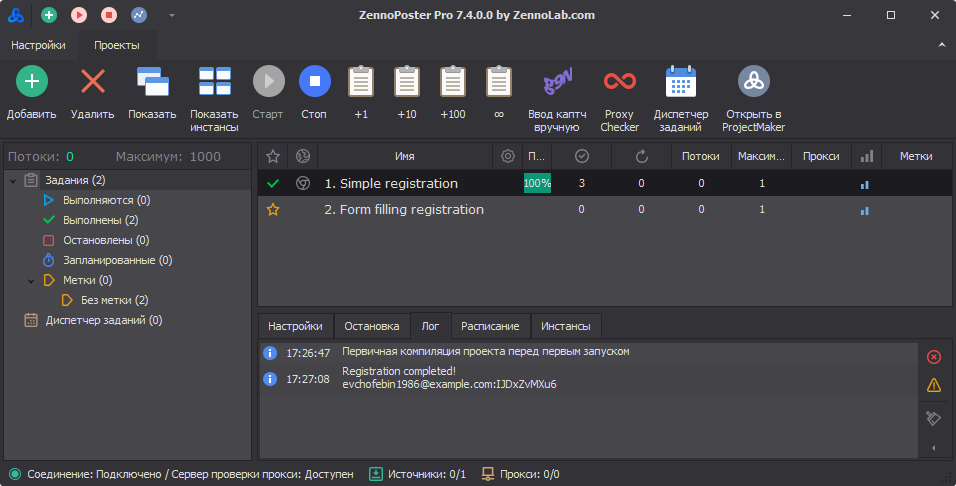
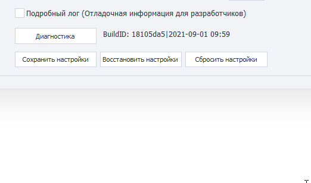

---
sidebar_position: 12
title: "Другие настройки ZennoPoster"
description: ""
date: "2025-09-10"
converted: true
originalFile: "Другие настройки ZennoPoster.txt"
targetUrl: "https://zennolab.atlassian.net/wiki/spaces/RU/pages/808779861/ZennoPoster"
---
:::info **Пожалуйста, ознакомьтесь с [*Правилами использования материалов на данном ресурсе*](../Disclaimer).**
:::

> 🔗 **[Оригинальная страница](https://zennolab.atlassian.net/wiki/spaces/RU/pages/808779861/ZennoPoster)** — Источник данного материала

_______________________________________________  
# Другие настройки ZennoPoster

  




## Общие настройки

### Отключить отчёты об ошибках программ (глобально)

Иногда из-за внутренних проблем браузера инстанс «падает», ZennoPoster это отлавливает, и восстанавливает работу упавшего инстанса. Если при падении инстанса будет висеть окно с сообщением о случившейся ошибке, то есть вероятность, что инстанс не сможет перезагрузиться.

### Отключить диалог восстановления настроек проектов

Отключает возможность восстановления настроек в случае аварийного завершения программы. Не рекомендуем отключать данную опцию. Она может пригодится в ситуации, когда данное окно блокирует автозапуск ZennoPoster.

### Пропускать выполнение задания планировщика для работающих заданий

Если проект выполняется на момент запуска в планировщике, то задание планировщика запустится только после окончания выполнения.

### Сворачивать ZennoPoster в трей

При сворачивании окна программы, она будет выгружаться в трей.

### Отслеживать состояние потоков

Включает отслеживание состояния потоков в программе. Для статистики. Не включайте, если эта информация не требуется при вашем обращении в поддержку.

### Сжимать кучу больших объектов

Через какой промежуток времени сжимать кучу больших объектов. Функция полезна при обработке больших строковых данных. Например, при включенном автопоиске в ProxyChecker.

### Автоматически продолжать активные задания после перезапуска

Нужно ли продолжать выполнение заданий, которые были активны до закрытия программы.

## Тема оформления

:::note На заметку
Данная настройка доступна только в ZennoPoster! О том как настроить внешний вид в ProjectMaker читайте в статье - [❗→ Внешний вид](https://zennolab.atlassian.net/wiki/spaces/RU/pages/808779861/ZennoPoster)
:::

### Light




### Dark




## Настройка директории загрузки проектов

:::note На заметку
Данная настройка доступна только в ZennoPoster!
:::

В данную папку будут сохранены проекты, которые Вам [❗→ будут проданы](https://zennolab.atlassian.net/wiki/spaces/RU/pages/494895200 "https://zennolab.atlassian.net/wiki/spaces/RU/pages/494895200") другими пользователями.

Для каждого продавца будет автоматически создаваться директория (в качестве имени будет использован либо email разработчика, либо его ZennoLab ID), а внутрь директорий будут загружены файлы проектов.

:::caution Важно
Вручную копировать проекты в эту папку нельзя!
:::

  

## Настройки лога

### Отключать автопрокрутку лога, только по клику на записи в логе

Автопрокрутка записей в логе будет отключаться только после клика по записи лога.

### Выводить оповещение только в лог

Сообщения выводимые с помощью [❗→ экшена **Оповещение**](https://zennolab.atlassian.net/wiki/spaces/RU/pages/534053050/Notification "https://zennolab.atlassian.net/wiki/spaces/RU/pages/534053050/Notification") будут выводиться только в лог, без всплывающего окна. Независимо от [❗→ настроек экшена](https://zennolab.atlassian.net/wiki/spaces/RU/pages/534053050/Notification#%D0%92%D1%8B%D0%B2%D0%BE%D0%B4%D0%B8%D1%82%D1%8C-%D1%82%D0%BE%D0%BB%D1%8C%D0%BA%D0%BE-%D0%B2-%D0%BB%D0%BE%D0%B3 "https://zennolab.atlassian.net/wiki/spaces/RU/pages/534053050/Notification#%D0%92%D1%8B%D0%B2%D0%BE%D0%B4%D0%B8%D1%82%D1%8C-%D1%82%D0%BE%D0%BB%D1%8C%D0%BA%D0%BE-%D0%B2-%D0%BB%D0%BE%D0%B3").

### Отображать дату в логе

Дополнительно показывать в логе текущую дату.

### Выводить в лог уведомления об успешном выполнении проекта

Оповещение в логе об успешном выполнении проекта.

### Выводить в лог уведомления о неуспешном выполнении проекта

Оповещение в логе неуспешном выполнении проекта.

### Хранить записи в логе часов

Максимальное время хранения записи в логе.

### Хранить максимально записей для одного задания

Количество записей в логе для одного задания. 

:::info Информация
Максимальное значение - 9999
:::

### Максимальный размер записи в логе

Ограничение на максимальный размер записи, которая может быть отображена в [❗→ окне лога](https://zennolab.atlassian.net/wiki/spaces/RU/pages/725352532 "https://zennolab.atlassian.net/wiki/spaces/RU/pages/725352532").

### Ограничить максимальный размер записи в файл лога

Данная настройка ограничивает размер записи, которая может быть сохранена в файл лога.

:::info Информация
Файлы логов хранятся в директории с установленным ZennoPoster в папке - ```Logs```.  
Возможный путь - ```C:\Program Files\ZennoLab\RU\ZennoPoster Pro V7\7.4.0.0\Progs\Logs\```
:::

:::note На заметку
Пользователям, которые работают с большими данными и которым не нужен полный лог, рекомендуется включить ограничение, т.к. это повысит производительность ZennoPoster и снизит потребление памяти.
:::

:::warning Внимание
Для вступления изменений требуется перезагрузка программы
:::

  

## Разное

### Подробный лог (Отладочная информация для разработчиков)

Записывает подробную информацию о работе, может потребоваться при обращении в поддержку.

### Диагностика

Диагностическая утилита (diagnostic.exe) для получения информации при возникновении проблем. После выполнения, в директории установленного ZennoPoster, будет создан файл report.zip

:::info Информация
Инструкция как правильно сделать Диагностику [❗→ находится по этой ссылке](https://zennolab.atlassian.net/wiki/spaces/RU/pages/808779861/ZennoPoster).
:::

### Сохранить настройки

Менеджер сохранения текущих настроек программы. Для сохранения настроек необходимо запустить менеджер и завершить работу программы.

### Восстановить настройки

Менеджер восстановления настроек программы, которые были сохранены менеджером сохранения настроек. Необходимо запустить менеджер и завершить работу программы.

### Сбросить настройки

Сброс текущих настроек программы на значения по умолчанию.

### BuildId

Данная строка состоит из комбинации букв и цифр, уникальной для каждой версии программы. А так же даты релиза.

Значение в этом поле можно выделить и скопировать с помощью контекстного меню (пример под спойлером)

<details>
<summary>Нажмите, чтобы развернуть</summary>




</details>

