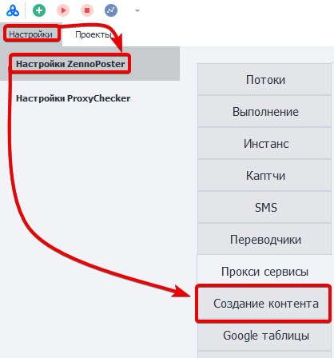
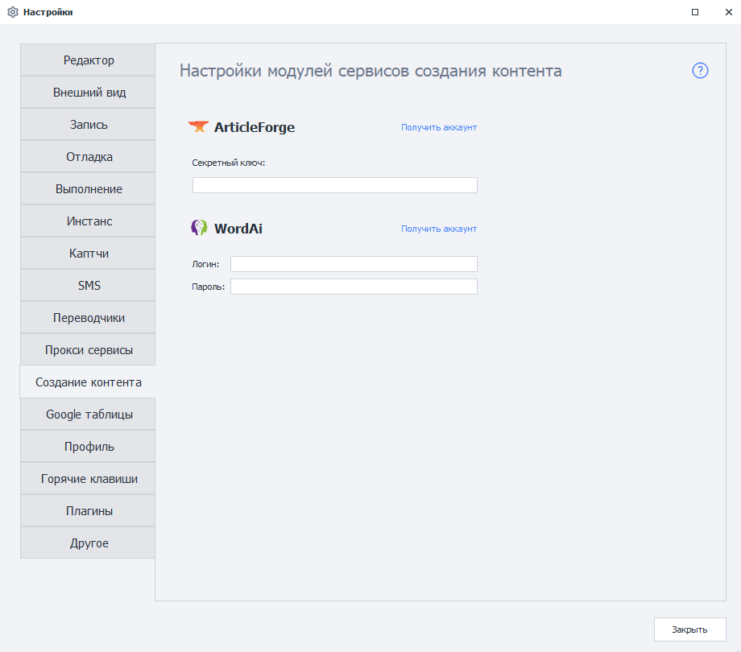
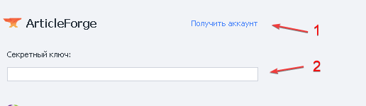
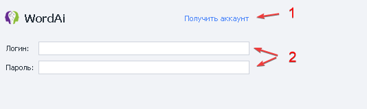

---
sidebar_position: 8
title: "Модули создания контента"
description: ""
date: "2025-09-10"
converted: true
originalFile: "Модули создания контента.txt"
targetUrl: "https://zennolab.atlassian.net/wiki/spaces/RU/pages/808812655"
---
:::info **Пожалуйста, ознакомьтесь с [*Правилами использования материалов на данном ресурсе*](../Disclaimer).**
:::

> 🔗 **[Оригинальная страница](https://zennolab.atlassian.net/wiki/spaces/RU/pages/808812655)** — Источник данного материала

_______________________________________________  
# Модули создания контента

## Описание

Позволяют создать контент на основе заданного текста с помощью сторонних сервисов. Технологии на основе искусственного интеллекта способны создать текстовку сравнимую с человеческим.

:::info Информация
Сервисы обрабатывают текст, написанный только на английском языке.
:::

  

## Как открыть это окно?

### ProjectMaker

- Через верхнее меню **Редактирование=&gt;Настройки=&gt;Создание контента**.

- Через [❗→ Стартовую страницу](https://zennolab.atlassian.net/wiki/spaces/RU/pages/735608964 "https://zennolab.atlassian.net/wiki/spaces/RU/pages/735608964")

### ZennoPoster

**Настройки=&gt;Настройки ZennoPoster=&gt;Создание контента**

### Внешний вид окна настроек

  

## Для чего это используется?

- Рерайтинг текста
- Создание уникального контента

## Как настроить сервисы?

### Настройка ArticleForge

1. Создать аккаунт, если необходимо.
2. Вносим ключ для идентификации на сервисе.

:::info Информация
Секретный ключ можно получить в личном кабинете
:::

  

### Настройка WordAi

1. Переход на страницу регистрации сервиса.
2. Вносим логин и пароль учетной записи.

  

## Как пользоваться созданием контента в шаблоне?

Подробнее об использовании этих сервисов в своих шаблонах, читайте в статье [❗→ Создание контента](https://zennolab.atlassian.net/wiki/spaces/RU/pages/489095179 "https://zennolab.atlassian.net/wiki/spaces/RU/pages/489095179") 

  

## Полезные ссылки

1. [❗→ Создание контента](https://zennolab.atlassian.net/wiki/spaces/RU/pages/489095179 "https://zennolab.atlassian.net/wiki/spaces/RU/pages/489095179")
2. [❗→ Стартовая страница](https://zennolab.atlassian.net/wiki/spaces/RU/pages/735608964 "https://zennolab.atlassian.net/wiki/spaces/RU/pages/735608964")

