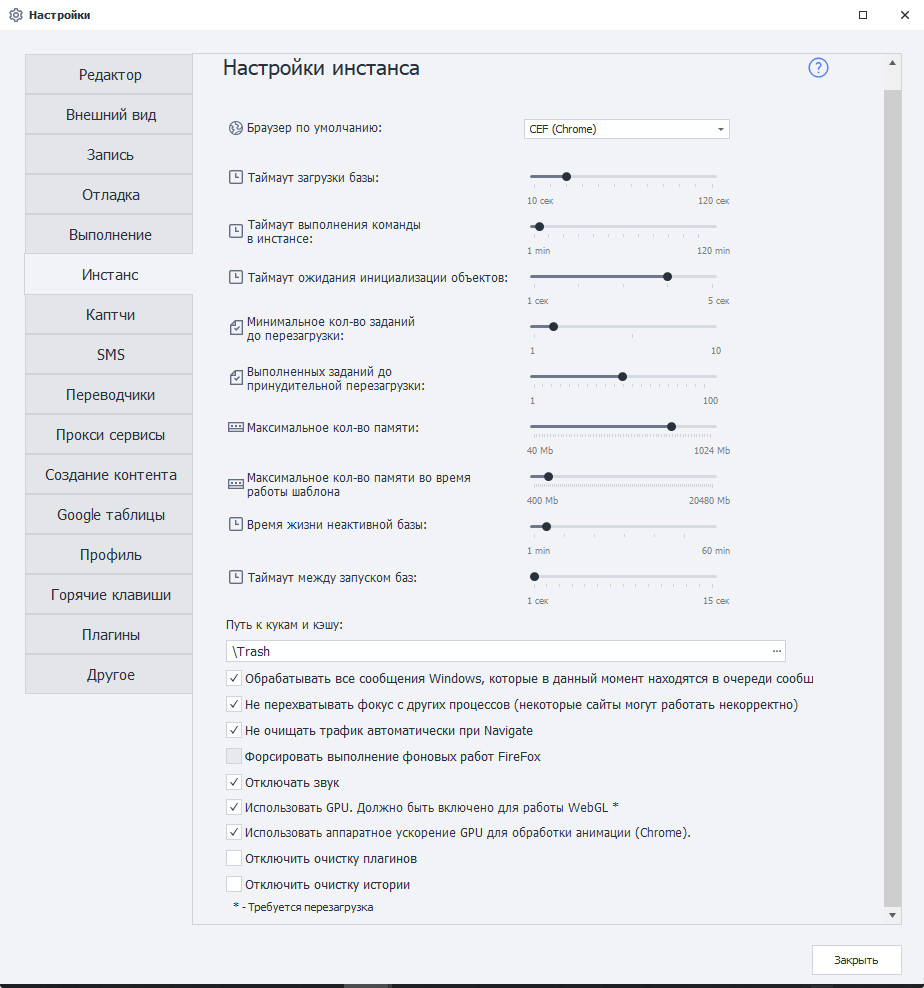

---
sidebar_position: 3
title: "Настройки инстанса"
description: ""
date: "2025-09-10"
converted: true
originalFile: "Настройки инстанса.txt"
targetUrl: "https://zennolab.atlassian.net/wiki/spaces/RU/pages/808845378"
---
:::info **Пожалуйста, ознакомьтесь с [*Правилами использования материалов на данном ресурсе*](../Disclaimer).**
:::

> 🔗 **[Оригинальная страница](https://zennolab.atlassian.net/wiki/spaces/RU/pages/808845378)** — Источник данного материала

_______________________________________________  
# Настройки инстанса

  




### Браузер по умолчанию

Выбор браузера, запускаемого по умолчанию. Изменить браузер можно и на уровне шаблона в [❗→ настройках проекта](https://zennolab.atlassian.net/wiki/spaces/RU/pages/534315477#%D0%A2%D0%B8%D0%BF-%D0%B1%D1%80%D0%B0%D1%83%D0%B7%D0%B5%D1%80%D0%B0 "https://zennolab.atlassian.net/wiki/spaces/RU/pages/534315477#%D0%A2%D0%B8%D0%BF-%D0%B1%D1%80%D0%B0%D1%83%D0%B7%D0%B5%D1%80%D0%B0"), либо через действие “[❗→ Запустить инстанс](https://zennolab.atlassian.net/wiki/spaces/RU/pages/489324572 "https://zennolab.atlassian.net/wiki/spaces/RU/pages/489324572")“.

:::warning Внимание
Настройка доступна только в ProjectMaker.
:::

### Таймаут загрузки базы

Время, отведенное для запуска нового потока в рамках запущенного процесса.

### Таймаут выполнения команды в инстансе

Время ожидания выполнения какой-либо команды в инстансе (любого [❗→ экшена](https://zennolab.atlassian.net/wiki/spaces/RU/pages/486342706/ProjectMaker "https://zennolab.atlassian.net/wiki/spaces/RU/pages/486342706/ProjectMaker")).

### Таймаут ожидания инициализации объектов 

Время, отведённое для дозагрузки web-страницы, иногда требуется для прогрузки некоторых элементов (например, каптчи). Иногда при неполной загрузке страницы выдаётся сообщение «не найден html-элемент». В таком случае можно попробовать увеличить этот параметр, но помните, его увеличение ведёт к увеличению времени выполнения шаблона.

### Минимальное кол-во заданий до перезагрузки

Пока не выполнится данное количество заданий, база инстансов не перезагрузится.

### Выполненных заданий до принудительной перезагрузки

Количество заданий, после которых база инстансов обязательно перезагрузится (независимо от успешности их выполнения). Также, принудительно выполнить рестарт инстанса можно с помощью действия “[❗→ Перезагрузить инстанс](https://zennolab.atlassian.net/wiki/spaces/RU/pages/489324572#%D0%9F%D0%B5%D1%80%D0%B5%D0%B7%D0%B0%D0%B3%D1%80%D1%83%D0%B7%D0%B8%D1%82%D1%8C-%D0%B8%D0%BD%D1%81%D1%82%D0%B0%D0%BD%D1%81 "https://zennolab.atlassian.net/wiki/spaces/RU/pages/489324572#%D0%9F%D0%B5%D1%80%D0%B5%D0%B7%D0%B0%D0%B3%D1%80%D1%83%D0%B7%D0%B8%D1%82%D1%8C-%D0%B8%D0%BD%D1%81%D1%82%D0%B0%D0%BD%D1%81")“ внутри шаблона.

### Максимальное кол-во памяти 

Максимально потребляемое количество памяти одним инстансом, после которого база инстансов будет принудительно помечена на перезагрузку.

### Максимальное кол-во памяти во время работы шаблона

:::info Информация
Добавлено в 7.4.0.0
:::

Лимит на количество выделяемой оперативной памяти для одного потока. Если во время работы поток превысит указанное в этой настройке значение, то он будет принудительно завершён с сообщением в [❗→ лог](https://zennolab.atlassian.net/wiki/spaces/RU/pages/725352532 "https://zennolab.atlassian.net/wiki/spaces/RU/pages/725352532") “Проект остановлен из-за превышения лимита занимаемой памяти”.

### Время жизни неактивной базы

Время жизни базы в неактивном состоянии.

### Таймаут между запуском баз 

Задержки между запуском баз. Позволяет предотвратить пиковые нагрузки CPU на слабых компьютерах.

### Путь к кукам и кэшу

Путь для хранения временных файлов (желательно хранить в папке с программой).

Так же в эту папку будут сохраняться файлы скачанные с помощью браузера ProjectMaker.

По умолчанию эта папка находится в директории установленной программы, путь к ней может выглядеть так 
```
C:\Program Files\ZennoLab\RU\ZennoPoster Pro V7\7.4.0.0\Progs\Trash\
```

### Обрабатывать все сообщения Windows, которые в данный момент находятся в очереди

Позволяет приложению обрабатывать все события, которые могут возникнуть при работе инстанса.

### Не перехватывать фокус с других процессов 

Позволяет избежать мерцания экрана и потери активного фокуса приложения при работе ZennoPoster, но нужно проверить, что ваши проекты не сломались, т.к. некоторые сайты требуют корректного переключения фокуса для браузера во время работы (например VK).

### Не очищать трафик автоматически при Navigate 

Отключает очистку лога запросов в [❗→ окне трафика](https://zennolab.atlassian.net/wiki/spaces/RU/pages/735805465 "https://zennolab.atlassian.net/wiki/spaces/RU/pages/735805465") при каждом переходе на страницу. Управление этой опцией доступно и на уровне шаблона из[❗→ C# кода](https://zennolab.atlassian.net/wiki/spaces/RU/pages/492011596 "https://zennolab.atlassian.net/wiki/spaces/RU/pages/492011596"):

```csharp
instance.ClearTrafficWhenNavigate = false; // Отключить очистку
instance.ClearTrafficWhenNavigate = true; // Включить очистку
```

### Форсировать выполнение фоновых работ FireFox

Позволяет форсировать работу инстанса при его зависании. Если у Вас нет непонятных зависаний при работе шаблона на сайте, лучше не используйте эту настройку.

### Отключить звук

Отключает звук при работе в инстансе.

### Использовать GPU. Должно быть включено для работы WEBGL 

Отрисовка выполнения действий проекта будет ускорена за счет использования графической карты. 

### Использовать аппаратное ускорение GPU для обработки анимации (Chrome)

Запрещает\Разрешает выполнять растеризацию на GPU.

:::warning Внимание
Включение этой настройки без встроенного GPU укорителя может приводить к нестабильной работе.
:::

### Отключить очистку плагинов 

Запрещает очистку плагинов для Firefox

### Отключить очистку истории

Запрещает очистку истории для Firefox

