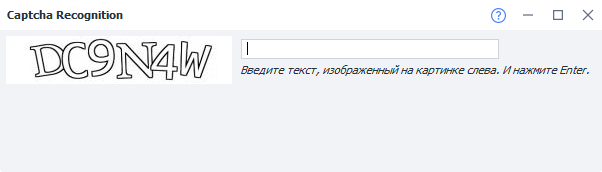

---
sidebar_position: 1
title: "Ввод капчи вручную"
description: ""
date: "2025-09-15"
converted: true
originalFile: "Ввод капчи вручную.txt"
targetUrl: "https://zennolab.atlassian.net/wiki/spaces/RU/pages/851705951"
---
:::info **Пожалуйста, ознакомьтесь с [*Правилами использования материалов на данном ресурсе*](../Disclaimer).**
:::

> 🔗 **[Оригинальная страница](https://zennolab.atlassian.net/wiki/spaces/RU/pages/851705951)** — Источник данного материала

_______________________________________________  
# Ввод капчи вручную

## Описание

Окно для ручного ввода капч. Появляется в том случае, если в [❗→ экшене распознавания капч](https://zennolab.atlassian.net/wiki/spaces/RU/pages/534053026 "https://zennolab.atlassian.net/wiki/spaces/RU/pages/534053026") был выбран *MonkeyEnter.dll в качестве модуля распознавания.

Если капчи будут поступать сразу из нескольких потоков, то они будут отображаться так:

  

## Полезные ссылки

- [❗→ Ввод капч вручную (ProjectMaker)](https://zennolab.atlassian.net/wiki/spaces/RU/pages/534053215 "https://zennolab.atlassian.net/wiki/spaces/RU/pages/534053215")
- [❗→ Экшен "Распознать каптчу"](https://zennolab.atlassian.net/wiki/spaces/RU/pages/534053026 "https://zennolab.atlassian.net/wiki/spaces/RU/pages/534053026")