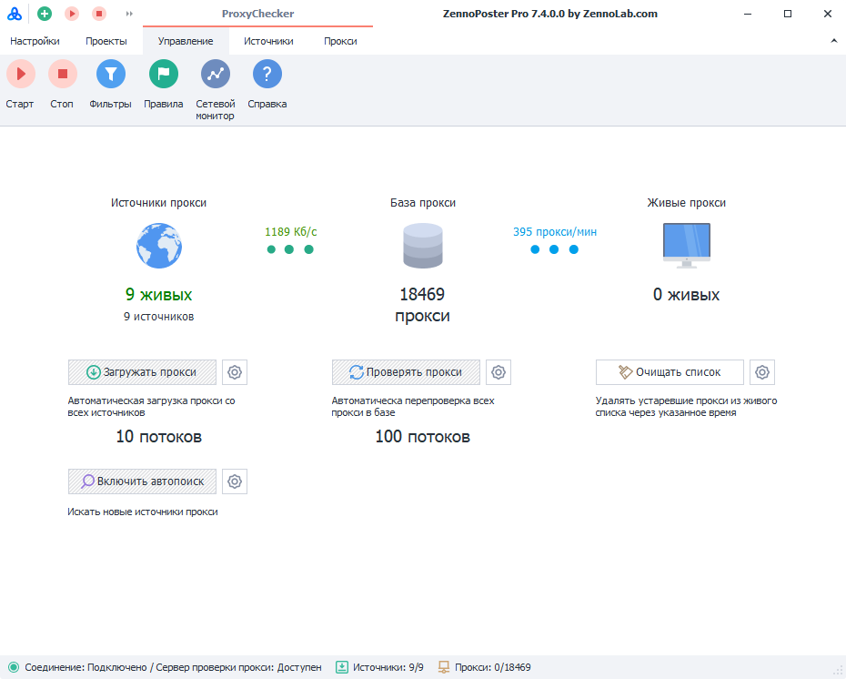

---
sidebar_position: 2
title: "ProxyChecker"
description: ""
date: "2025-09-15"
converted: true
originalFile: "ProxyChecker.txt"
targetUrl: "https://zennolab.atlassian.net/wiki/spaces/RU/pages/851705960/ProxyChecker"
---
import DisclaimerNotice from '@site/src/components/DisclaimerNotice';

<DisclaimerNotice />

> 🔗 **[Оригинальная страница](https://zennolab.atlassian.net/wiki/spaces/RU/pages/851705960/ProxyChecker)** — Источник данного материала

_______________________________________________  
# ProxyChecker

## Описание

ProxyChecker - это программный продукт, предназначенный для загрузки прокси, их хранения, автоматической перепроверки в соответствии с гибкими критериями.

ProxyChecker позволяет:

- Хранить источники проксей и удобно с ними работать.
- С заданной периодичностью загружать в хранилище с источников новые прокси.
- Устанавливать фильтры для всех источников и для каждого в отдельности.
- Гибко настраивать проверку проксей для каждого источника.

:::caution Важно
Ограничение встроенного в ZennoPoster ProxyChecker: нельзя выгружать список прокси.
:::

:::info Информация
Более подробную информацию о ProxyChecker Вы можете найти по этой ссылке - ZennoProxyChecker
:::

  

## Полезные ссылки

- [❗→ Настройки встроенного ProxyChecker](https://zennolab.atlassian.net/wiki/spaces/RU/pages/848560318 "https://zennolab.atlassian.net/wiki/spaces/RU/pages/848560318")