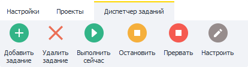
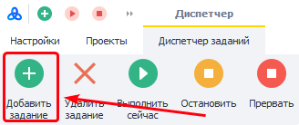
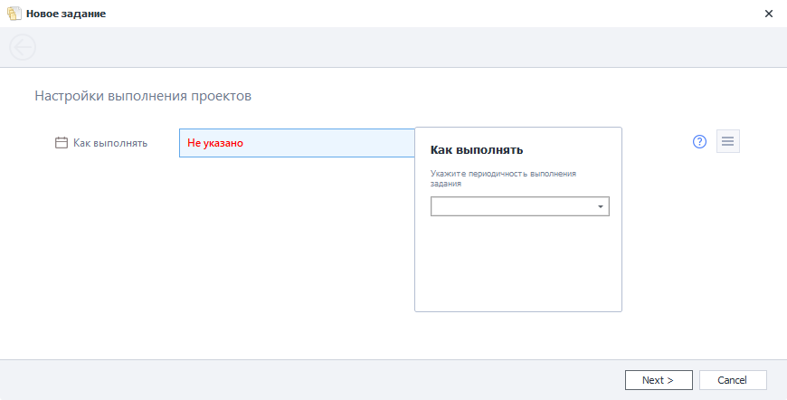
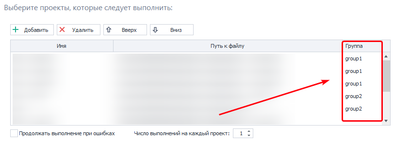
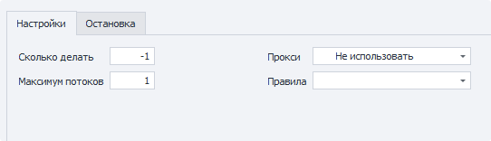
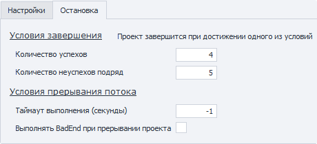
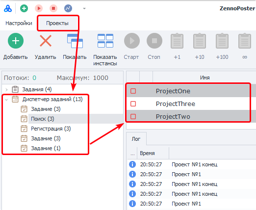

:::info **Пожалуйста, ознакомьтесь с [*Правилами использования материалов на данном ресурсе*](../Disclaimer).**
:::

> 🔗 **[Оригинальная страница](https://zennolab.atlassian.net/wiki/spaces/RU/pages/851116198)** — Источник данного материала

_______________________________________________  
## Описание

Диспетчер заданий позволяет настроить выполнение проектов по расписанию или по триггеру (появление файла по указанному пути).
Он очень похож на [❗→ Планировщик расписания](https://zennolab.atlassian.net/wiki/spaces/RU/pages/534086320 "https://zennolab.atlassian.net/wiki/spaces/RU/pages/534086320"), но в случае Планировщика нужно настраивать расписание для каждого проекта отдельно, а Диспетчер заданий позволяет создать задание, в котором будет находиться несколько проектов (выполняться проекты будут последовательно, сверху вниз). 

  

## Главное меню




### Добавить задание

Добавление нового задания в Диспетчер.
Подробнее процесс добавления описан ниже.

### Удалить задание

Удаление выделенного задания.

### Выполнить сейчас

Однократное выполнение задания.

### Остановить

Плавная остановка - текущий работающий шаблон доходит до логического конца и задание останавливается, даже если дальше в очереди этого задания есть ещё проекты на выполнение. Расписание тоже отключается.
Чтоб снова запустить расписание нужно повторно включить чекбокс напротив нужного задания в колонке “Включить”.

### Прервать

Резкая остановка работы.
Работа проекта будет немедленно прервана.

### Настроить

Данная кнопка активирует настройки для выделенного задания. Подробнее они описаны ниже.

  

## Создание нового задания

Для начала необходимо нажать кнопку “Добавить задание” в главном меню.

<details>
<summary>Скриншот</summary>




</details>
### Окно настройки расписания

После этого откроется новое окно, где сперва нужно настроить расписание для задания (подробнее о возможностях расписания можно почитать в статьях о [❗→ планировщике расписания](https://zennolab.atlassian.net/wiki/spaces/RU/pages/534086320 "https://zennolab.atlassian.net/wiki/spaces/RU/pages/534086320")).
После того, как Вы завершили настройку расписания нажмите кнопку “Next”.

<details>
<summary>Скриншот</summary>




</details>
### Окно добавления проектов


#### **Добавить**

После клика по кнопке открывается стандартный диалог выбора файлов. Можно выбрать сразу несколько шаблонов.

#### **Удалить**

Позволяет удалить выделенные шаблоны из задания.

#### **Вверх\вниз**

При старте задания проекты в нём будут выполняться по очереди - сверху вниз. С помощью данных кнопок Вы можете менять порядок шаблонов в очереди.

#### **Группа**




Позволяет группировать проекты внутри задания. 

Шаблоны *с одинаковым названием группы и *находящиеся по соседству друг с другом будут выполняться одновременно.
Управление перейдёт к следующей группе (или шаблону) только после того, как закончат работу все проекты внутри текущей группы.

В данную колонку можно вручную внести любое текстовое значение.

<details>
<summary>Пример</summary>

Напомню: одновременно выполняются только те задания, которые имеют одинаковую группу и находятся рядом друг с другом.

Задание содержит 7 проектов.

| **Имя проекта**<figure><div><div aria-disabled="false"><div></div></div></div></figure> | **Группа**<figure><div><div aria-disabled="false"><div></div></div></div></figure> |
| --- | --- |
| **Имя проекта**<figure><div><div aria-disabled="false"><div></div></div></div></figure> | **Группа**<figure><div><div aria-disabled="false"><div></div></div></div></figure> |
| --- | --- |
| Проект №1 | one |
| Проект №2 | one |
| Проект №3 | two |
| Проект №4 | two |
| Проект №5 | two |
| Проект №6 | one |
| Проект №7 | one |

После запуска задания одновременно стартуют Проект №1 и №2 (первая группа **one**). 
После того как предыдущие проекты завершат работу стартуют Проекты №3, №4 и №5 (группа **two**).
Когда они завершатся начнут выполняться Проекты №6 и №7 (вторая группа **one**)

</details>
#### **Продолжать выполнение при ошибках**

Если настройка включена, то выполнение перейдёт к следующему шаблону в очереди даже если текущий завершил работу с ошибками.

<details>
<summary>Пример</summary>

В задании 2 шаблона.

В первом происходит ошибка из-за которой он не может успешно завершиться. Далее может быть несколько вариантов развития событий.

- Если настройка “Продолжать выполнение при ошибках” будет вЫключена, то шаблон будет пытаться выполниться снова и снова, пока количество указанное в настройке “Количество неуспехов подряд” (вкладка “Остановка”, описано ниже в разделе “Настройка задания”) не будет достигнуто. После этого выполнение задания остановится и будет ожидать следующего запуска согласно настроенного Расписания.
- Если же настройка “Продолжать выполнение при ошибках” включена, то, снова-таки, шаблон будет пытаться выполниться снова и снова, пока количество указанное в настройке “Количество неуспехов подряд” не будет достигнуто, после его достижения выполнение перейдёт к следующему шаблону в очереди. И так, пока не кончатся все шаблоны в задании. После того, как последний проект закончит работу задание будет ожидать следующего запуска, согласно настроенного Расписания.

</details>
#### **Число выполнений на каждый проект**

Каждый проект в задании будет выполняться указанное в этой настройке количество раз.
Каждый проект выполняет попытки подряд, все сразу.

<details>
<summary>Пример</summary>

В задании 3 шаблона. В настройке “Число выполнений на каждый проект” - 3.

После старта задания запускается первый проект и он выполнится 3 раза подряд, затем стартует второй проект и он тоже выполнится 3 раза подряд, далее запустится и выполнит 3 попытки 3-й проект.
После этого задание будет считаться завершённым.

</details>

Затем нажмите “Next” и “Завершить”.

### Таблица заданий


Все добавленные задания отображаются в таблице заданий, которая состоит из следующих колонок:

**Включить -** включает\отключает выполнение задания по расписанию. Если чекбокс отмечен, значит задание включено.
**Название -** имя задания. По умолчанию каждое задание получает имя “Задание”. Изменить его можно в Настройках (описано ниже).
**Проекты -** список проектов, которые входят в это задание.
**Последний запуск -** время последнего запуска данного задания.
**Число выполнений -** сколько раз уже было выполнено данное задание.
**Следующий запуск -** Время следующего запуска, согласно настроенного Расписания.

**Сортировка -** задания можно сортировать по каждой из колонок, для этого достаточно кликнуть по её названию.

  

## Настройка задания

Существует несколько способов открыть настройки для задания:

- выделить и нажать кнопку “Настроить” в главном меню
- через контекстное меню
- двойной клик по заданию

### **Имя задания**

Здесь Вы можете указать новое имя.

### **Вкладка “Проекты в задании”**

#### **Редактирование списка заданий**

Верхняя часть вкладки состоит из уже знакомого Окна добавления проектов (описано выше в одноимённом разделе).


Тут Вы также можете *Добавить\Удалить проекты, *изменить очередность, настроить поведение при возникновении ошибок, изменить или назначить группы.

:::note На заметку
Дополнительно здесь можно открыть и заполнить входные настройки каждого из проектов. Для этого нужно дважды кликнуть по проекту.
:::

В нижней части окна расположено две других вкладки:

#### **Настройки**




:::caution Важно
Параметры настраиваются отдельно для каждого проекта в задании, а НЕ для всего задания!
:::

- *Сколько делать - сколько раз должен выполниться проект. Если стоит `-1` (минус один, бесконечное выполнение), то шаблон будет выполнен столько раз, сколько указано в настройке “Количество успехов” во вкладке Остановка.
- *Максимум потоков - количество одновременно работающих потоков для данного шаблона.
- *Прокси - стоит ли использовать прокси из встроенного [❗→ ProxyChecker](https://zennolab.atlassian.net/wiki/spaces/RU/pages/475365507 "https://zennolab.atlassian.net/wiki/spaces/RU/pages/475365507").
- *Правила - [❗→ правила](https://zennolab.atlassian.net/wiki/spaces/RU/pages/848560252 "https://zennolab.atlassian.net/wiki/spaces/RU/pages/848560252"), по которым будут браться прокси.

:::tip Совет
Подробнее об этих настройках можно прочитать в статье Настройки.
:::

#### **Остановка**




- *Количество успехов - по умолчанию здесь будет находиться число, которое Вы указали в настройке “Число выполнений на каждый проект” при создании задания (описано выше).
Если стоит `-1```json
 (минус один, бесконечное выполнение), то шаблон будет выполнен столько раз, сколько указано в “Сколько делать” во вкладке Настройки.
- *Количество неуспехов подряд - количество ошибок подряд, после достижения которого выполнение перейдёт к следующему шаблону в очереди или будет остановлено всё задание (поведение зависит от настройки “Продолжать выполнение при ошибках”, которая описана выше, в разделе “Окно добавления проектов”)
- *Таймаут выполнения (секунды) - если проект не выполнится за указанное здесь количество секунд, то он будет принудительно прерван.
- *Выполнить BadEnd при прерывании проекта - данная настройка позволит обрабатывать прерывания проекта по [❗→ BadEnd](https://zennolab.atlassian.net/wiki/spaces/RU/pages/534020265/Bad+End "https://zennolab.atlassian.net/wiki/spaces/RU/pages/534020265/Bad+End"). Учитывается, как ручное прерывание (с помощью кнопки “Прервать”), так и по таймауту.

:::caution Важно
Не ставьте в настройке “Количество неуспехов подряд” -1 (минус один), т.к. в случае возникновения ошибки в шаблоне он никогда не сможет завершиться!
:::

:::tip Совет
Подробнее об этих настройках можно прочитать в статье Остановка
:::

### **Вкладка “Условия выполнения”**

Здесь можно отредактировать расписание, по которому будет выполняться проект. 
Более подробно об этих настройках Вы можете прочитать в статьях о [❗→ планировщике расписания](https://zennolab.atlassian.net/wiki/spaces/RU/pages/534086320 "https://zennolab.atlassian.net/wiki/spaces/RU/pages/534086320").

  

## Как просмотреть лог выполнения проекта?

Для этого нужно перейти в Проекты, затем в [❗→ боковом меню](https://zennolab.atlassian.net/wiki/spaces/RU/pages/852787297 "https://zennolab.atlassian.net/wiki/spaces/RU/pages/852787297") выбрать задание, после чего в [❗→ таблице проектов](https://zennolab.atlassian.net/wiki/spaces/RU/pages/853737528 "https://zennolab.atlassian.net/wiki/spaces/RU/pages/853737528") выделить проект (или проекты; несколько можно выделить с зажатой клавишей CTRL или SHIFT). После этого будет активна [❗→ вкладка Лог](https://zennolab.atlassian.net/wiki/spaces/RU/pages/853737573 "https://zennolab.atlassian.net/wiki/spaces/RU/pages/853737573").




  

## Примеры

### Запуск в многопоточном режиме с разным количеством выполнений на каждый шаблон

<details>
<summary>Описание</summary>

После того, как добавили новое задание зайдите в его настройки.

- Выделите необходимый проект и перейдите во вкладку Настройки. 

 - В поле “Сколько делать” укажите желаемое число повторений.
 - В “Максимум потоков” количество потоков для этого проекта.
- После этого надо перейти во вкладку “Остановка”

 - в “Количество успехов” выставьте 
```-1` (минус один).

</details>
* * *

## Полезные ссылки

- [❗→ Планировщик расписания](https://zennolab.atlassian.net/wiki/spaces/RU/pages/534086320 "https://zennolab.atlassian.net/wiki/spaces/RU/pages/534086320")
- [❗→ Настройки](https://zennolab.atlassian.net/wiki/spaces/RU/pages/851574897 "https://zennolab.atlassian.net/wiki/spaces/RU/pages/851574897")