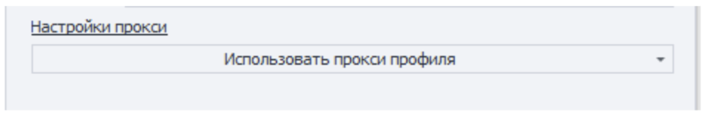

:::info **Пожалуйста, ознакомьтесь с [*Правилами использования материалов на данном ресурсе*](../Disclaimer).**
:::

> 🔗 **[Оригинальная страница](https://zennolab.atlassian.net/wiki/spaces/RU/pages/3670704134/ZennoPoster+7.8.6.0+02.07.2025)** — Источник данного материала

_______________________________________________  
# ZennoPoster 7.8.6.0 (02.07.2025)

## **ZennoPoster 7.8.6: улучшенная интеграция ZennoBrowser, Chromium 137 и другие обновления**

**Главное:**

**Настройка прокси в действии "Запустить инстанс ZennoBrowser"**

- Перед запуском профиля вы можете настроить прокси у профиля. По умолчанию выбран режим “Использовать прокси профиля”, в этом режиме ZennoPoster7 не будет менять прокси у профиля ZennoBrowser.

- Второй режим “Установить прокси” предоставляет строку для ввода прокси. Вы можете использовать макросы ZennoPoster7, как и в других действиях. Если вы выбираете этот режим и указываете прокси, ZennoPoster7 создаст специальную папку для прокси в ZennoBrowser с именем “ZP7 Proxies”, внутри этой папки ZennoPoster7 будет создавать прокси, которые вы указываете в настройках прокси при запуске, либо переиспользовать прокси, если такая уже добавлена.

- Если выбрать режим “Установить прокси” и оставить поле для прокси пустым, то перед запуском профиля ZennoPoster7 очистит прокси у профиля.

**Настройки прокси в действии "Удалить профили ZennoBrowser"**

При удалении профиля вы можете также удалить используемый им прокси с помощью опции “Удалить связанный прокси”.
Прокси будет удален, если он не используется другими профилями. В случае использования другими профилями, действие удалит профиль без прокси и выведет предупреждение о невозможности удаления прокси.

**Весь список изменений:**

+ Браузер Chromium обновлен до 137 версии.

+ В кубики Запустить инстанс ZennoBrowser и Получить профили ZennoBrowser добавлены логи об успешном выполнении.

+ Добавлены настройки прокси в действие Запустить инстанс ZennoBrowser. С помощью новой настройки можно переопределить прокси профиля перед запуском. Для этого выберете "Установить прокси" в настройках прокси и установите строку с прокси. Если строка будет пустая, то профиль запустится без прокси. Новые прокси добавляются в специальный список с именем "ZP7 proxies".

+ Добавлена опция "Удалить связанный прокси" в действии Удалить профиль ZennoBrowser. При включенной опции вместе с профилем будет удалена и прокси, если она не используется в других профилях ZennoBrowser.

+ Теперь браузер Chromium лучше представляется в качестве Safari. Новые эмуляции работают автоматически, определяя браузер на основе UserAgent. Так же режим имперсонации можно установить используя ключ: --impersonation=&lt;mode&gt;, где &lt;mode&gt;:

safari - режим Safari
auto - автоматический (режим выбирается на основе User Agent)
chromium - режим Chromium\

**Исправлено**:

- Исправлено автоматическое переподключение ZP7 к серверам ZennoLab. В том числе исправление влияет на получение профилей.
- Теперь действие "Создать профили ZennoBrowser" корректно ждёт создания большого количества профилей. В globalsettings для действия создания профилей добавлена новая настройка RemoteAgentCreateProfilesCallTimeoutSec со значением по умолчанию 900 секунд.

**Подробную информацию и инструкцию по настройке читайте в** [❗→ **этой статье**](https://zennolab.atlassian.net/wiki/spaces/RU/pages/3641737224 "https://zennolab.atlassian.net/wiki/spaces/RU/pages/3641737224")**.**

**Где скачать?**

ZennoPoster 7.8.6.0 уже доступен в [<u data-renderer-mark="true">личном кабинете</u>](https://account.zennolab.com/personal-area-main/?roistat_visit=1592899 "https://account.zennolab.com/personal-area-main/?roistat_visit=1592899")!
Также, обновление будет предложено при запуске ProjectMaker.

**Как сообщать о проблемах?**

Просьба сообщать обо всех багах в [<u data-renderer-mark="true">Багтрекере</u>](https://zennolab.com/discussion/threads/61815/?roistat_visit=1592899 "https://zennolab.com/discussion/threads/61815/?roistat_visit=1592899"), сопровождая проблему подробным описанием и сценарием воспроизведения. Это позволит нам быстро диагностировать и исправить ошибку.