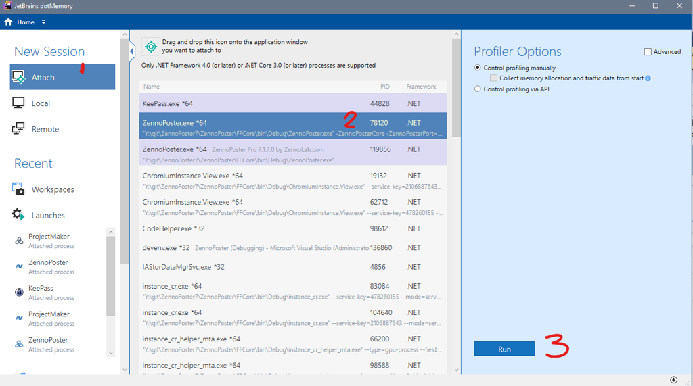

:::info **Пожалуйста, ознакомьтесь с [*Правилами использования материалов на данном ресурсе*](../Disclaimer).**
:::

> 🔗 **[Оригинальная страница](https://zennolab.atlassian.net/wiki/spaces/RU/pages/1474691080)** — Источник данного материала

_______________________________________________  
:::info Информация
ZennoPoster - сложная программа с огромным количеством функций и тысячами сценариев использования. Мы стараемся тестировать большинство из них, но 100% достигнуть непросто. Если у вас случилась ситуация, что программа начинает тормознить через некоторое время, нам очень поможет подробный отчет об ошибочном поведении программы в лично вашем случае. Эта информация поможет команде разработки устранить причину возникновения ошибки.
:::

### Ссылки на софт используемый в статье

[**Process Explorer**](https://docs.microsoft.com/en-us/sysinternals/downloads/process-explorer "https://docs.microsoft.com/en-us/sysinternals/downloads/process-explorer")

[**dotMemory**](https://www.jetbrains.com/dotmemory/download/#section=web-installer "https://www.jetbrains.com/dotmemory/download/#section=web-installer")

### Алгоритм записи утечки памяти (на примере ZennoPoster)

- Нужно проверить у какого из процессов утекает память, например через Process Explorer удобно смотреть в древовидном виде. В ZP7 два процесса ZennoPoster, отличить можно по наличию аргумента -ZennoPosterCore.
- Нужно запустить dotMemory, запустить ZennoPoster, в dotMemory сделать Attach к процессу с параметром -ZennoPosterCore если жрет память Core процесс или без этого аргумента если UI процесс.

- dotMemory подключится, нужно сделать несколько snapshot c помощью кнопки Get Snapshot: в начале работы, когда память начнет утекать, когда совсем много утечет памяти.
- После получения этих трех snapshot'ов , нужно сделать Detach или Kill Process.

- Далее нажать слева сверху на Home, перейти в Workspaces, верхний workspace должен быть текущим, можно проверить по дате.
- Нажать на кнопку Export у текущего workspace и отправить нам.

