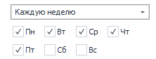
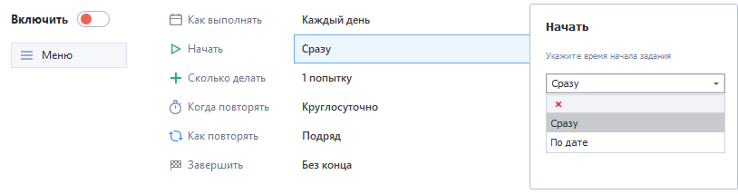

---
sidebar_position: 2
title: "Описание возможностей планировщика"
description: ""
date: "2025-09-10"
converted: true
originalFile: "Описание возможностей планировщика.txt"
targetUrl: "https://zennolab.atlassian.net/wiki/spaces/RU/pages/547258378"
---
:::info **Пожалуйста, ознакомьтесь с [*Правилами использования материалов на данном ресурсе*](../Disclaimer).**
:::

> 🔗 **[Оригинальная страница](https://zennolab.atlassian.net/wiki/spaces/RU/pages/547258378)** — Источник данного материала

_______________________________________________  
## Основные функции

## 1. Как выполнять

Данный пункт отвечает за настройку периодичности выполнения задания. Всего доступно 5 опций выполнения:

- **Один раз** — задание будет выполнено ровно один раз.
- **Каждый день** — задание будет выполняться каждый день с Пн по Вс.
- **Каждую неделю** — задание будет выполняться в указанные дни недели. Необходимые дни следует отметить в чекбоксах галочкой.

- **Каждый месяц** — задание будет выполняться в определенные даты. Отдельные числа месяца указываются через запятую, интервалы дат указываются через дефис. Пример: 1-5, 10, 20 (проект будет выполняться с 1 по 5 число месяца, а также 10 и 20 числа).

- **По сигналу** — выполнение задания будет начинаться при появлении загруженного файла. Если необходимо, чтобы файл удалялся после старта задания, отметьте чекбокс “Удалять файл” галочкой.

## 2. Начать

В данном разделе указывается способ и время начала выполнения задания. 

- **Сразу** — задание начнет выполняться сразу после включения планировщика.
- **По дате** — задание начнет выполняться в указанные дату и время.

## 3. Сколько делать

В данном поле указывается количество попыток выполнения проекта, которые необходимо добавить к заданию. Количество можно указать как точным числом, так и диапазоном, из которого число попыток будет выбрано случайным образом. Чтобы добавить диапазон, нужно нажать на ссылку “Указать диапазон”.

Чекбокс “Сбрасывать успехи” отвечает за сброс счетчика успехов с вкладки “Остановка”.

## 4. Когда повторять

В этом пункте указываются временные интервалы выполнения проекта. Для добавления интервала, необходимо нажать кнопку “Добавить интервал” ** и в появившемся окне указать временные рамки интервала. Чтобы добавить новый интервал , необходимо нажать на кнопку еще раз. Количество интервалов — неограниченно. 

Если интервалы не указаны, проект будет выполняться круглосуточно. Функция доступна в режимах выполнения “Каждый день”, “Каждую неделю” и “Каждый месяц”.

## 5. Как повторять

Данная функция управляет настройкой типа повторения выполнения проекта. Активируется в режимах выполнения “Каждый день”, “Каждую неделю” и “Каждый месяц”.

Доступны 4 способа повторения выполнения проекта: 

- **Подряд** — задание начнет выполняться заново сразу после завершения предыдущего повторения.
- **Подряд с паузой** — задание выполняется так же, как в режиме “Подряд”, но между повторами добавляется пауза. Паузу можно указать как точным числом, так и диапазоном, из которого время паузы будет выбрано случайным образом. Чтобы добавить диапазон, нужно нажать на ссылку “Указать диапазон”. Время указывается в минутах.

- **Регулярно** — задание начнет выполняться заново спустя указанное время вне зависимости от предыдущего повторения, как это сделано в режиме “Подряд с паузой”.
- **Распределить по интервалу** — повторы выполнения задания будут автоматически распределены по интервалам, указанным в поле “Когда повторять” (пункт 4).

## 6. Завершить

В данном пункте указывается условия завершения задания. Данная функция доступна в режимах выполнения “Каждый день”, “Каждую неделю” и “Каждый месяц”.

Доступны 3 способа завершения выполнения задания:

- **По дате** — проект будет выполняться до указанной даты и времени.
- **После N повторений** — проект будет завершен после выполнения точного количества повторений или любого числа из указанного диапазона. Чтобы добавить диапазон, нужно нажать на ссылку “Указать диапазон”.

- **Без конца** — проект будет выполняться неограниченное количество раз, пока не будет остановлен вручную.

