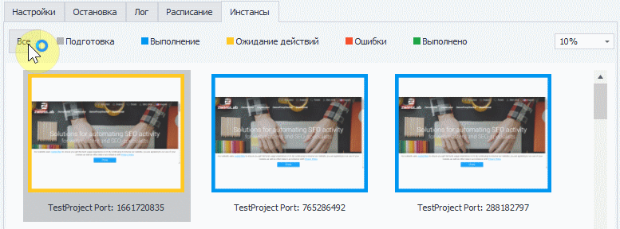
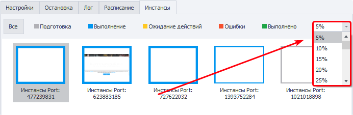
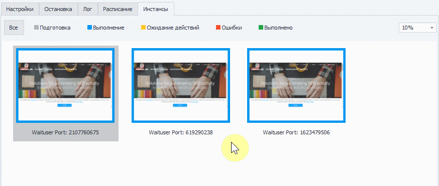
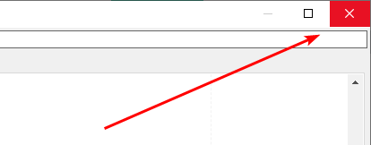
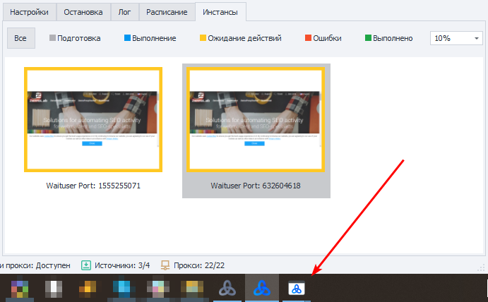
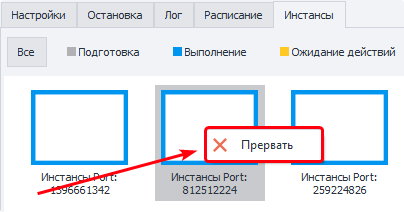

---
sidebar_position: 5
title: "Инстансы"
description: ""
date: "2025-09-10"
converted: true
originalFile: "Инстансы.txt"
targetUrl: "https://zennolab.atlassian.net/wiki/spaces/RU/pages/853803144"
---
:::info **Пожалуйста, ознакомьтесь с [*Правилами использования материалов на данном ресурсе*](../Disclaimer).**
:::

> 🔗 **[Оригинальная страница](https://zennolab.atlassian.net/wiki/spaces/RU/pages/853803144)** — Источник данного материала

_______________________________________________  
## Описание

В этой вкладке можно в реальном времени наблюдать за работой всех инстансов. 

  

## Статусы выполнения

Цвет рамки инстанса зависит от его текущего состояния.

- **Подготовка**
- **Выполнение**
- **Ожидание действий** ([❗→ Настройки браузера =&gt; Ожидание действий пользователя](https://zennolab.atlassian.net/wiki/spaces/RU/pages/489324572#%D0%9E%D0%B6%D0%B8%D0%B4%D0%B0%D0%BD%D0%B8%D0%B5-%D0%B4%D0%B5%D0%B9%D1%81%D1%82%D0%B2%D0%B8%D0%B9-%D0%BF%D0%BE%D0%BB%D1%8C%D0%B7%D0%BE%D0%B2%D0%B0%D1%82%D0%B5%D0%BB%D1%8F "https://zennolab.atlassian.net/wiki/spaces/RU/pages/489324572#%D0%9E%D0%B6%D0%B8%D0%B4%D0%B0%D0%BD%D0%B8%D0%B5-%D0%B4%D0%B5%D0%B9%D1%81%D1%82%D0%B2%D0%B8%D0%B9-%D0%BF%D0%BE%D0%BB%D1%8C%D0%B7%D0%BE%D0%B2%D0%B0%D1%82%D0%B5%D0%BB%D1%8F"))
- **Ошибки**
- **Выполнено**

### Фильтрация по статусу выполнения

Дополнительно Вы можете фильтровать отображение по текущему состоянию инстанса:

  

## Изменение масштаба

С помощью выпадающего списка в правой части вкладки можно изменить масштаб отображения.

Инстансы на скриншоте имеют масштаб 5%

  

## Открытие инстанса

Если дважды кликнуть по любой миниатюре, то откроется окно инстанса в реальном размере

Чтобы закрыть окно достаточно кликнуть по крестику в правом углу окна

## Инстансы в режиме “Ожидание действий пользователя”

Окна в режиме «[❗→ Ожидании действия пользователя](https://zennolab.atlassian.net/wiki/spaces/RU/pages/489324572#%D0%9E%D0%B6%D0%B8%D0%B4%D0%B0%D0%BD%D0%B8%D0%B5-%D0%B4%D0%B5%D0%B9%D1%81%D1%82%D0%B2%D0%B8%D0%B9-%D0%BF%D0%BE%D0%BB%D1%8C%D0%B7%D0%BE%D0%B2%D0%B0%D1%82%D0%B5%D0%BB%D1%8F "https://zennolab.atlassian.net/wiki/spaces/RU/pages/489324572#%D0%9E%D0%B6%D0%B8%D0%B4%D0%B0%D0%BD%D0%B8%D0%B5-%D0%B4%D0%B5%D0%B9%D1%81%D1%82%D0%B2%D0%B8%D0%B9-%D0%BF%D0%BE%D0%BB%D1%8C%D0%B7%D0%BE%D0%B2%D0%B0%D1%82%D0%B5%D0%BB%D1%8F")» отображаются на панели задач, их можно сворачивать и разворачивать. Однако, если у инстанса истекает таймаут ввода - он пропадает из панели.

  

## Прерывание работы инстанса

Вы можете прервать работу инстанса в любой момент. Для этого кликните по миниатюре необходимого инстанса и нажмите “Прервать”

  

## Полезные ссылки

- [❗→ Ожидание действий пользователя](https://zennolab.atlassian.net/wiki/spaces/RU/pages/489324572#%D0%9E%D0%B6%D0%B8%D0%B4%D0%B0%D0%BD%D0%B8%D0%B5-%D0%B4%D0%B5%D0%B9%D1%81%D1%82%D0%B2%D0%B8%D0%B9-%D0%BF%D0%BE%D0%BB%D1%8C%D0%B7%D0%BE%D0%B2%D0%B0%D1%82%D0%B5%D0%BB%D1%8F "https://zennolab.atlassian.net/wiki/spaces/RU/pages/489324572#%D0%9E%D0%B6%D0%B8%D0%B4%D0%B0%D0%BD%D0%B8%D0%B5-%D0%B4%D0%B5%D0%B9%D1%81%D1%82%D0%B2%D0%B8%D0%B9-%D0%BF%D0%BE%D0%BB%D1%8C%D0%B7%D0%BE%D0%B2%D0%B0%D1%82%D0%B5%D0%BB%D1%8F")
