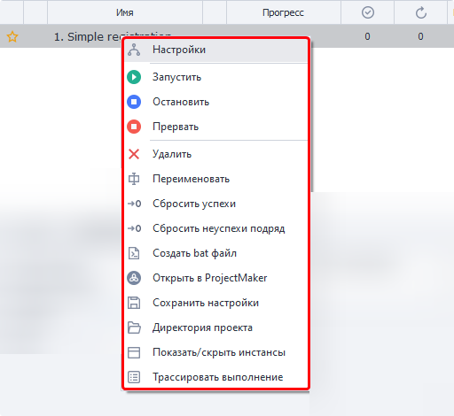
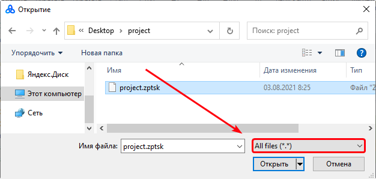

---
sidebar_position: 2
title: "Контекстное меню"
description: ""
date: "2025-09-10"
converted: true
originalFile: "Контекстное меню.txt"
targetUrl: "https://zennolab.atlassian.net/wiki/spaces/RU/pages/852885672"
---
:::info **Пожалуйста, ознакомьтесь с [*Правилами использования материалов на данном ресурсе*](../Disclaimer).**
:::

> 🔗 **[Оригинальная страница](https://zennolab.atlassian.net/wiki/spaces/RU/pages/852885672)** — Источник данного материала

_______________________________________________  
## Описание

Для открытия контекстного меню необходимо кликнуть ПКМ по проекту в [❗→ таблице проектов](https://zennolab.atlassian.net/wiki/spaces/RU/pages/853737528 "https://zennolab.atlassian.net/wiki/spaces/RU/pages/853737528").
Так же можно выделить сразу несколько шаблонов и нажать ПКМ, тогда выбранное действие будет применено сразу ко всем выделенным проектам.




  

## Пункты меню

### Настройки

Данный пункт открывает [❗→ входные настройки](https://zennolab.atlassian.net/wiki/spaces/RU/pages/1846051204/ZennoPoster "https://zennolab.atlassian.net/wiki/spaces/RU/pages/1846051204/ZennoPoster") проекта.
Также их можно открыть дважды кликнув по проекту.

### Запустить

Запускает выполнение шаблона.
Во вкладке “[❗→ Настройки проекта](https://zennolab.atlassian.net/wiki/spaces/RU/pages/851574897 "https://zennolab.atlassian.net/wiki/spaces/RU/pages/851574897")” должно быть выставлено количество потоков и количество повторений.

### Остановить

Плавная остановка работы.
При выборе данной функции все работающие потоки дойдут до своего логического конца и больше не будут запускаться, пока не будет нажата кнопка “Запустить”.

### Прервать

Резкое прерывание работы.
Работа проекта будет немедленно прервана.

### Удалить

Удаление шаблона из [❗→ таблицы проектов](https://zennolab.atlassian.net/wiki/spaces/RU/pages/853737528 "https://zennolab.atlassian.net/wiki/spaces/RU/pages/853737528").

### Переименовать

Данная функция позволяет изменить имя проекта.
Так же диалог переименования можно вызвать с помощью клавиши F2.

### Сбросить успехи, Сбросить неуспехи подряд

Позволяет сбросить счётчик (не)успехов в ноль.
Может быть полезно, когда [❗→ настроена остановка](https://zennolab.atlassian.net/wiki/spaces/RU/pages/852885665 "https://zennolab.atlassian.net/wiki/spaces/RU/pages/852885665") по их числу.

### Создать bat файл

Данная функция позволяет создать файл для запуска шаблонов.
Более подробно описано в статье [❗→ Создать bat файл](https://zennolab.atlassian.net/wiki/spaces/RU/pages/1940979747 "https://zennolab.atlassian.net/wiki/spaces/RU/pages/1940979747") 

### Открыть в ProjectMaker

Открывает выбранной шаблон в ProjectMaker на [❗→ редактирование](https://zennolab.atlassian.net/wiki/spaces/RU/pages/534052914 "https://zennolab.atlassian.net/wiki/spaces/RU/pages/534052914") (если у Вас есть [❗→ права на открытие и редактирование](https://zennolab.atlassian.net/wiki/spaces/RU/pages/534315498 "https://zennolab.atlassian.net/wiki/spaces/RU/pages/534315498") данного проекта).

### Сохранить настройки

С помощью данной функции можно сохранить все настройки и данные по проекту - количество потоков, количество выполнений, теги, условия остановки, текущий статус, id, расписание и др.

Расширение у итогового файла - `.zptsk`. Открыть файл можно с помощью любого текстового редактора (Notepad++, SublimeText и др.). Внутри данные сохранены в XML виде. 

Под спойлером пример данных.

<details>
<summary>Настройки в виде XML </summary>


```xml
<id>e6a601d1-fd0e-4198-a667-80614726186f</id>
 <name>ProjectZ</name>
 <isnewbie>True</isnewbie>
 <isenable>True</isenable>
 <createtime>08/08/2021 12:14:32</createtime>
 <settingstype>InputSettings</settingstype>
 
 
 <showautofilterrow>False</showautofilterrow>
 <executionsettings>
 <id>552d0abb-9629-4521-a960-c11ac9274676</id>
 <limitofthreads>1</limitofthreads>
 <maxallowofthreads>0</maxallowofthreads>
 <donesuccessfully>1</donesuccessfully>
 <doneall>1</doneall>
 <numberoftries>0</numberoftries>
 <lastnumberoftries>1</lastnumberoftries>
 <priority>100000</priority>
 <proxy>UseProxyWithoutRemove</proxy>
 <status>Complete</status>
 
 <shouldbeexecutedrandomly>False</shouldbeexecutedrandomly>
 <grouplabels>sometag</grouplabels>
 <groupstates>Выполнены</groupstates>
 <maxnumofsuccessstop>1024</maxnumofsuccessstop>
 <timeout>-1</timeout>
 <maxnumoffailstop>128</maxnumoffailstop>
 <numoffailstop>0</numoffailstop>
 <showtask>False</showtask>
 <tracetask>False</tracetask>
 <performbadendoninterrupt>True</performbadendoninterrupt>
 </executionsettings>
 <scheduler7settings>
 <id>e6a601d1-fd0e-4198-a667-80614726186f</id>
 <isactive>False</isactive>
 <executeperiod>EveryDay</executeperiod>
 <startdatetype>Immediately</startdatetype>
 <attemptsrange>12</attemptsrange>
 <isclearsuccess>False</isclearsuccess>
 <intervals>09:00 - 17:00</intervals>
 <stopexecutionoutsideofintervals>True</stopexecutionoutsideofintervals>
 <repeattype>Continued</repeattype>
 <enddatetype>Count</enddatetype>
 <repeatcounttotalrange>525252</repeatcounttotalrange>
 
 
 <taskname>ProjectZ</taskname>
 
 <isonetimerunning>False</isonetimerunning>
 <istaskrunning>False</istaskrunning>
 </scheduler7settings>
 <project>
 <projectfilelocation>C:\ProjectZ.zp</projectfilelocation>
 <projecttype>Assembly</projecttype>
 </project>
 <schedulersettings>
 <id>4095f5b5-141f-43a1-888e-fa809fe3404d</id>
 <startdate>08/08/2021 12:14:00</startdate>
 <schedulerondate>01/01/0001 00:00:00</schedulerondate>
 <enddate>08/08/2022 12:14:00</enddate>
 <repetitioncount>1</repetitioncount>
 <scheduletype>EveryMinutes</scheduletype>
 <repeattype>FinishAfter</repeattype>
 <activatetime>01/01/0001 00:00:00</activatetime>
 <activateworktime>01/01/0001 00:00:00</activateworktime>
 <isactive>False</isactive>
 <numberoftries>0</numberoftries>
 <minutes>1</minutes>
 <days>1</days>
 <lastscheduledate>01/01/0001 00:00:00</lastscheduledate>
 <nextscheduledate>null</nextscheduledate>
 <isclearsuccess>False</isclearsuccess>
 
 </schedulersettings>
 <purchasestate>None</purchasestate>
```


</details>
#### Как загрузить данные?

Загрузить эти настройки можно при помощи bat файла с таким содержимым:


```bash
"%ZennoPosterCurrentPath%\TasksRunner.exe" -o LoadSettings -o "c:\path\to\file.zptsk"
```


#### Для чего может пригодиться?

- можно динамически менять настройки проекта:

 - создать заранее несколько файлов настроек и загружать их с помощью экшена [❗→ Запуск программ](https://zennolab.atlassian.net/wiki/spaces/RU/pages/534315231 "https://zennolab.atlassian.net/wiki/spaces/RU/pages/534315231")
 - создавать файл динамически (с помощью [❗→ экшена работы с файлами](https://zennolab.atlassian.net/wiki/spaces/RU/pages/486309948 "https://zennolab.atlassian.net/wiki/spaces/RU/pages/486309948")), сохранять эти данные в файл и затем подгружать
- загрузка удалённого из [❗→ таблицы проектов](https://zennolab.atlassian.net/wiki/spaces/RU/pages/853737528 "https://zennolab.atlassian.net/wiki/spaces/RU/pages/853737528") шаблона:

<details>
<summary>Подробное описание процесса</summary>

Нажмите кнопку [❗→ Добавить](https://zennolab.atlassian.net/wiki/spaces/RU/pages/851116136#%D0%94%D0%BE%D0%B1%D0%B0%D0%B2%D0%B8%D1%82%D1%8C "https://zennolab.atlassian.net/wiki/spaces/RU/pages/851116136#%D0%94%D0%BE%D0%B1%D0%B0%D0%B2%D0%B8%D1%82%D1%8C") в [❗→ Главном меню](https://zennolab.atlassian.net/wiki/spaces/RU/pages/851116136 "https://zennolab.atlassian.net/wiki/spaces/RU/pages/851116136"), в открывшемся окне выбора файла выберите All files ( \* ) в правом нижнем углу (этим действием будет включено отображение файлов всех типов, а не только `.zp`)




После чего выберите файл сохранённых настроек `.zptsk`и нажмите кнопку “Открыть”. В таблицу проектов будет добавлен шаблон, со всеми его настройками.

</details>

### Директория проектов

В Проводнике откроется папка, где сохранён файл шаблона.

### Показать/скрыть инстансы

Активируется вкладка [❗→ Инстансы](https://zennolab.atlassian.net/wiki/spaces/RU/pages/853803144 "https://zennolab.atlassian.net/wiki/spaces/RU/pages/853803144").

### Трассировать выполнение

Будет запущена трассировка проекта. Подробнее - [❗→ трассировка проектов](https://zennolab.atlassian.net/wiki/spaces/RU/pages/494829586 "https://zennolab.atlassian.net/wiki/spaces/RU/pages/494829586")

* * *

## Полезные ссылки

- [❗→ Таблица проектов](https://zennolab.atlassian.net/wiki/spaces/RU/pages/853737528 "https://zennolab.atlassian.net/wiki/spaces/RU/pages/853737528")
- [❗→ Создать bat файл](https://zennolab.atlassian.net/wiki/spaces/RU/pages/1940979747 "https://zennolab.atlassian.net/wiki/spaces/RU/pages/1940979747")
- [❗→ Входные настройки](https://zennolab.atlassian.net/wiki/spaces/RU/pages/492339208 "https://zennolab.atlassian.net/wiki/spaces/RU/pages/492339208")
- [❗→ Параметры проекта](https://zennolab.atlassian.net/wiki/spaces/RU/pages/851574888 "https://zennolab.atlassian.net/wiki/spaces/RU/pages/851574888")
