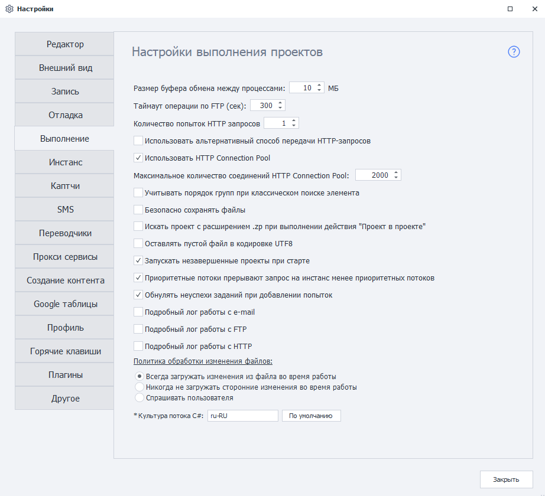

---
sidebar_position: 2
title: "Настройки выполнения проектов"
description: ""
date: "2025-09-10"
converted: true
originalFile: "Настройки выполнения проектов.txt"
targetUrl: "https://zennolab.atlassian.net/wiki/spaces/RU/pages/809074766"
---
:::info **Пожалуйста, ознакомьтесь с [*Правилами использования материалов на данном ресурсе*](../Disclaimer).**
:::

> 🔗 **[Оригинальная страница](https://zennolab.atlassian.net/wiki/spaces/RU/pages/809074766)** — Источник данного материала

_______________________________________________  

  

  

### Размер буфера обмена между процессами

Позволяет задать размер буфера между процессами от 10 до 1000 Мб. Данная настройка по-умолчанию (10) не требует изменений до тех пор, пока Вам напрямую не будет дана рекомендация по её изменению при наличии проблем. 

:::warning Внимание
Эту настройку не нужно понимать как «максимальный размер списка или таблицы», используемые в шаблоне. Она не имеет к этому отношения.
:::

### Таймаут операции по FTP (сек)

Время, которое затратит программа на ожидание выполнения операции по FTP.

### Количество попыток HTTP-запросов

Количество попыток для выполнения программой [❗→ HTTP-запроса](https://zennolab.atlassian.net/wiki/spaces/RU/pages/534085713 "https://zennolab.atlassian.net/wiki/spaces/RU/pages/534085713").

### Использовать альтернативный способ передачи HTTP-запросов

Использовать по умолчанию альтернативный способ передачи HTTP-запросов. Задаётся глобально для всей программы и всех новых проектов.

:::note На заметку
В ZennoPoster есть два метода работы с запросами - сторонняя разработка (стандартный метод, библиотека Chilkat) и собственная (альтернативный метод). Если при работе с HTTP-запросами с использованием стандартного метода у Вас что-то работает не так, то попробуйте переключиться на альтернативный метод. Сделать это можно и через Настройки проекта.
:::

### Использовать HTTP Connection Pool

Использование оптимизированной работы с HTTP-запросами, повышающее стабильность работы.

### Максимальное количество соединений HTTP Connection Pool

:::info Информация
Добавлено в 7.3.0.0
:::

Данная настройка позволяет ограничить количество соединений ZennoPoster и ProjectMaker, что позволяет стабилизировать работу программы с большим количеством HTTP-запросов.

### Учитывать порядок групп при классическом поиске элемента

Если включено, условия будут выполняться по порядку, следуя нумерации в колонке “Группа“.

### Использовать обновленный метод поиска элементов

:::info Информация
Настройка присутствует только в ZennoDroid. Добавлено в 2.4.2.0
:::

Классический поиск элемента

Актуально для экшенов использующих классический поиск: “Получить значение”, “Установить значение”, “Выполнить событие”.

До версии 2.4.2 при классическом поиске элементов не учитывалось первое условие в списке (при наличии двух и более условий). Экшен мог завершиться успехом даже если первое условие не выполнялось. 

Включение данной настройки исправляет проблему - первое условие будет учитываться.

Используйте с осторожностью. Возможно изменение в логике старых шаблонов.

### Безопасно сохранять файлы

Предотвращение порчи списков и файлов при внезапных перегрузках сервера.

### Искать проект с расширением .zp при выполнении действия “Проект в проекте”

:::info Информация
Добавлено в 7.4.0.0
:::

При включении данной настройки, если в действии "[❗→ Проект в проекте](https://zennolab.atlassian.net/wiki/spaces/RU/pages/489291822 "https://zennolab.atlassian.net/wiki/spaces/RU/pages/489291822")" используется проект старого формата с расширением .xmlz, то при его отсутствии будет искаться проект с таким же именем, но с новым расширением .zp

### Оставлять пустой файл в кодировке UTF8

Если во время выполнения шаблона список остаётся пустым, в нём будет сохраняться кодировка UTF-8.

### Запускать незавершенные проекты при старте

При старте программы будут запускаться незавершенные при прошлом запуске проекты, если в момент закрытия программы Вы выбрали такую опцию.

### Приоритетные потоки прерывают запросы менее приоритетных потоков

Позволяет учитывать приоритет потоков при обработке запросов в многопоточном выполнении шаблонов.

### Проверять соответствие введенных данных

:::warning Внимание
Настройка исключена из программы начиная с версии 7.1.7.0
:::

Проверка введённых данных в полях web-элементов. Если Вы столкнулись с проблемой, когда поле на сайте заполняется дважды, снимите эту галку.

### Обнулять неуспехи заданий при добавлении попыток

Сбрасывает счётчик неуспешных выполнений при добавлении попыток выполнения.

### Подробный лог работы с e-mail

Включает подробный лог для операций по работе с e-mail.

### Подробный лог работы с FTP

Включает подробный лог операций по работе с FTP.

### Подробный лог работы с HTTP

Включает подробный лог операций по работе c HTTP.

### <u data-renderer-mark="true">Политика обработки изменения файлов:</u>

Здесь задаётся то, как будет вести себя программа при внешних изменениях файлов, которые привязаны к спискам и таблицам,

#### Всегда загружать изменения из файла во время работы

Программа будет загружать обновления файла.

#### Никогда не загружать сторонние изменения во время работы

Программа загрузит файл в начале работы и не будет загружать его изменения.

#### Спрашивать пользователя

Программа будет запрашивать у пользователя подтверждение на загрузку изменений файла.

### Культура потока C#

:::info Информация
Добавлено в 7.3.1.0
:::

Настройка влияет на язык локализации потока (культура) выполнения и отладки проектов и [❗→ C# кубиков](https://zennolab.atlassian.net/wiki/spaces/RU/pages/492011596 "https://zennolab.atlassian.net/wiki/spaces/RU/pages/492011596"). В русской версии установлена по умолчанию "ru-RU", может влиять на парсинг дат, чисел с десятичной запятой и другое.

:::note На заметку
Для установки InvariantCulture необходимо из поля ввода всё удалить и оставить пустую строку.
:::

:::note На заметку
Для вступления изменений в силу связанных со сменой культуры потока C# необходима перезагрузка программы.
:::

