---
sidebar_position: 6
title: "Переводчики ZennoPoster"
description: ""
date: "2025-09-10"
converted: true
originalFile: "Переводчики ZennoPoster.txt"
targetUrl: "https://zennolab.atlassian.net/wiki/spaces/RU/pages/808747136/ZennoPoster"
---
:::info **Пожалуйста, ознакомьтесь с [*Правилами использования материалов на данном ресурсе*](../Disclaimer).**
:::

> 🔗 **[Оригинальная страница](https://zennolab.atlassian.net/wiki/spaces/RU/pages/808747136/ZennoPoster)** — Источник данного материала

_______________________________________________  
## Описание

В этом разделе вводятся данные для использования сервисов автоматического перевода в ходе выполнения проекта.

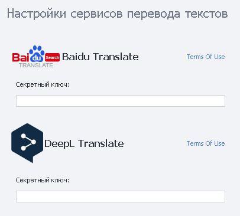

## Как открыть окно?

Или через [❗→ стартовую страницу](https://zennolab.atlassian.net/wiki/spaces/RU/pages/735608964 "https://zennolab.atlassian.net/wiki/spaces/RU/pages/735608964") ProjectMaker

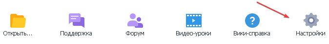

Выбираем раздел

## Для чего это используется?

- Перевод статей
- Перевод текста сообщения на определенный язык получателя
- Перевод текста для работы ботов-автоответчиков

## Как настроить сервисы?

### Настройка Baidu Translate

:::info Информация
Родной язык ресурса - китайский. Для удобства использования воспользуйтесь браузером со встроенным переводчиком.
:::

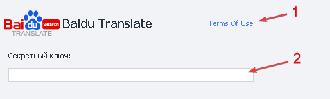

1. Переход на инструкцию использования сервиса для настройки экшена [❗→ Обработка текста](https://zennolab.atlassian.net/wiki/spaces/RU/pages/488865793 "https://zennolab.atlassian.net/wiki/spaces/RU/pages/488865793").
2. Секретный ключ для идентификации на сервере.

Как получить Секретный Ключ

- Заходим на сайт сервиса - https://fanyi.baidu.com/
- Наводим курсор на указанный иероглиф

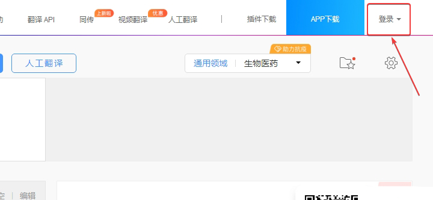

- Появится выплывающее окно для авторизации

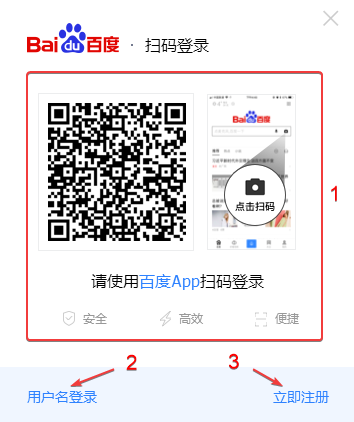

1. Авторизоваться через приложение.
2. Ввести логин и пароль.
3. Зарегистрироваться в сервисе.

### Авторизация в сервисе

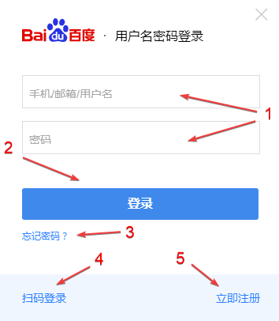

1. Вводим логин и пароль в соответствующие поля.
2. Кнопка авторизации.
3. Восстановление пароля.
4. Вернутся к авторизации через приложение.
5. Зарегистрировать аккаунт.

### Зарегистрироваться новую учетную запись

В окне авторизации выбираем *Зарегистрироваться

Открывается страница ввода данных для новой учётной записи

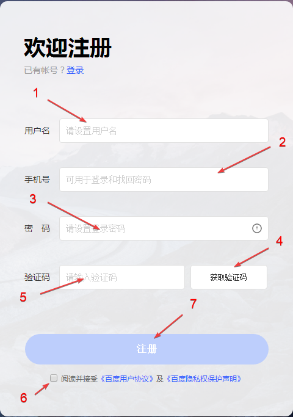

1. Задаём имя пользователя.
2. Указываем номер без кода страны.
3. Пароль учитывая рекомендации сервиса.
4. Нажимаем кнопку принять смс.
5. Вносим код активации.
6. Соглашаемся с условиями пользования сайта.
7. Нажимаем Регистрация.

Сервис принимает **только** китайские номера телефонов, могут попросить отправить смс на номер.

После регистрации в личном кабинете копируем ключ и вставляем в **Настройки**.

  

### Настройка Deepl Translate

1. Переход на инструкцию использования сервиса для настройки экшена [❗→ Обработка текста](https://zennolab.atlassian.net/wiki/spaces/RU/pages/488865793 "https://zennolab.atlassian.net/wiki/spaces/RU/pages/488865793").
2. Секретный ключ для идентификации на сервере.

:::info Информация
Сервис временно не работает с гражданами и компаниями из Российской Федерации. Но если у вас есть действующий платежный адрес и способ оплаты из страны Европейского Союза, Швейцарии, Великобритании, США, Канады или Японии, вы можете получить доступ к DeepL Pro, введя эти данные в регистрационную форму.
:::

Как получить Секретный Ключ

Необходимо зарегистрироваться и авторизоваться на сайте.

- Переходим на сайт https://www.deepl.com/translator , наводим курсор в правый верхний угол

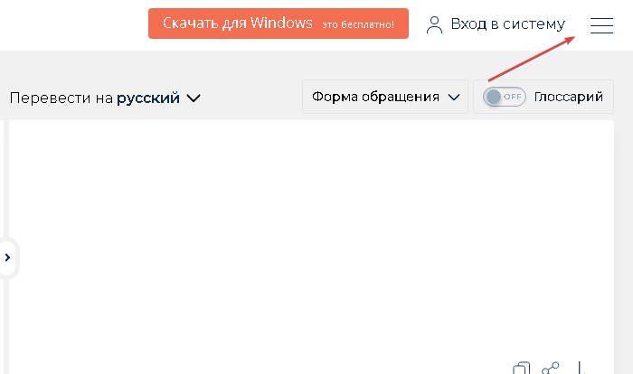

- В открывшемся меню выбираем *Тарифные планы и расценки

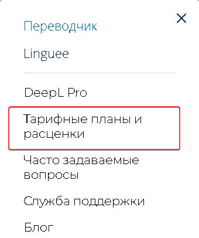

- Необходимо выбрать тарифы *Для разработчиков

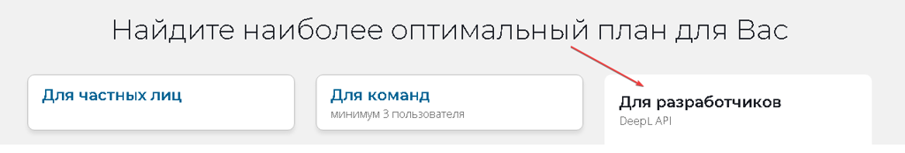

- На данный момент у сервиса представлен один тариф, выбираем его

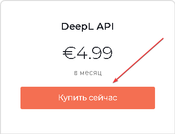

Стоимость тарифа может отличаться в зависимости от страны

- В открывшемся окне *Регистрация заполняем соответствующие поля и нажимаем *Продолжить

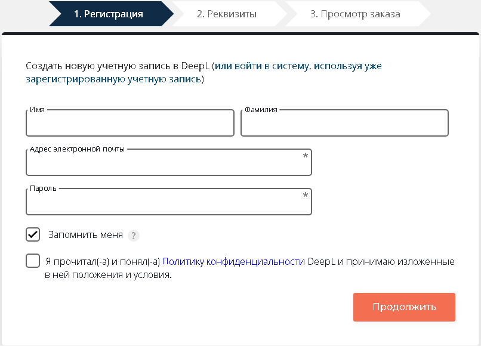

Если у вас уже есть учетная запись нажимаем вверху страницы и вводим данные от аккаунта

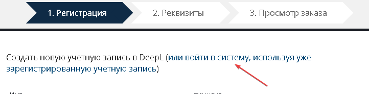

- Во вкладке *Реквизиты очень внимательно изучите условия пользования тарифным планом и только после этого переходите к заполнению.

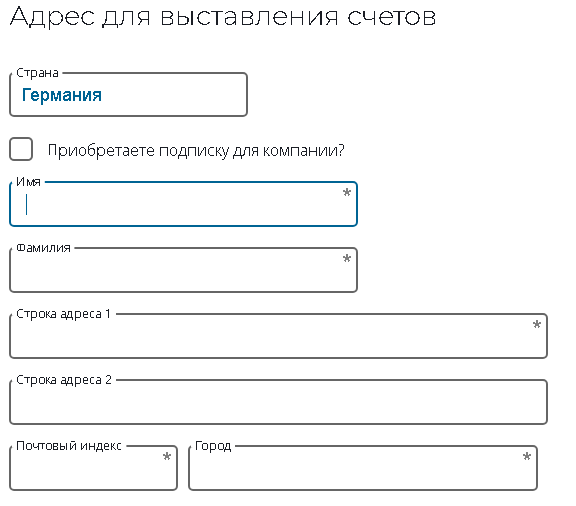

Сервис проверяет введённые данные

Доступные методы оплаты

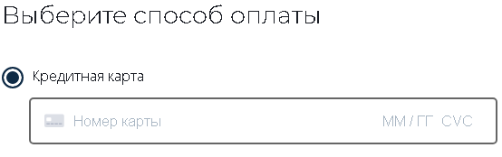

- После заполнения всех реквизитов произведите оплату тарифного плана
- Переходим в личный кабинет и копируем *Секретный ключ

  

### Настройка Google Translate via Api

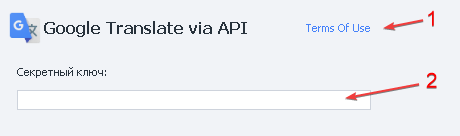

1. Переход на инструкцию использования сервиса для настройки экшена [❗→ Обработка текста](https://zennolab.atlassian.net/wiki/spaces/RU/pages/488865793 "https://zennolab.atlassian.net/wiki/spaces/RU/pages/488865793").
2. Секретный ключ для идентификации на сервере.

:::info Информация
Перед использованием изучите тарификацию
:::

Как получить Секретный Ключ

- Переходим на сайт https://www.google.com/ и в правом верхнем углу нажимаем кнопку *Войти

- Вводим данные от учетной записи для входа в аккаунт

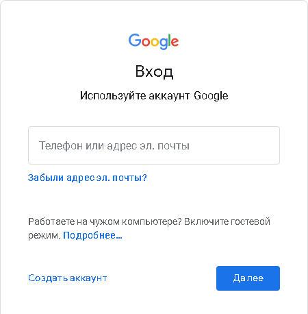

- Переходим на страницу https://console.cloud.google.com, отмечаем необходимые чек-боксы и принимаем условия пользования сервисом

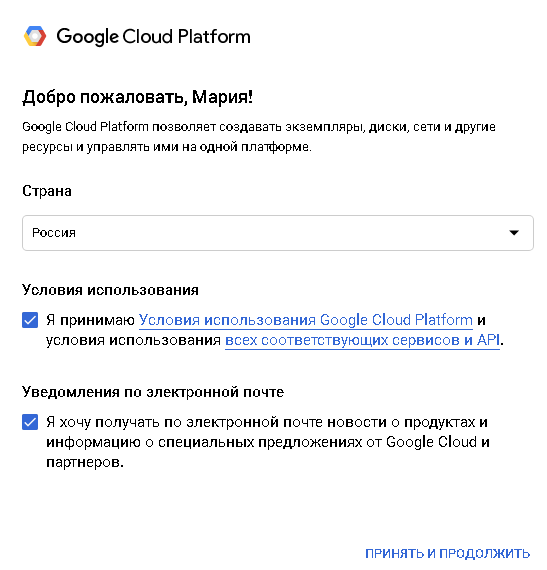

- Нажимаем на меню проектов

- Переходим к окну создания проектов и заполняем соответствующие поля, нажимаем *Создать проект

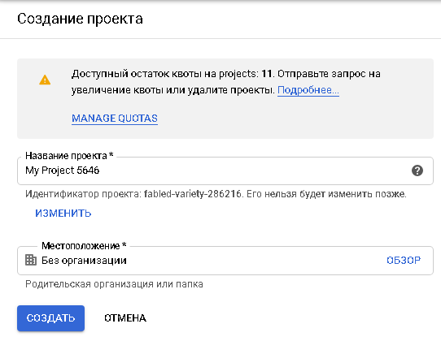

- Переходим на страницу для добавления необходимой библиотеки https://console.developers.google.com/apis/library/translate.googleapis.com
- Активируем API

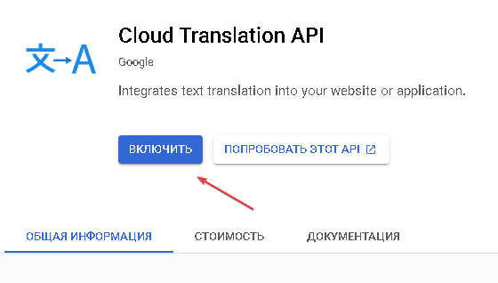

Предварительно нужно создать платёжный аккаунт

- После выдачи *Секретного ключа (API key) копируем его в соответствующее поле

  

### Настройка Google Translate via Web Interface

Настройка данного метода не требуется.

:::info Информация
Сервис перевода контента полностью бесплатный
:::

  

### Настройка Microsoft Translation

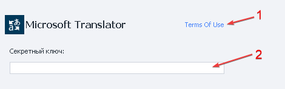

1. Переход на инструкцию использования сервиса для настройки экшена [❗→ Обработка текста](https://zennolab.atlassian.net/wiki/spaces/RU/pages/488865793 "https://zennolab.atlassian.net/wiki/spaces/RU/pages/488865793").
2. Секретный ключ для идентификации на сервере.

:::info Информация
Имеется 30-ти дневный пробный период
:::

Как получить Секретный Ключ

- Переходим на сайт https://azure.microsoft.com/ru-ru/free/ и в верхнем правом углу нажимаем *Войти

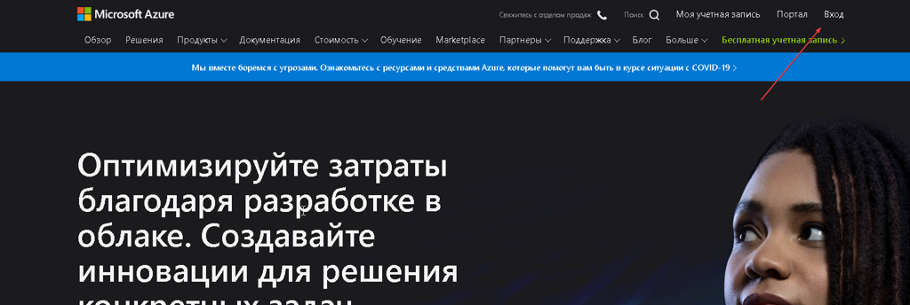

- Вводим данные от учетной записи

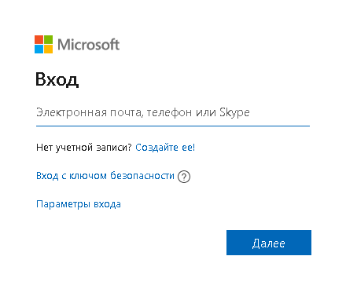

- На главное странице выбираем создать бесплатную учетную запись

- Заполняем данные учетной записи,номер телефона и реквизиты

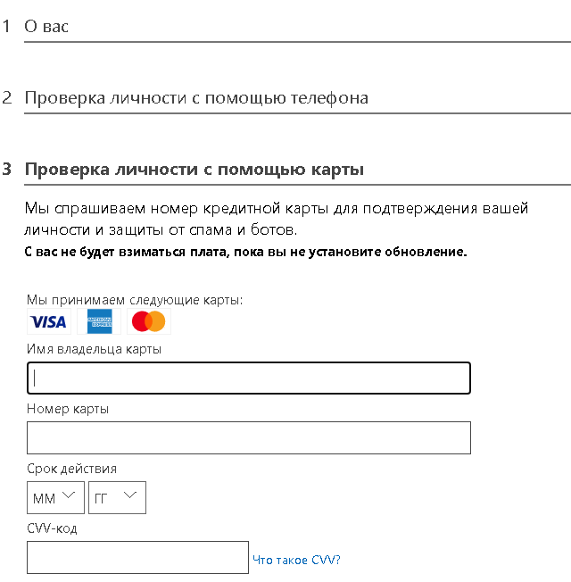

- После получения пробного периода переходим на портал https://portal.azure.com и нажимаем *Создать ресурс

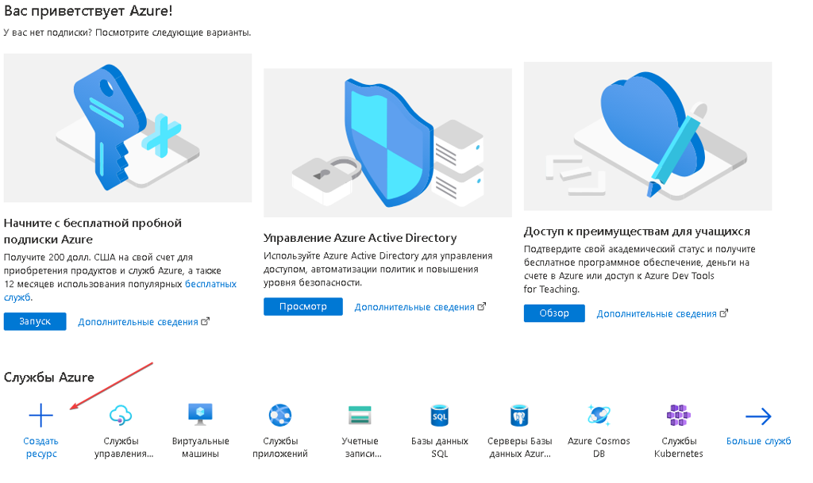

- В поисковой строке задаём *Переводчик и ждём появление результата, переходим

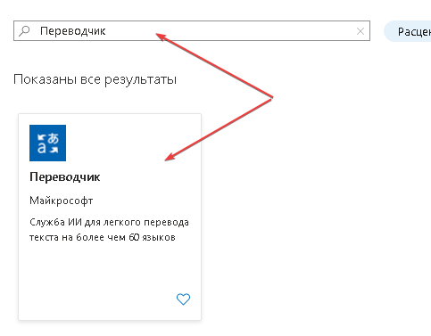

- Нажимаем создать

Внимательно ознакомьтесь с тарифными планами

- После выдачи *Секретного ключа (API key) копируем его в соответствующее поле

  

### Настройка Yandex Translate

1. Переход на инструкцию использования сервиса для настройки экшена [❗→ Обработка текста](https://zennolab.atlassian.net/wiki/spaces/RU/pages/488865793 "https://zennolab.atlassian.net/wiki/spaces/RU/pages/488865793").
2. Секретный ключ для идентификации на сервере.

:::info Информация
Яндекс приостановил выдачу бесплатных ключей. С 15.08.2020 все выданные ранее ключи будут заблокированы
:::

Как получить Секретный Ключ

- Переходим на страницу https://translate.yandex.ru/developers/keys

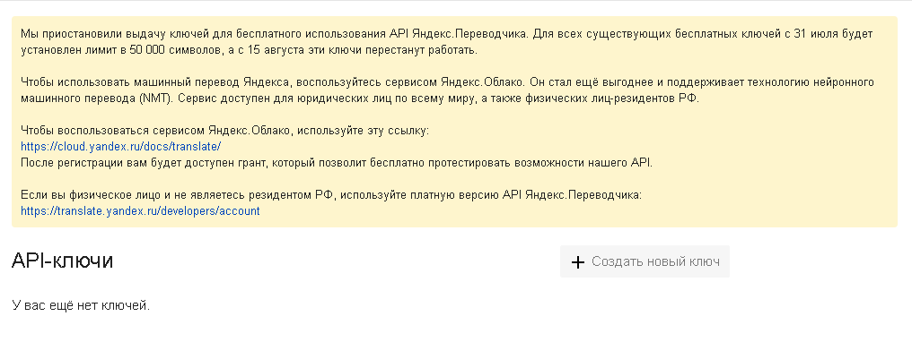

- Следуя новым инструкциям создаём ключ

Для получения ключа необходим платежный аккаунт

- После выдачи *Секретного ключа (API key) копируем его в соответствующее поле

  

## Пример использования

Перевести фразу с русского на английский и отправить сообщение.

1. Получаем строку с текстом из [❗→ списка](https://zennolab.atlassian.net/wiki/spaces/RU/pages/534053375 "https://zennolab.atlassian.net/wiki/spaces/RU/pages/534053375").
2. Добавляем экшен [❗→ Обработка текста](https://zennolab.atlassian.net/wiki/spaces/RU/pages/488865793 "https://zennolab.atlassian.net/wiki/spaces/RU/pages/488865793").
3. Настраиваем функцию перевода, указав сервис и параметры.
4. Отправляем сообщение адресату.

Таким образом, используя сервисы, можно в ходе выполнения проекта выполнять перевод контента.

  

## Полезные ссылки

1. [❗→ Обработка текста](https://zennolab.atlassian.net/wiki/spaces/RU/pages/488865793 "https://zennolab.atlassian.net/wiki/spaces/RU/pages/488865793")
