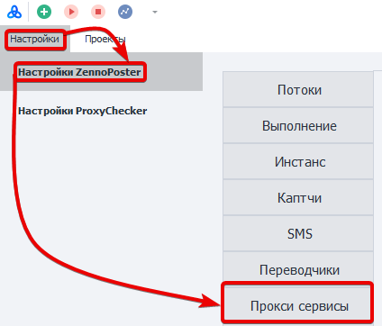
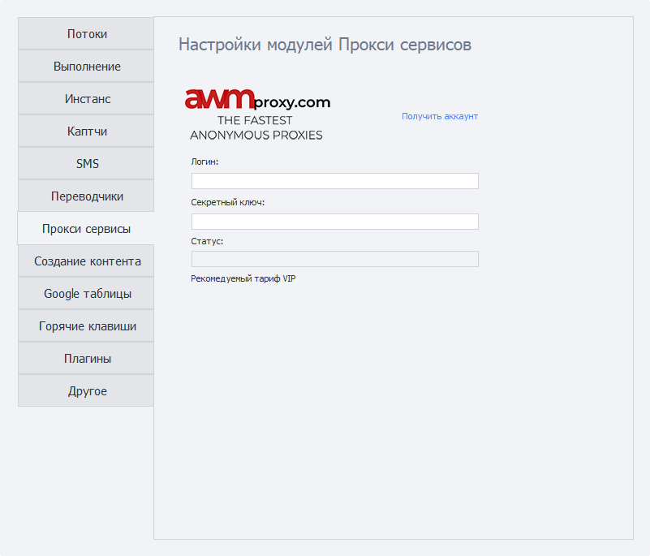
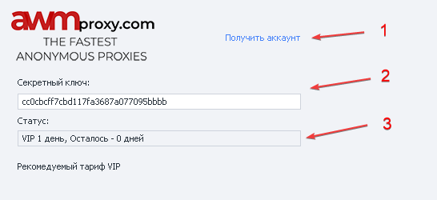
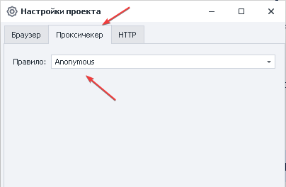
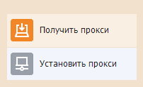

---
sidebar_position: 7
title: "Прокси-сервисы"
description: ""
date: "2025-09-10"
converted: true
originalFile: "Прокси-сервисы.txt"
targetUrl: "https://zennolab.atlassian.net/wiki/spaces/RU/pages/809140312/-"
---
:::info **Пожалуйста, ознакомьтесь с [*Правилами использования материалов на данном ресурсе*](../Disclaimer).**
:::

> 🔗 **[Оригинальная страница](https://zennolab.atlassian.net/wiki/spaces/RU/pages/809140312/-)** — Источник данного материала

_______________________________________________  
## Описание

Быстрая настройка прокси-сервисов для использование в Zennoposter.

## Как открыть окно?

### ProjectMaker

- Через верхнее меню **Редактирование=&gt;Настройки=&gt;Прокси сервисы**.

- Через [❗→ Стартовую страницу](https://zennolab.atlassian.net/wiki/spaces/RU/pages/735608964 "https://zennolab.atlassian.net/wiki/spaces/RU/pages/735608964")

### ZennoPoster

**Настройки=&gt;Настройки ZennoPoster=&gt;Прокси сервисы**

### Внешний вид окна настроек

## Для чего это используется?

Быстрый доступ к списку прокси сервиса

## Как настроить сервисы?

:::warning Внимание
После внесения любых изменений необходимо перезагрузить программу.
:::

### Настройка AWMproxy

1. Зарегистрироваться на сервисе если нет аккаунта.
2. Вносим **API-ключ** предварительно получив его в личном кабинете.
3. Если всё сделано верно, то в строке *Статус отобразится ваш тариф и количество дней.

:::info Информация
В личном кабинете необходимо указать IP-адрес с которого будете использовать прокси.
:::

  

### Получение статуса

Если вы ошиблись с вводом данных или учетная запись заблокирована, то программа сообщит об этом 

Пример : 

- Wrong Email or Password
- Account blocked
- Authorization error! Api-key is wrong2

:::info Информация
Для исправления ошибки проверьте введённые данные или обратитесь к поставщику услуг.
:::

  

### Добавление в проект

Для установки прокси в проект необходимо добавить экшен [❗→ Получить прокси](https://zennolab.atlassian.net/wiki/spaces/RU/pages/492208129 "https://zennolab.atlassian.net/wiki/spaces/RU/pages/492208129") или задать централизованно в [❗→ Настройках проекта](https://zennolab.atlassian.net/wiki/spaces/RU/pages/534315477 "https://zennolab.atlassian.net/wiki/spaces/RU/pages/534315477").

  

## Пример использования

Получение списка значений с одного сайта, но разных страниц.

1. Регистрируемся в нужном прокси-сервисе.
2. Указываем данные от учетной записи.
3. Добавляем в проект экшен [❗→ Получить прокси](https://zennolab.atlassian.net/wiki/spaces/RU/pages/492208129 "https://zennolab.atlassian.net/wiki/spaces/RU/pages/492208129").
4. Устанавливаем прокси.

Таким образом системе защиты сайта будет сложно понять, что работает один и тот же человек. 

  

## Полезные ссылки

1. [❗→ Получить прокси](https://zennolab.atlassian.net/wiki/spaces/RU/pages/492208129 "https://zennolab.atlassian.net/wiki/spaces/RU/pages/492208129")
2. [❗→ Настройки](https://zennolab.atlassian.net/wiki/spaces/RU/pages/489324572 "https://zennolab.atlassian.net/wiki/spaces/RU/pages/489324572")
3. [❗→ Настройках проекта](https://zennolab.atlassian.net/wiki/spaces/RU/pages/534315477 "https://zennolab.atlassian.net/wiki/spaces/RU/pages/534315477")
4. [❗→ Стартовая страница](https://zennolab.atlassian.net/wiki/spaces/RU/pages/735608964 "https://zennolab.atlassian.net/wiki/spaces/RU/pages/735608964")
