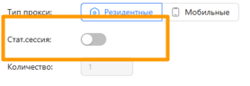

:::info **Пожалуйста, ознакомьтесь с [*Правилами использования материалов на данном ресурсе*](../Disclaimer).**
:::
## Создание  
Зайдите в свой [личный кабинет ZennoLab](https://account.zennolab.com/personal-area-main/my-products) и перейдите с главной вкладки на вкладку ZennoProxy.
  

Для создания подключения через прокси нажмите на кнопку «+ Новое подключение» в боковой панели навигации (слева).
  

После нажатия на кнопку в основной области раздела появится форма настроек подключения. 
  
Рассмотрим каждую настройку подробнее.

## Настройки

### **Название**  
Назовите подключение так, чтобы вам было понятно.   
Максимальное количество символов для названия подключения – 200 символов. 
  

### **Список**  
Выберите нужный список подключений из ранее созданных. Если вы делаете самое первое подключение, то вам будет доступен стандартный список с именем Default list.  
  

:::info **Информация**  
Как создать новый список → [читать](./WorkingwithLists#создание-нового-списка)
:::

### **Тип прокси**  
Выберите нужный вам тип – резидентных или мобильных прокси.
  

### **Какой тип прокси выбрать – практические сценарии**

Резидентные: для массового и стабильного скрейпа, параллельных потоков, точной привязки к городу, долгих «липких» сессий. Они быстрее и предсказуемее.

Мобильные: для «строгих» антиботов (регистрация/логин/прогрев аккаунтов, PWA/моб.приложения), когда нужен мобильный ASN и максимум доверия. Они терпимее к «подозрительным» паттернам, но хуже для сильной параллельности (CG-NAT) и иногда возможны редкие смены IP.

### **Статическая сессия**

Если вам нужна статическая сессия подвиньте ползунок вправо. Если вам не нужна статическая сессия и вы хотите использовать ротационную – оставьте ползунок выключенным. 

Переведите ползунок вправо для использования статической сессии (один IP на сессию).   
  

Для ротационной сессии оставьте ползунок выключенным (серым). IP будет меняться.  
  

### **Какую сессию выбрать – практические сценарии**

#### **Статические:**

* Мультиаккаунт в соцсетях:   
  закрепляете один IP за каждым аккаунтом → меньше триггеров аномалий.  
    
* E-commerce и гео-акции:   
  фиксированный IP для корзины/платежа/профиля → корректные цены и меньше срабатываний антифрода.  
    
* Ручное маркет-исследование/контент:   
  стабильный IP дает воспроизводимые результаты; ротация искажает персонализацию.

#### **Ротационные:**

* Веб-скрейпинг на объемах: 

много страниц/долгие сессии → смена IP снижает баны и капчи.

* SEO-мониторинг по регионам: 

меняете IP/гео, чтобы видеть SERP как местные пользователи.

* Агрегаторы цен/путешествий:   
  сбор данных с множества сайтов, обход лимитов за счет смены IP.

Вывод:   
статические прокси – когда нужна стабильность одного и того же IP;   
ротационные – когда нужна массовость запросов без банов.

### **Количество**

Количество сессий – это количество параллельных независимых «линий». Каждый такой канал – отдельный закрепленный IP/порт.   
Это полезно, когда нужно выполнять несколько параллельных задач.   
Например: 5 сессий → 5 одновременных потоков/браузер-профилей без пересечений по IP.

Количество сессий можно указать только при включенном режиме «статическая сессия».     
  

После включения режима «статическая сессия» поле для ввода количества сессий станет доступным для ввода значения с клавиатуры или с помощью нажатий на стрелочки.  
  

### **Таргетинг**

Для резидентных прокси доступны 2 типа таргетинга: по геолокации или ASN.  
Для мобильных прокси доступен таргетинг только по геолокации (стране).

#### **Для резидентных**

1) По геолокации вы можете выбрать **страну → регион**.  
  
2) По ASN вы можете выбрать **страну → конкретного оператора/провайдера**.  
  
#### **Для мобильных прокси**

Таргетинг определяется только по стране, без региона.   
  
Вы можете выбрать нужную геолокацию: 
либо из тегов стран с наибольшим количеством доступных прокси:  
  
либо из выпадающего списка с полным перечнем доступных стран.  
  

В разделе справа вы можете увидеть резюме создаваемого подключения.   
Для завершения и сохранения подключения нажмите на кнопку «создать подключение».  
  