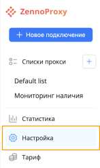
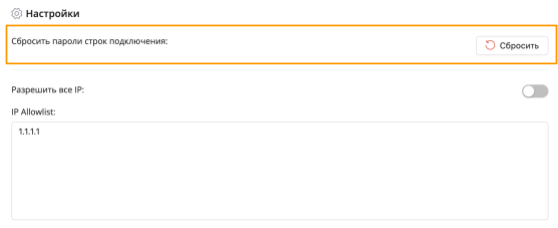
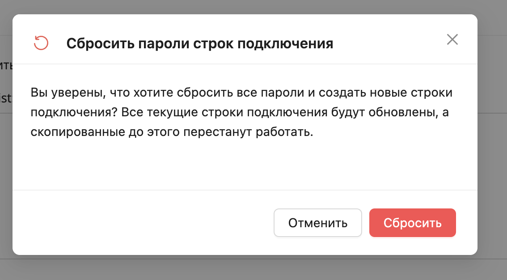
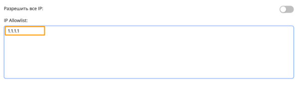
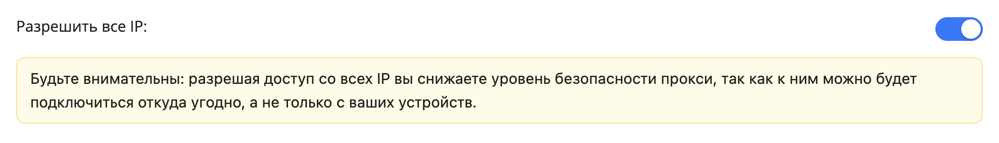

:::info **Пожалуйста, ознакомьтесь с [*Правилами использования материалов на данном ресурсе*](../Disclaimer).**
:::

## Сброс пароля строк подключения

В меню слева перейдите в раздел «Настройка».  
  

Если ваши строки подключения оказались рассекреченными, или по какой-либо другой причине вам нужно поменять пароль для строк, вы можете сбросить его нажав на кнопку «Сбросить».
  

:::warning **Внимание!**
Сброс пароля подразумевает создание новых строк подключения! Все текущие строки подключения будут обновлены, а скопированные до этого перестанут работать.
:::    
После нажатия на кнопку появится всплывающее окно с подтверждением действия.  

  

## Настройка IP

Это список IP, которым разрешено делать подключения через ваши прокси-строки. По умолчанию там должен быть один IP – ваш.  
  

Если вы хотите дать возможность подключаться с любого IP, передвиньте ползунок вправо.

:::warning **Внимание!**
Разрешая доступ со всех IP вы снижаете уровень безопасности прокси, так как к ним можно будет подключиться откуда угодно, а не только с ваших устройств.
:::

  