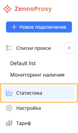
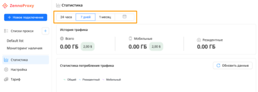
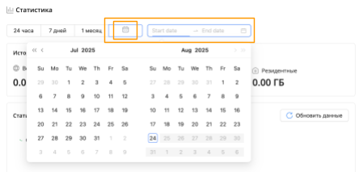
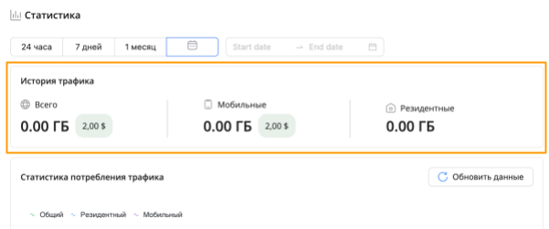
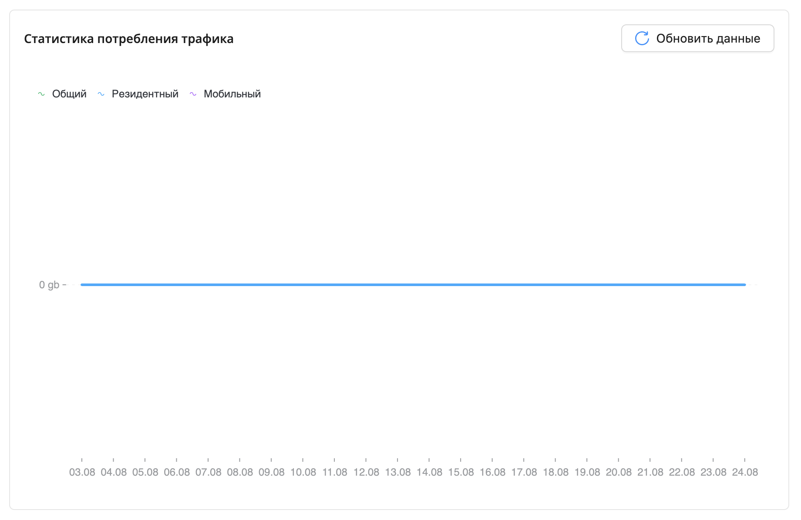
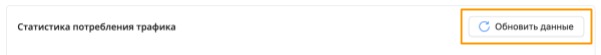

:::info **Пожалуйста, ознакомьтесь с [*Правилами использования материалов на данном ресурсе*](../Disclaimer).**
:::

## Интерфейс

Для просмотра статистики использования прокси перейдите в раздел «Статистика» в меню слева.  
  

Чтобы посмотреть статистику за определенный период, выберите соответствующее значение из предложенных.  
  

Вы также можете выбрать определенный период, нажав на календарик и выбрать точные даты:  
    

### История трафика
Здесь вы можете отслеживать объем использованного трафика, в том числе отдельно по мобильным и резидентным подключениям.  
  

### Статистика потребления трафика

Следующий блок отображает график потребления объема данных.  
  

Нажмите на кнопку «Обновить данные», чтобы получить актуальные значения.  
  