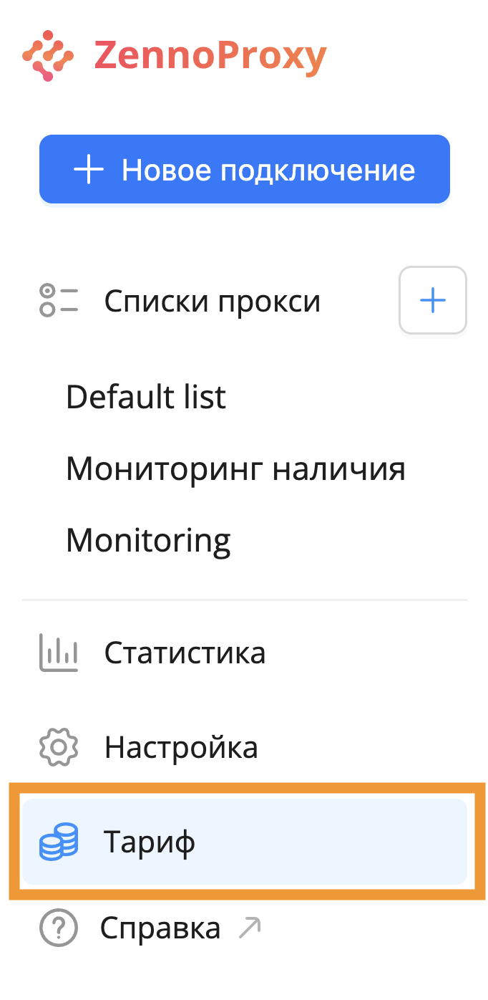
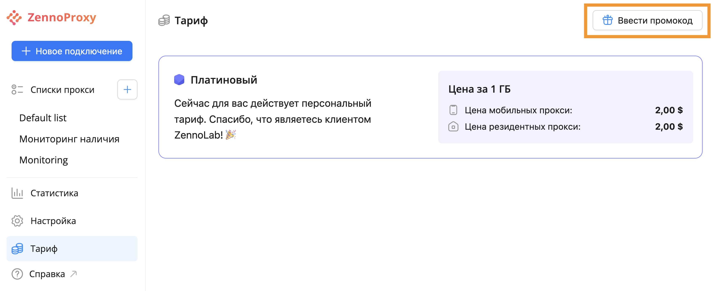
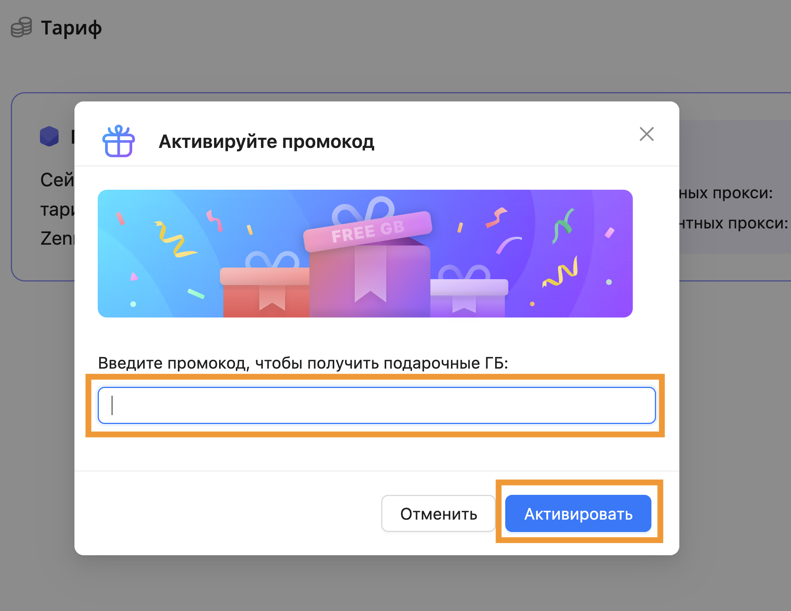
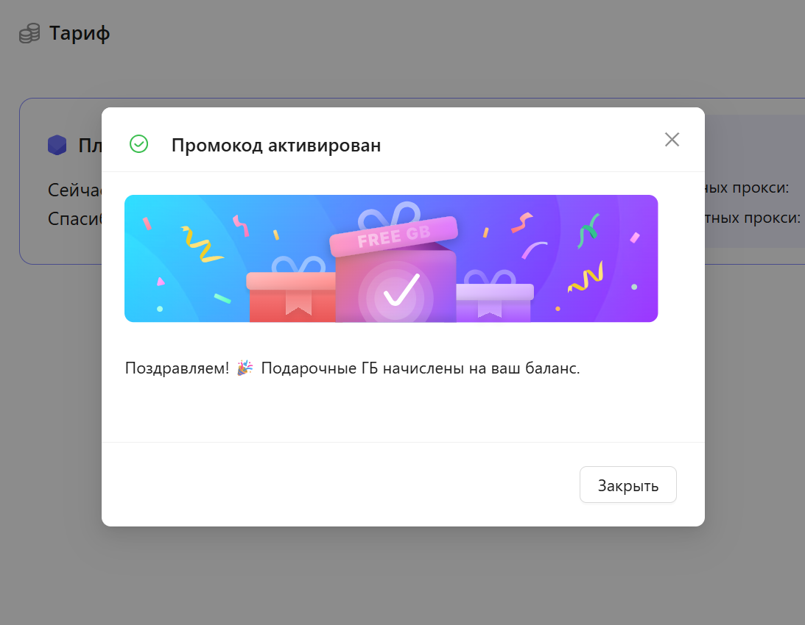

:::info **Пожалуйста, ознакомьтесь с [*Правилами использования материалов на данном ресурсе*](../../Disclaimer).**
:::
# Промо-коды

С помощью промокодов можно начислить бонусные ГБ на ваш счет. 

## **Активация через промокод**

Для активации промокода перейдите в раздел «Тарифы» в меню слева.  

Далее в правом верхнем углу нажмите на кнопку «Ввести промокод».  

Появится всплывающее окно с возможностью ввести промокод. Нажмите на кнопку «Активировать». Промокод будет применен.  

Важно! Каждый промокод уникален и может быть использован только 1 раз.  

После нажатия на кнопку «Активировать» вы получите сообщение об успешном начислении ГБ на ваш баланс. 

## **Активация через ссылку**

Если у вас есть специальная ссылка для активации промокода, то просто перейдите по ней в браузере. 
При переходе по ссылке промокод активируется сразу. 