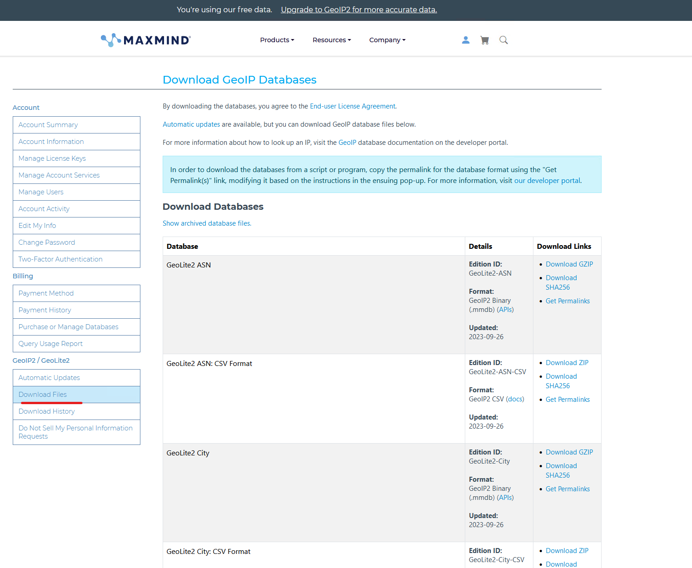
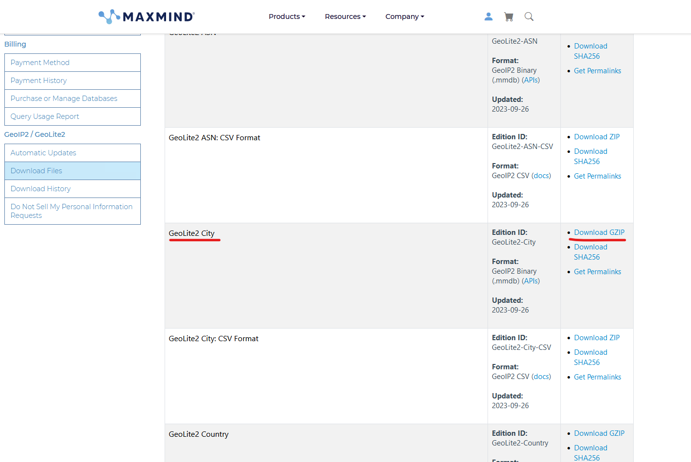
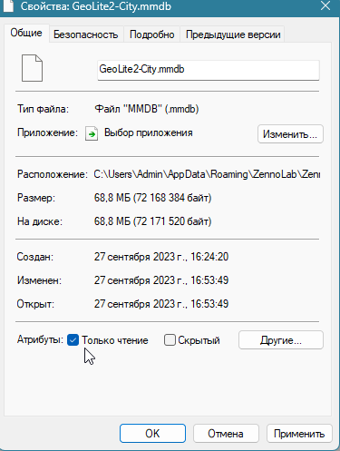

---
sidebar_position: 6
title: Как получить актуальную базу GeoIP
description: "Инструкция по получению GeoIP"
--- 

import DisclaimerNotice from '@site/src/components/DisclaimerNotice';

<DisclaimerNotice />

1. Зарегистрироваться на сайте: https://www.maxmind.com/en/account/login

2. Выбрать раздел Downloads:

3. Скачать GeoLite2 City базу:

4. Разархивировать и положить файл GeoLite2-City.mmdb в папку:
 - для ZennoPoster C:\Users\{имя_пользователя}\AppData\Roaming\ZennoLab\ZennoPoster\7\Data\ 
 - для ProxyChecker  C:\Users\{имя_пользователя}\AppData\Roaming\ZennoLab\ProxyChecker\3\Data\
 - для ZennoDroid C:\Users\{имя_пользователя}\AppData\Roaming\ZennoLab\ZennoDroid\2\Data\

5. Задать файлу GeoLite2-City.mmdb права только на чтение:

 

