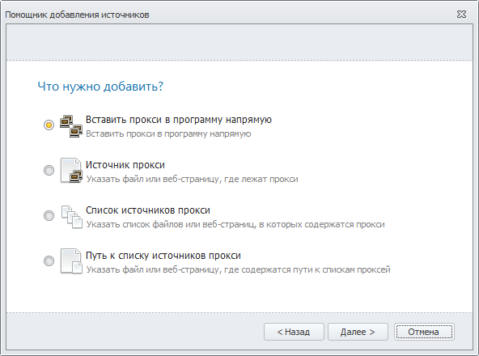
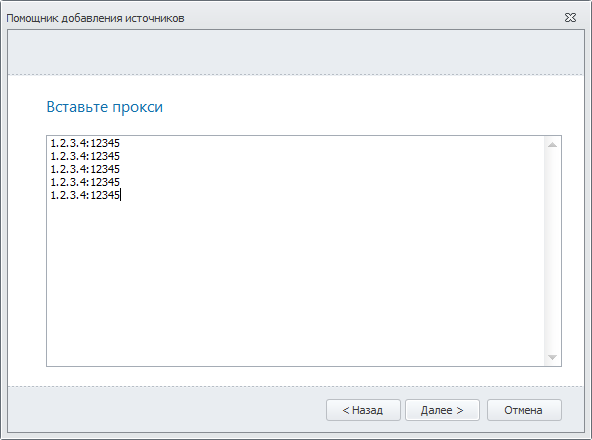
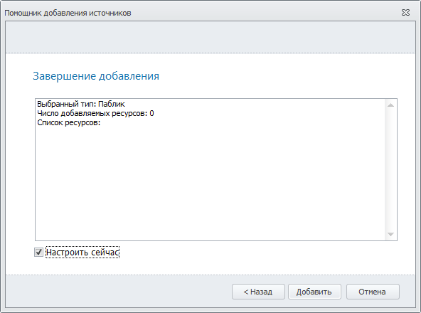
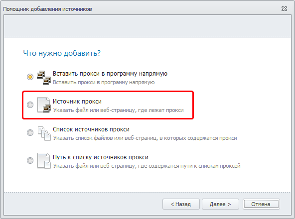
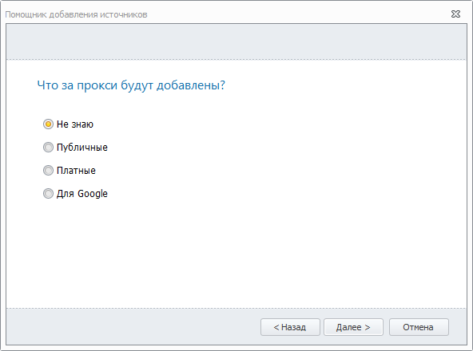
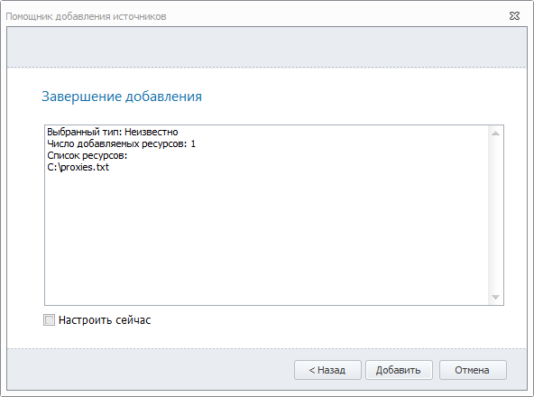
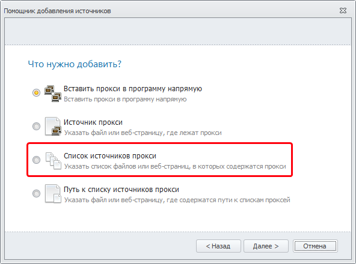

---
sidebar_position: 1
title: Помощник
description: "Помощник"
--- 

import DisclaimerNotice from '@site/src/components/DisclaimerNotice';

<DisclaimerNotice />

## **Помощник**

**Помощник** предназначен для упрощения добавления *Источников* парсинга в программу. После нажатия на кнопку **Помощник** откроется окно *Помощник добавления источников*.

### **Что нужно добавить?**

Далее, вы увидите 4 сценария действия. Выберите один из них и нажмите кнопку *Далее* в правом нижнем углу.

#### **Вставить прокси в программу напрямую**
 

При выборе этого сценария откроется пустое окно для внесения прокси.

После внесения прокси нажмите *Далее* и выберите вид добавляемых прокси.

Нажмите кнопку *Далее* и увидите информацию по вашему запросу для поиска желаемого прокси.

Если вы поставите галочку в пункте *Настроить сейчас*, то, после нажатия кнопки *Добавить*, помимо того, что создастся новый список, сразу же будут открыты его настройки.

 На главной странице *Источников* появится новый источник в категории *Без метки*.

### **Источник прокси**

В этом сценарии вы можете указать файл или веб-страницу, откуда будет происходить сбор прокси.
После нажатия кнопки *Далее* появится окно, в котором нужно выбрать, где хранятся прокси:

 - **Путь к файлу** — полный путь к файлу;
 - **Адрес URL** — адрес источника в сети интернет.

Нажмите кнопку *Далее* и выберите вид добавляемых прокси.

Нажмите кнопку *Далее* и вы увидите результирующую информацию.

Если вы поставите галочку в пункте *Настроить сейчас*, то, после нажатия кнопки *Добавить*, помимо того, что создастся новый список сразу же будут открыты его настройки.

На главной странице *Источников* появится новый источник в категории *Без метки*.

### **Список источников прокси**

Этот сценарий похож на предыдущий ("Источник прокси") с тем лишь отличием, что здесь вы сможете указать сразу несколько источников прокси (файлов и/или URL адресов).

### **Путь к списку источников прокси**

Этот сценарий тоже похож на "Источник прокси" с тем лишь отличием, что здесь нужно указать *Путь к файлу* или *Адрес URL*, где сохранён список источников прокси.

### **Полезные ссылки**

[**Основные настройки**](https://docs.zennolab.com/zennoproxychecker/Settings/Main_settings)

[**Настройки источников**](https://docs.zennolab.com/zennoproxychecker/Program%20interface/Sources)