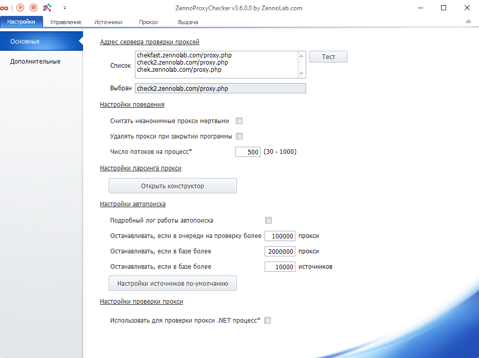
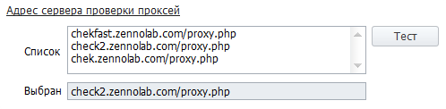
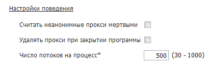
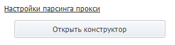
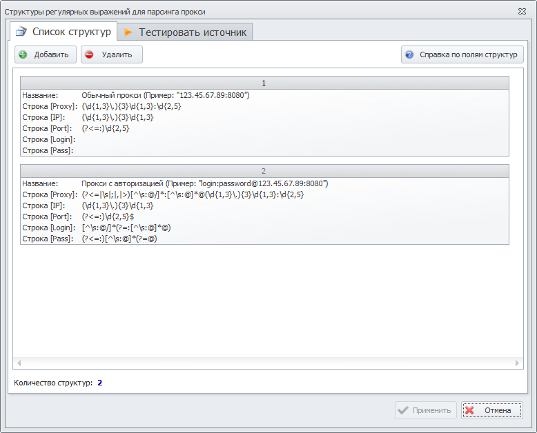
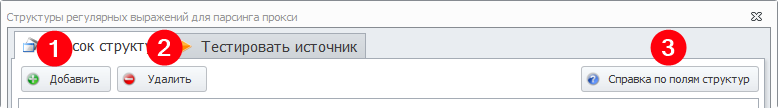
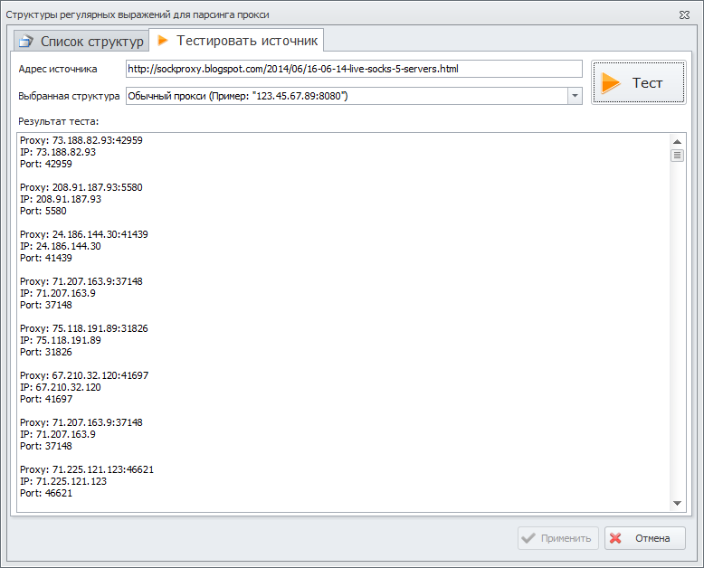
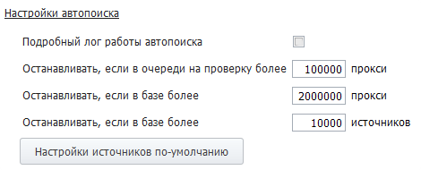
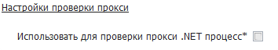

---
sidebar_position: 1
title: Основные настройки
description: "Основные настройки программы ZennoProxyChecker"
--- 

import DisclaimerNotice from '@site/src/components/DisclaimerNotice';

<DisclaimerNotice />

## **Какие есть основные настройки ZennoProxyChecker?**

### **Адрес сервера проверки прокси**

Выбор сервера проверки прокси из списка адресов.

### **Список**

URL адреса, которые программа использует для проверки прокси. По умолчанию здесь указаны три адреса, но вы можете добавить свои.

### **Кнопка "Тест"**

После её нажатия программа последовательно будет проверять адреса из "Списка" выше на работоспособность. Завершится тест, когда будет найден первый рабочий сервер проверки или когда кончатся адреса в списке.

### **Выбран**

Здесь будет указан адрес, с помощью которого будут проверяться все прокси на предмет того, живы они или нет. Сюда попадает первый рабочий адрес из "Списка".

## **Настройки поведения**

### **Считать неанонимные прокси мёртвыми**

Программа будет фильтровать неанонимные прокси и выдавать только анонимные.

### **Удалить прокси при закрытии программы**

Очистка списка прокси при закрытии программы.

### **Число потоков на процесс**

Задаёт число потоков, используемых для проверки.

Для применения изменений нужно перезапустить программу.

## **Настройки парсинга прокси**

Здесь вы можете добавить новые и отредактировать существующие структуры для парсинга прокси (фактически структура — это регулярные выражения).
Чтобы перейти в конструктор парсинга, нажмите кнопку "Открыть конструктор".

### **Конструктор структур парсинга прокси**

 
### **Вкладка “Список структур”**

По умолчанию здесь уже внесены 2 регулярных выражения. Также вы можете использовать свои собственные регулярные выражения, нажав кнопку "Добавить" (1) или "Удалить" (2).

На некоторых сайтах может встретиться своя разметка прокси, поэтому при необходимости можно создать свою структуру парсинга практически для любого вида и протестировать на конкретном источнике с помощью тестера. С помощью кнопки "Справка по полям структур" (3) можно получить описание используемых полей.

### **Вкладка “Тестировать источник”**

**Адрес источника**: тут нужно указать адрес сайта, с которого будет происходить парсинг проксей.

**Выбранная структура**: необходимо выбрать добавленное ранее условие для парсинга из вкладки "Список структур".
Далее нажмите кнопку "Тест", и запустится тестирование.

В окне "Результат теста" вы увидите полученные в соответствии с условиями парсинга прокси.

После закрытия окна "Конструктора" или нажатии кнопки отмены результаты парсинга не сохраняются.

## **Настройки автопоиска**

### **Подробный лог работы автопоиска**

Поставив здесь галочку, вы будете видеть подробный отчет о работе ZennoProxyChecker в режиме автопоиска.

### **Останавливать, если в очереди на проверку более XXX прокси**

При превышении этого количества прокси в очереди автопоиск будет остановлен.

### **Останавливать, если в базе более XXX прокси**

При превышении этого количества прокси в базе автопоиск будет остановлен.

### **Останавливать, если в базе более XXX источников**

При превышении этого количества источников автопоиск будет остановлен.

### **Настройки источников по умолчанию**

Здесь указываются настройки, которые будут применены ко всем вновь добавленным источникам. Подробнее о функциях и настройках источников можно прочитать в статье Настройки источников

## **Настройки проверки прокси**

### **Использовать для проверки прокси .NET процесс**

Если параметр установлен, то прокси будут проверяться с помощью .NET реализации CheckingProcessor (требуется перезапуск).

## **Полезные ссылки**

[**Работа с прокси**](https://docs.zennolab.com/zennoproxychecker/category/proxychecker-working-with-proxy)

[**Настройки источников**](https://docs.zennolab.com/zennoproxychecker/Program%20interface/Sources/Source_settings)

