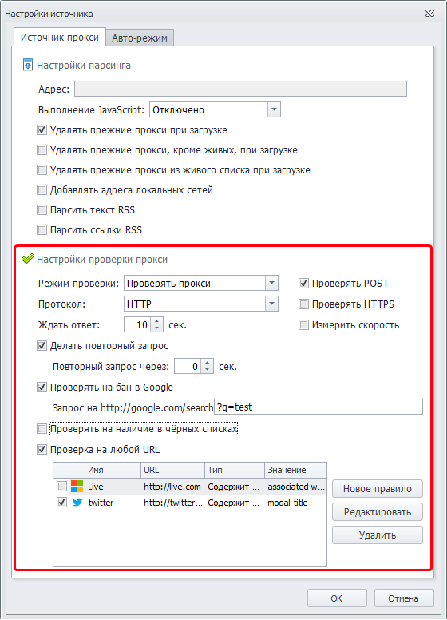
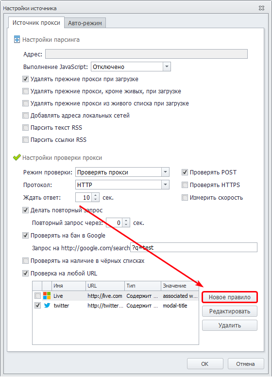
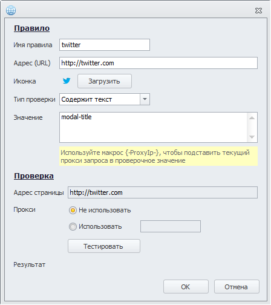
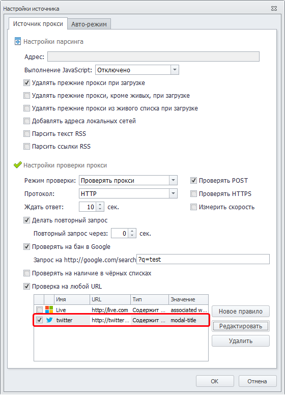
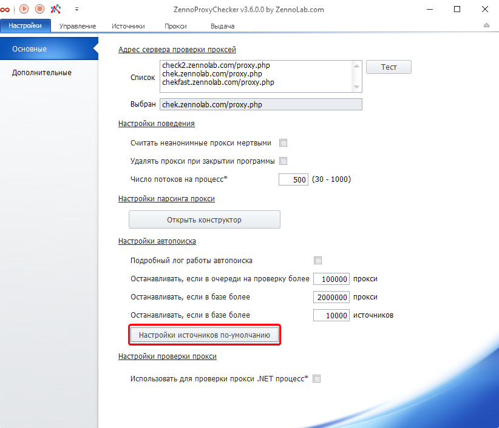
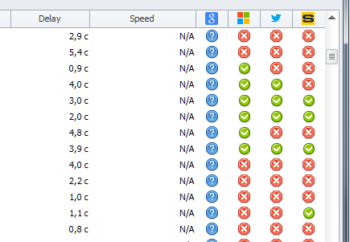
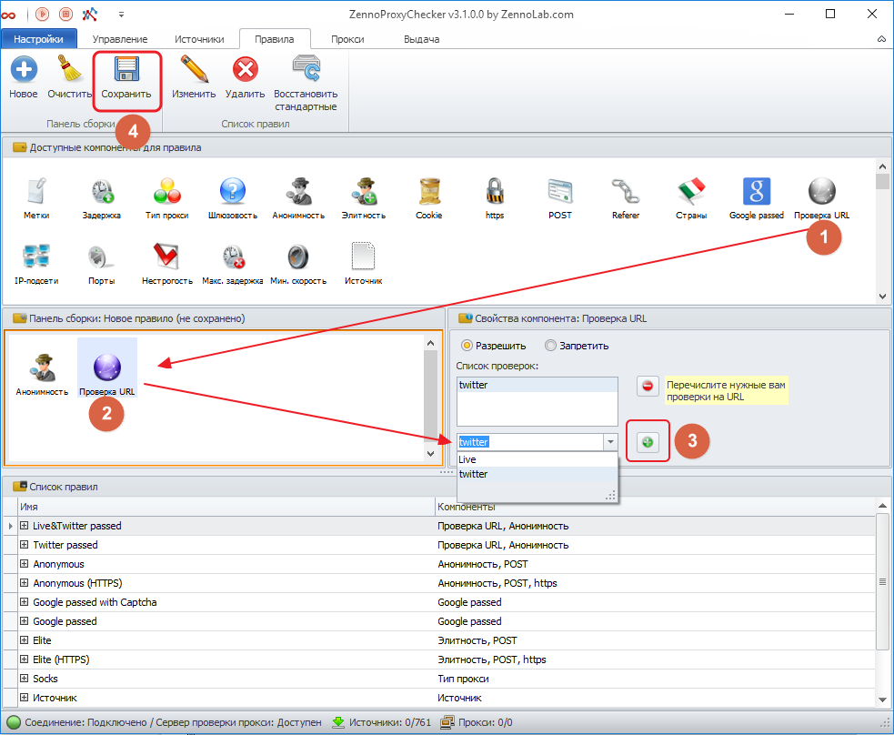
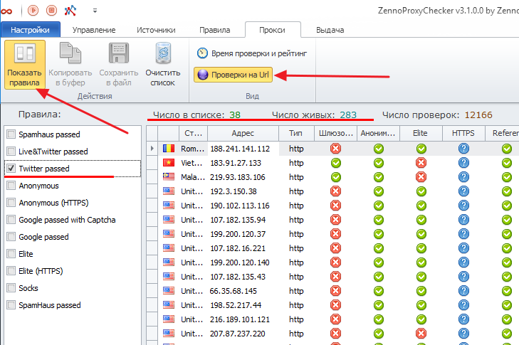

---
sidebar_position: 3
title: Проверка прокси
description: "Как проверить надёжность прокси?"
--- 

import DisclaimerNotice from '@site/src/components/DisclaimerNotice';

<DisclaimerNotice />

Гибкие настройки проверки позволяют отбирать с источников надёжные рабочие прокси, подходящие для использования в ваших проектах.

Параметры проверки задаются в *Настройках источников* [(подробности есть здесь)](https://docs.zennolab.com/zennoproxychecker/Program%20interface/Sources).

## **Cоздание новой проверки на URL**

Для того чтобы добавить проверку прокси на любой URL, откройте настройки источников. Включите настройку *Проверка на любой URL*, чтобы дополнительные настройки были открыты. В нижней части формы будет настройка проверок на URL. Выберите пункт *Новое правило*:

Откроется форма создания нового правила проверки на любой сайт:

В разделе *Правило* необходимо указать имя и параметры проверки. При проверке программа зайдет на указанный URL и возьмёт текст страницы без выполнения JavaScripts. В случае если текст соответствует критериям, проверка будет считаться успешной.

В разделе *Проверка* можно протестировать правило прямо сейчас. По умолчанию запрос идёт без прокси, но его можно указать опционально.

После добавления новая проверка появится в таблице проверок. Все добавленные в программу проверки сохраняются глобально и доступны для выбора во всех источниках.

## **Конфигурация источников**

Чтобы прокси с этого источника проходили желаемую проверку, выберите её в таблице:

Выбрать проверки на URL для прокси из автопоиска можно в настройках программы:

## **Проверка прокси**

После добавления новой проверки на URL в [таблице живых прокси](https://docs.zennolab.com/zennoproxychecker/Working%20with%20proxies/Live_list) появится новая колонка, где будет отображаться результат проверки:

В целях отладки существует следующая функция: двойной клик мышью по результату проверки запустит тестирование выбранного прокси на эту проверку.

## **Настройка правил**

Чтобы использовать результаты проверки на URL, необходимо создать соответствующее правило. В окне программы [*Правила*](https://docs.zennolab.com/zennoproxychecker/Program%20interface/Rules) создайте *Новое* правило и добавьте 2 компонента:

1. Анонимность: *Вкл*.  
2. Проверка URL: *Добавьте ваши проверки*.

После чего сохраните правило, указав имя.

В качестве примера можно ориентироваться на правила «Twitter passed», «Twitter\&Live passed», и т.д.

## **Использование правил**

В окне [*Прокси*](https://docs.zennolab.com/zennoproxychecker/Program%20interface/Proxy/) можно включить демонстрацию правила:

В дальнейшем правило можно использовать в выдаче прокси в ZennoProxyChecker и в ZennoPoster.

## **Полезные ссылки**

[**Настройка выдачи прокси**](https://docs.zennolab.com/zennoproxychecker/Program%20interface/Results)

[**Источники**](https://docs.zennolab.com/zennoproxychecker/Program%20interface/Sources)

[**Прокси**](https://docs.zennolab.com/zennoproxychecker/Program%20interface/Proxy)

[**Правила**](https://docs.zennolab.com/zennoproxychecker/Program%20interface/Rules)