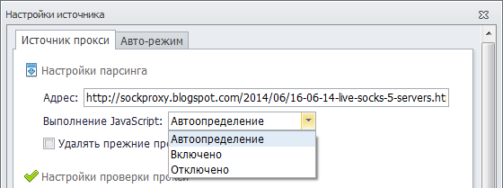

---
sidebar_position: 2
title: Парсинг прокси
description: "Парсинг прокси в ZennoProxyChecker"
--- 

import DisclaimerNotice from '@site/src/components/DisclaimerNotice';

<DisclaimerNotice />

После того как вы добавили источник прокси в ZennoProxyChecker, можете настроить парсинг прокси с этого источника.

В настройках указывается адрес, с которого будет производится парсинг прокси. Это может быть URL-адрес web-страницы или путь к файлу со списком прокси. Структура парсинга прокси задана в основных настройках программы.

Некоторые источники выводят списки прокси на странице при помощи JavaScript. В настройках источника вы можете выбрать условия выполнения JavaScript на странице.

Не забывайте, что при включении этой функции потребление системных ресурсов программой увеличивается. Вы можете выбрать пункт *Автоопределение*, чтобы ZennoProxyChecker сам определил необходимость выполнения JavaScript.

После того как прокси загружены с источника и отсортированы фильтрами (если они определены), они попадают в общую базу прокси. Каждый прокси помнит, с какого источника он скачан: настройки проверки прокси привязаны к его источнику. Все прокси в базе уникальны — в ней нет двух повторяющихся прокси.

## **Полезные ссылки**

[**Главное окно**](https://docs.zennolab.com/zennoproxychecker/Program%20interface/Sources/Main_window)

[**Фильтры**](https://docs.zennolab.com/zennoproxychecker/Program%20interface/Filters)

[**Прокси**](https://docs.zennolab.com/zennoproxychecker/Program%20interface/Proxy)

[**Настройки**](https://docs.zennolab.com/zennoproxychecker/category/proxychecker-settings/)

                                             
