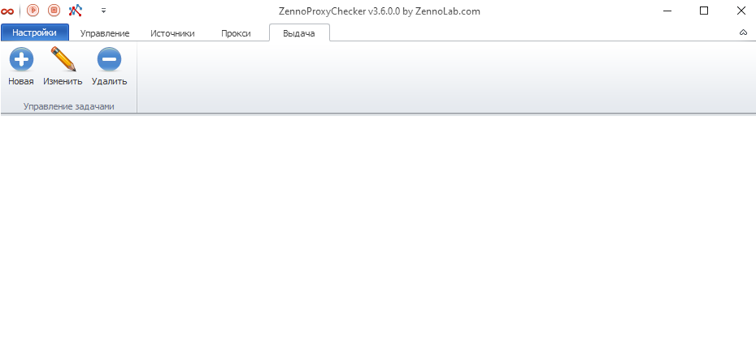

---
sidebar_position: 7
title: Выдача прокси
description: "Как настроить выдачу прокси в ZennoProxyChecker?"
--- 

import DisclaimerNotice from '@site/src/components/DisclaimerNotice';

<DisclaimerNotice />

Для постоянного получения прокси, которые нужны вашим проектам и программам, нужно настроить выдачу прокси. ProxyChecker позволяет выдавать прокси на локальный или сетевой ресурс с заданной периодичностью либо по запросу. 

О том, как настроить вкладку *Выдача*, можете прочитать [здесь](https://docs.zennolab.com/zennoproxychecker/Program%20interface/Results).

## **Полезные ссылки**

[**Помощник ZennoProxyChecker**](https://docs.zennolab.com/zennoproxychecker/Program%20interface/Sources/Hepler)

[**Основные настройки**](https://docs.zennolab.com/zennoproxychecker/Settings/Main_settings)
