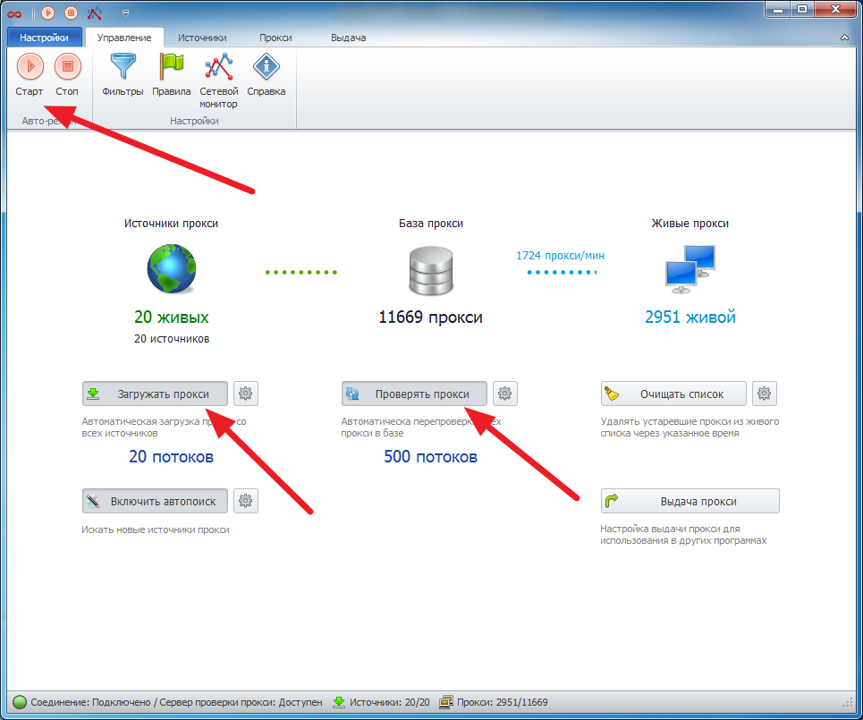
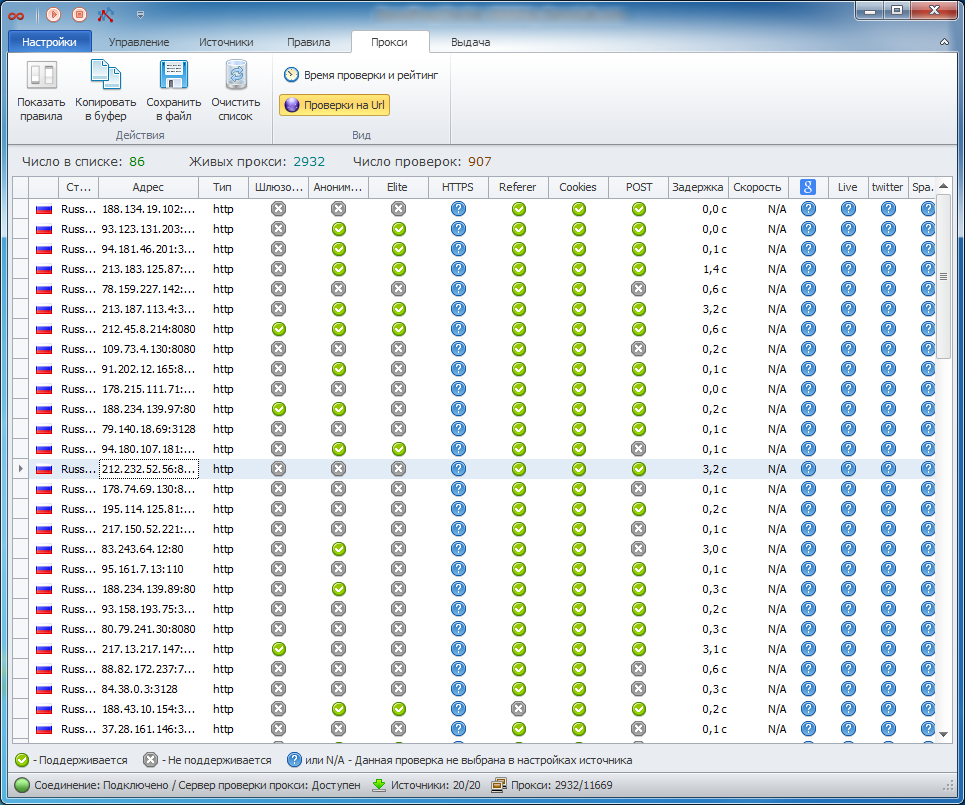

---
sidebar_position: 3
title: Быстрый старт
description: "Быстрый старт программы ZennoProxyChecker"
--- 

import DisclaimerNotice from '@site/src/components/DisclaimerNotice';

<DisclaimerNotice />

**Основная задача программы** — проверить прокси и отобрать из них рабочие для использования в ваших проектах, для работы с различными сайтами и сервисами.
ProxyChecker позволяет проверить и получить прокси всего за несколько шагов:

1. Добавьте прокси в программу на вкладке “Источники” с помощью опции “Добавить прокси”. Формат адреса прокси: *ip:port* для обычных прокси и *login:password@ip:port* для прокси с авторизацией.

2. Запустите процесс проверки прокси на вкладке “Управление”. Включите загрузку и проверку прокси.

3. Получите проверенные прокси на вкладке “Прокси”. Применяйте “Правила”  для отбора подходящих прокси.

4. Полученные прокси можно скопировать в буфер, сохранить в файл или настроить выдачу.

