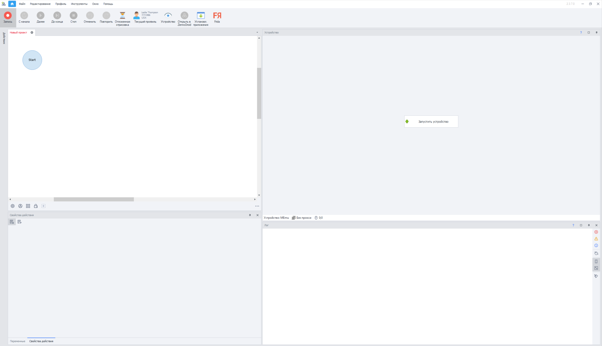
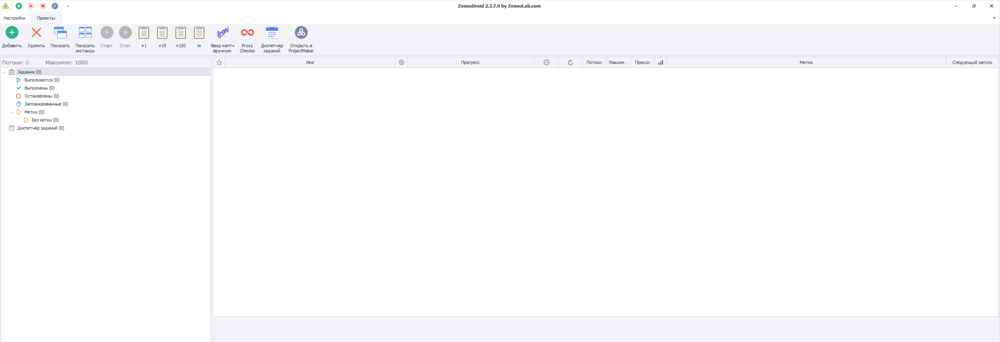
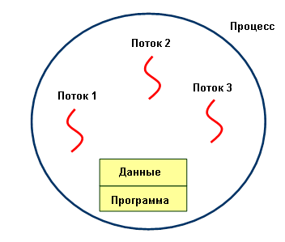
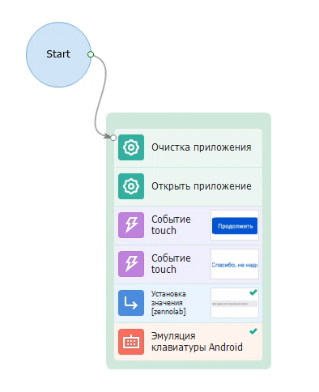
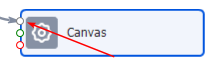
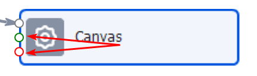
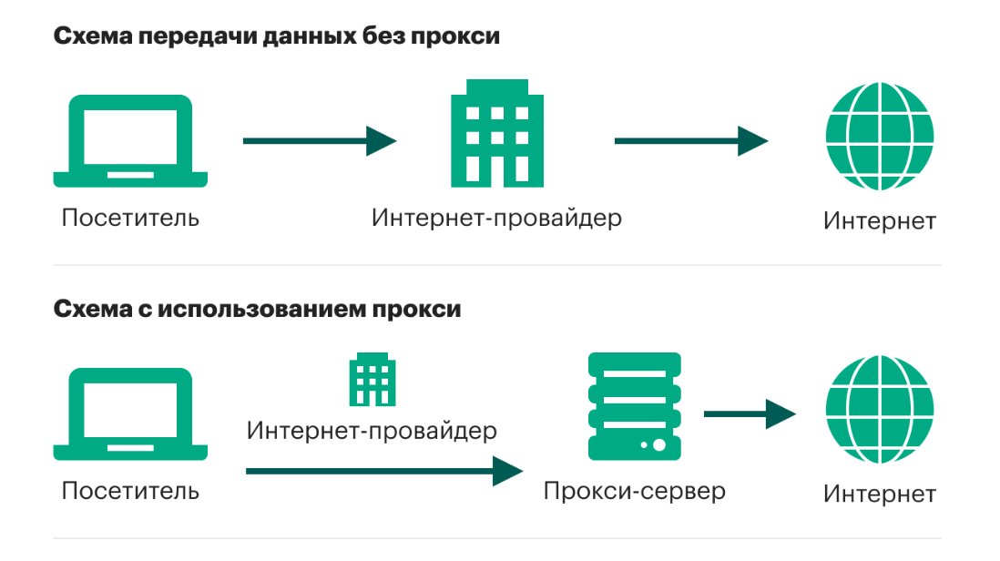
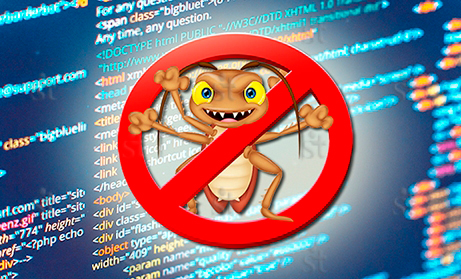
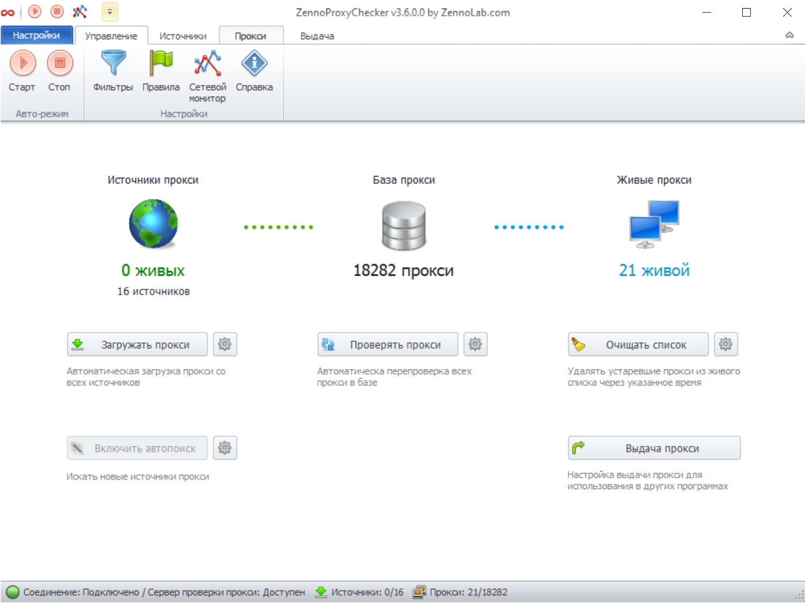
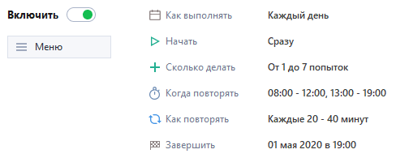

---
sidebar_position: 1
title: Основные понятия
description: Основные понятия в ZennoDroid
---  

:::warning **Обязательно ознакомьтесь с [*Правилами использования материалов на данном ресурсе*](../Disclaimer.mdx).**
:::

В этой статье мы разберем термины, с которыми столкнемся при работе с ZennoDroid. Что-то вам наверняка уже знакомо, а что-то вы как раз хотели узнать. Используйте статью как памятку и возвращайтесь, когда какой-то термин не понятен.  

**Краткое содержание**

<!--All you need is a blank line-->

    + ProjectMaker.
    + ZennoDroid.  
    + Поток.  
    + Виртуальная машина.  
    + Экшен.
    + Порт экшена.
    + Ветки логики.
    + Шаблон.
    + Прокси.
    + Переменная.
    + Сниппет.
    + Баг.
    + Диагностика.
    + Проксичекер.
    + Планировщик.

   

###  1. ProjectMaker (сокращенно PM или ПМ).  
  
Так называется наша среда для разработки проектов и шаблонов. Вы совершаете действия на Android-эмуляторе или реальном устройстве, а программа записывает их. Затем шаблон можно отредактировать, дополнить новыми шагами и логикой.   
Мы будем часто использовать его в дальнейшем.  Хоть это и отдельное приложение, но оно тесно связано с ZennoDroid и ZennoPoster.  
_______________________________________________ 
###  2. [ZennoDroid](https://zennolab.com/ru/products/zennodroid/) (сокращенно ZD или ЗД).  
  
В представлении не нуждается, но если вы случайно оказались в этой статье, то так называется основная программа, в которой запускаются и исполняются проекты. В версии Pro также можно запускать шаблоны в многопоточном режиме и настраивать расписание для запуска.  
_______________________________________________ 
###  3. Поток.  
  
Так мы называем отдельную единицу выполнения, для которой выделяется отдельный набор данных (переменные, списки, таблицы), а также отдельный эмулятор. Поток можно сравнить с человеком, работающим на заводе и выполняющим определенный набор действий. Когда проект выполняется в несколько потоков, то его можно сравнить с полной цепочкой производства, когда у каждого человека своя функция.  
_______________________________________________ 
###  4. Виртуальная машина (сокращенно ВМ).  
  
Это один запущенный экземпляр эмулятора, в рамках которого совершаются действия. То есть это как настоящий телефон, только виртуальный, отсюда и название.  
_______________________________________________ 
### 5. Экшен (кубик, действие, action).  
   
Блок действия в ProjectMaker из которых конструируется шаблон. Так как PM имеет нодовую структуру работы, то каждое действие нужно скреплять между собой линией ("нитью"). Они выполняются по порядку, друг за другом. Если какое-то действие не присоединить к общему древу, то оно не будет участвовать в выполнении.  

Что можно делать с помощью кубика:  
- получить значение,
- совершить нажатие (touch),
- сохранить значение элемента,
- записать текст в файл, список, таблицу или базу данных,
- и много всего другого :)  
_______________________________________________  
### 6. Порт (вход) экшена.  
С помощью портов кубик соединяется с другими действиями. Обычно у экшенов три порта (один входящий и два исходящих), но у действия Switch может быть больше двух исходящих портов.  
- Входящий порт.  
  
Сюда подключается стрелка от предыдщущих действия (один входящий порт может принимать сразу несколько других действий).  
- Исходящие порты.  
    
Их два: зеленый для успешного результата, а красный выводит данные в случае ошибки.  
_______________________________________________  
### 7. Ветки (стрелки, нити, линии) логики.    
Все действия в проекте должны соединятся между собой стрелками. Если действие не подключить к ветке, то оно не будет работать в общей логике.  
#### Зеленая стрелка, результат:  
- получили строку из списка или таблицы,
- нашли элемент и получиги его значение,
- выражение внутри экшена if вернуло истинное значение,
- прочие успешные результаты.  
#### Красная стрелка, результат:  
- не найден запрашиваемый элемент,
- не найден файл для считывания,
- попытка получить строку, которой нет,
- и прочие ошибки.  
_______________________________________________ 
### 8. Шаблон (проект).  
Файл, который создается в PM и выполняется в ZD. Обычно содержит инструкцию для управления эмулятором. Можно сказать, что это программа или скрипт, служащая для автоматизации определенных действий. Шаблон состоит из различных экшенов, связанных между собой стрелками логики.  
_______________________________________________ 
### 9. Прокси (или прокси-сервер).  
   
Это своего рода посредник между вами и интернетом. При отправке запроса через прокси, он идет не напрямую от устройства, а через этого посредника. То есть прокси помогают скрыть реальный IP-адрес. Таким образом можно обходить блокировки, скрывать личную информацию и быть анонимным в сети.  
Они бывают платными и бесплатными. Последние, как это обычно бывает, медленно работают и быстро приходят в негодность. Поэтому для работы с бесплатными прокси лучше иметь их большую базу, чтобы в случае чего сразу заменить.  
В ZD прокси устанавливается с помощью специального экшена. Также в программу интегрированы некоторые сервисы по продаже прокси.  
_______________________________________________ 
### 10. Переменная.  
Так называется область в памяти компьютера, где содержатся различные типы информации: числа, строки текста, значения логики. Переменные используются программами для временного хранения и манипулирования данными в процессе работы. Каждая переменная имеет свое уникальное имя и может быть изменена или прочитана в процессе выполнения шаблона.
_______________________________________________ 
### 11. Сниппет.  
Это небольшой фрагмент исходного кода, который выполняет какую-то одну функцию. Чаще всего он представляет собой часто используемый алгоритм, который можно использовать в различных задачах.  

Сниппеты используются для ускорения процесса написания кода, так как позволяют использовать заранее подготовленные фрагменты кода вместо того, чтобы писать их с нуля. Они могут быть как простыми, например, создание цикла или условия, так и сложными, с реализацией графического интерфейса пользователя.  

В ZennoDroid мы чаще всего используем код, написанный на языке программирования С#
_______________________________________________ 
### 12. Баг.  
    
Это ошибочное поведение программы, которое не было задумано разработчиком и приводит к непредсказуемым результатам. Например, программа может выдавать неправильные результаты, зависать, аварийно завершаться или работать некорректно в определенных сценариях.  

Баги могут возникать из-за ошибок в коде, неправильного использования сторонних библиотек или зависимостей, не соблюдения требований к программе. Для обнаружения и исправления багов используются различные методы тестирования, отладки и анализа кода.    
_______________________________________________ 
### 13. Диагностика.  
Специальный софт, который собирает диагностическую информацию о текущем состоянии ZennoDroid. Она  может включать в себя идентификацию ошибок, проверку состояния компонентов системы, анализ журналов и сообщений об ошибках, а также тестирование производительности. Чаще всего диагностика требуется при обращении в поддержку, когда программа работает со сбоями.  
_______________________________________________ 
### 14. Проксичекер [(ProxyChecker)](https://zennolab.com/ru/products/zennoproxychecker/).  
  
Одна из наших программ, которая нужна для регулярной проверки прокси по множеству параметров и экспорта в удобном формате. Регулярная проверка прокси гарантирует их надежность и эффективность. Использование качественных прокси позволит увеличить скорость загрузки страниц и ускорить приложения.
_______________________________________________ 
### 15. Планировщик.  
  
Часть ZennoDroid с помощью которой можно детально настроить и автоматизировать выполнение проектов по расписанию. Его возможности:  
- создание простых расписаний с однократным выполнением заданий,
- постановка сложных расписаний с учетом интервалов времени, количества попыток и их повторений,  
- отладка расписаний для уверенности в том, что шаблон выполнится, как и задумано.

