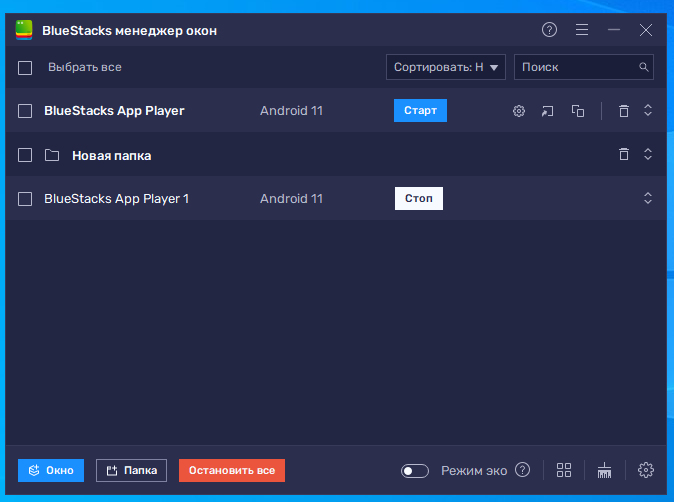
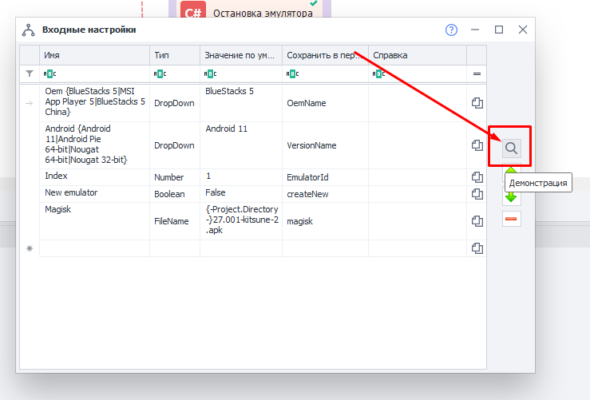

:::info **Пожалуйста, ознакомьтесь с [*Правилами использования материалов на данном ресурсе*](../Disclaimer).**
:::
_______________________________________________
## Что такое BlueStacks?  
Это эмулятор Android, который создает виртуальную среду, аналогичную смартфону или планшету на базе Android. Доступен для использования на Windows и macOS.  

:::warning **Доступен для использования только в версии Enterprise.**  
Официальной поддержки нет, поэтому может работать нестабильно. 
:::

### В чём отличие от Memu?  
Основное отличие заключается в производительности. [**BlueStacks**](https://www.bluestacks.com/features.html) требует больше системных ресурсов, так как использует технологию виртуализации. При этом является более стабильным и оптимизированным для тяжелых задач. Для его нормального использования вам понадобится мощный компьютер.  

Также у него более удобный интерфейс и частое обновление для поддержки новых приложений.  
_______________________________________________
## Подключение к ZennoDroid.  
**1.** Скачиваем эмулятор с официального сайта: [**BlueStacks**](https://www.bluestacks.com/features.html).  
**2.** После установки открываем именно ярлык под названием *BlueStacks Multi-Instance*. 

  

**3.** Новые виртуальные машины можно добавить с помощью кнопок: Окно → Новое.  

:::tip **Не используйте в работе первую добавленную ВМ.**  
Так как могут возникать ошибки, чинятся которые только полной переустановкой BlueStacks. Это специфика самого эмулятора.  

Поэтому рекомендуем создать один и более дополнительных и использовать именно их.
:::  

**4.** Скачайте [**данный архив**](./assets/BlueStacks_5_Root_ver.2.zip) и распакуйте его.  
**5.** Запустите Project Maker для ZDE и откройте проект из архива, который называется *Bluestacks5RootMagisk_v2*.  
**6.** Заходим во входные настройки проекта:  

   

**7.** И нажимаем кнопку **Демонстрация**:  

   

**8.** В поле **Index** указываем индекс виртуальной машины, которую планируем использовать. Это цифра, которую эмулятор автоматически подставляет к названию при создании ВМ, нумерация с **0**.  
**9.** Сохраняем параметры и запускаем проект для выполнения.  
**10.** Дожидаемся успешного завершения проекта. После этого эмулятор будет виден в программе, и его можно будет использовать для работы.  

:::info **Если проект падает на каком-либо кубике, то запустите его ещё раз.**  
В том случае, когда после нескольких перезапусков шаблон так и не срабатывает, напишите нам [**в поддержку**](https://helpdesk.zennolab.com/ru/conversation/new).
:::  
_______________________________________________
## Работа с эмулятором.  
В приложенном проекте мы добавили кубики со своим C# кодом, которые вы можете использовать в работе.  
Они специально названы так, чтобы вам было легко определить их назначение:  

#### Запуск эмулятора. 
Кубик запускает уже созданный эмулятор.  

#### Подключение к эмулятору.  
Подключается к запущенному эмулятору.  

#### Остановка эмулятора.  
Останавливает запущенный эмулятор.  

#### Создание эмулятора.  
Cоздаёт эмулятор с настройками по умолчанию.  

#### Создание эмулятора с параметрами.  
Создаёт эмулятор с заданными параметрами. В настройках кубика зелёным текстом мы описали, какие значения можно изменять. Среди них: режим рендеринга, профиль устройства, его имя, доступные ресурсы ОЗУ и CPU, графический движок и разрядность системы.  

#### Удаление эмулятора.  
Удаляет эмулятор, указанный в коде. Значение прописывается в `DeleteByName("Rvc64_2")`, где `2` — это индекс эмулятора, который мы хотим удалить.  

#### Запуск менеджера. 
Запускает менеджер окон BlueStacks.  

#### Разблокировка системного диска.  
Даёт вам возможность записывать файлы на системный диск эмулятора. По умолчанию хранилище находится в режиме **Только чтение**, записать на него ничего нельзя

#### Восстановление системного диска.   
Восстанавливает системный диск эмулятора до изначального состояния.

#### Патч системы для установки Magisk.  
Этот кубик подготавливает систему для последующей установки Magisk на устройство.

#### Установка Magisk.  
Устанавливает Magisk (приложение-менеджер), позволяющий управлять правами *root*.

#### Запись Magisk в системный раздел.  
Выполняет скрипт установки Magisk в системный раздел (бинарные файлы, скрипты и прочие необходимые файлы).

#### Включение Zygisk.  
Включает модуль утилиты Magisk, которая позволяет установить и запустить LSPosed.  

LSPosed нужен для:  
- скрытия факта наличия Root-прав от других приложений,  
- подмены параметров устройства,  
- обхода ограничения приложений,  
- и многого другого.  
_______________________________________________
## Полезные ссылки.  
- [**Установка Root-прав**](../Installation/Root).  
- [**Настройка LSPosed**](../Installation/LSPosed).  
- [**C# код**](../Project%20Editor/CustomCode/С).