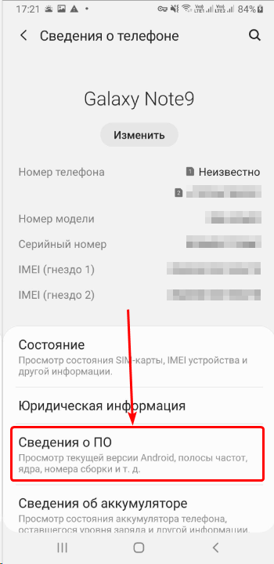
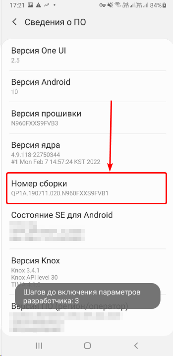
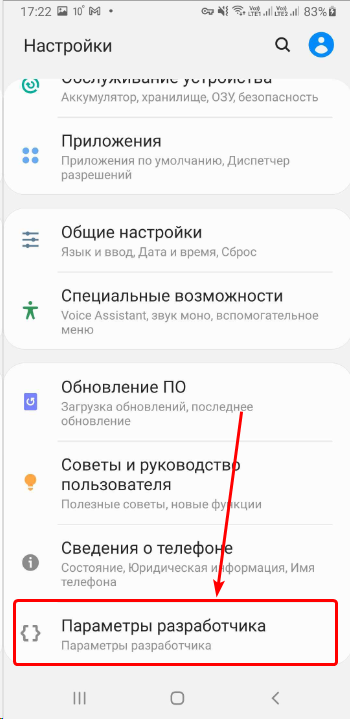
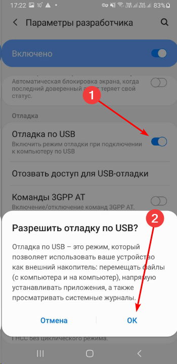
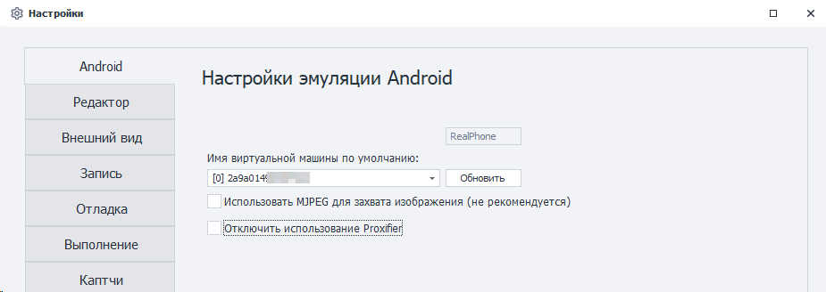
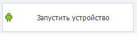
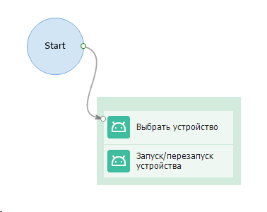
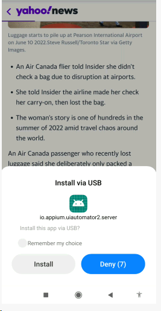
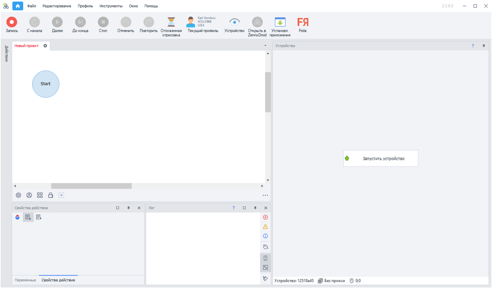

:::info **Пожалуйста, ознакомьтесь с [*Правилами использования материалов на данном ресурсе*](../Disclaimer).**
:::

export const VideoSample = ({source}) => (
  <video controls playsInline muted preload="auto" className='docsVideo'>
    <source src={source} type="video/mp4" />
</video>
);  

## Подключение реального устройства к ZennoDroid  

Для подключения смартфона к ZennoDroid требуется выполнить ряд простых действий.  
К сожалению, написать универсальную документацию по подключению невозможно, так как процесс настройки может отличаться в зависимости от производителя телефона, версии Android и UI оболочки.

Данная статья написана на основе тестирования несколько типов устройств. Если у Вас что-то не получается, то напишите нам в службу поддержки.  

**Краткое содержание**

<!--All you need is a blank line-->

    + Входим в режим разработчика.
    + Запускаем отладку по USB.  
    + Подключаемся к ZennoDroid.  
    + Запуск устройства.

   

## 1. Включаем режим разработчика.  
#### Подробная инструкция:  

1. Открываем настройки устройства.  
 

2. Нажимаем на раздел **«О телефоне»**/**«Сведения о телефоне»**
  

 

   

3. Переходим к графе **«Номер сборки»**.
  

 

 

:::info **Внимание.**
Если не находите такой пункт, то нажмите на **«Сведения о ПО»**, после этого откроется нужный раздел.
:::

4. Нажмите несколько раз на опцию **«Номер сборки»**. В результате ваших действий на экране устройства появится всплывающая надпись *«Вы стали разработчиком!»*.
  

  

 
  

5. Теперь вы увидите, что в меню настроек телефона появился новый пункт **«Параметры разработчика»**.
  

  

 
## 2. Запускаем отладку по USB  
#### Подробная инструкция:  

1. Переходим в тот самый пункт, который у нас только что появился: **«Параметры разработчика»** или **«Для разработчиков»**. Название может отличаться на разных девайсах.  
2. Находим параметр **«Отладка по USB»**, включаем его и подтверждаем.  

*Если у вас также присутствуют настройки **«Установка через USB»** и **«Отладка по USB (Настройки безопасности)»**, то их нужно включить для корректной работы.*
  

 

   
:::info **Как еще можно?**
*На устройствах с Root эти настройки можно включить c помощью действия*  
***«Консольная команда ADB shell»:***   
`su -c setprop persist.security.adbinstall 1`    
`su -c setprop persist.security.adbinput 1`
::: 

## 3. Подключаем устройство к ZennoDroid 
#### Подробная инструкция:  

1. Теперь, когда на смартфоне включен режим отладки, подключаем его по USB к компьютеру, на котором установлен ZennoDroid.  
2. На телефоне выпрыгнет вопрос такого типа: *«Разрешаете ли Вы отладку с этого компьютера?»*. Ставим галочку и жмем *Разрешить*.  

  

3. Запускаем **ProjectMaker for ZennoDroid** и открываем в нем **Настройки → Android**, чтобы убедиться, что подключенное устройство доступно для выбора.    

  
:::info **Внимание.**
Если в выпадающем меню пусто, нажмите *Обновить*. В случае, когда ничего не поменялось, напишите нам в [**Службу поддержки**](https://helpdesk.zennolab.com/ru).
:::
4. Создаём проект или открываем уже существующий. Жмём кнопку *«Запустить устройство»* в окне **Устройство**. Либо запускаем его через действия *«Выбрать»* и *«Запустить»*.  

   
:::tip **Не пугайтесь.**
 *Также будет установлено несколько приложений в фоновом режиме:*  
- ***com.genymobile.gnirehtet** для использования прокси;*  
- ***com.android.adbkeyboard** внешняя клавиатура;*  
- ***io.appium.settings** для фиктивной эмуляции геопозиции;*  
- ***io.appium.uiautomator2.server** для корректной работы с деревом элементов;*
:::
>  

#### У меня появилось окно о запросе установки неизвестного мне приложения, что делать?  

На некоторых телефонах не удаётся произвести фоновую установку вышеописанных приложений. В таком случае может появиться окно о разрешении установки. Подтвердите установку каждого из них для корректной работы ZennoDroid.

  

## 4. Запускаем устройство:  
#### Подробная инструкция:   

1. После подключения устройства нужно добавить в проект действия:  
**«Выбрать устройство»** и **«Запуск/Перезапуск устройства»**.

  

2. Выполнить запись проекта.     

 

