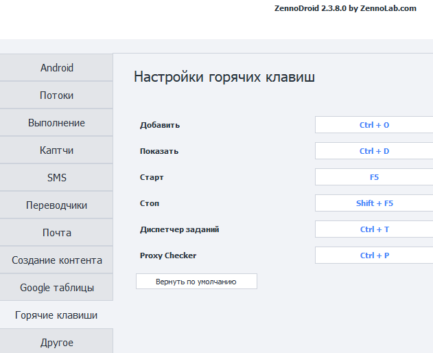
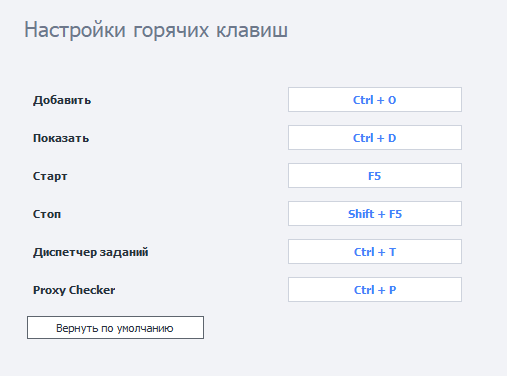

:::info **Пожалуйста, ознакомьтесь с [*Правилами использования материалов на данном ресурсе*](../Disclaimer).**
:::
_______________________________________________
Горячие клавиши можно настроить перейдя в **Настройки ZennoDroid**. Здесь мы рассмотрим клавиши, которые заданы по умолчанию, но вы также можете изменить их на произвольные комбинации.  

_______________________________________________
## Описание.  
- **Добавить `Ctrl + O`**. Открывает окно добавления нового проекта в программу.  
- **Показать `Ctrl + D`**. Переход во вкладку **Инстансы** для выделенного проекта. 
- **Старт `F5`**. Запуск выделенного проекта.  
- **Стоп `Shift + F5`**. Остановка выделенного проекта. 
- **Диспетчер заданий `Ctrl + T`**. Показывает окно Диспетчера заданий.  
- **Proxy Checker `Ctrl + P`**. Открывает окно управления Proxy Checker'ом.  
_______________________________________________
## Переназначение клавиш.  
Для изменения комбинации достаточно кликнуть по интересующему вас полю и зажать желаемое сочетание клавиш на клавиатуре. Если захотите вернуть изначальные варианты, то достаточно нажать на кнопку **Вернуть по умолчанию**.

  
_______________________________________________
## Полезные ссылки.    
- [**Диспетчер заданий**](./Task_Manager).  
- [**ProxyChecker для ZD**](../Installation/ProxyCheckerZD).  
- [**Какие есть настройки?**](../category/настройки)

