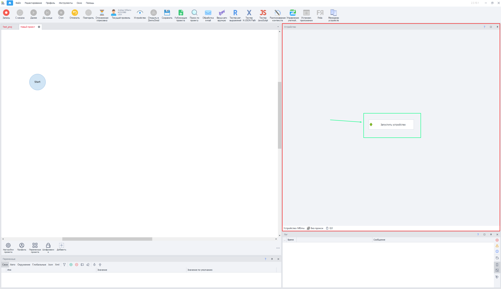
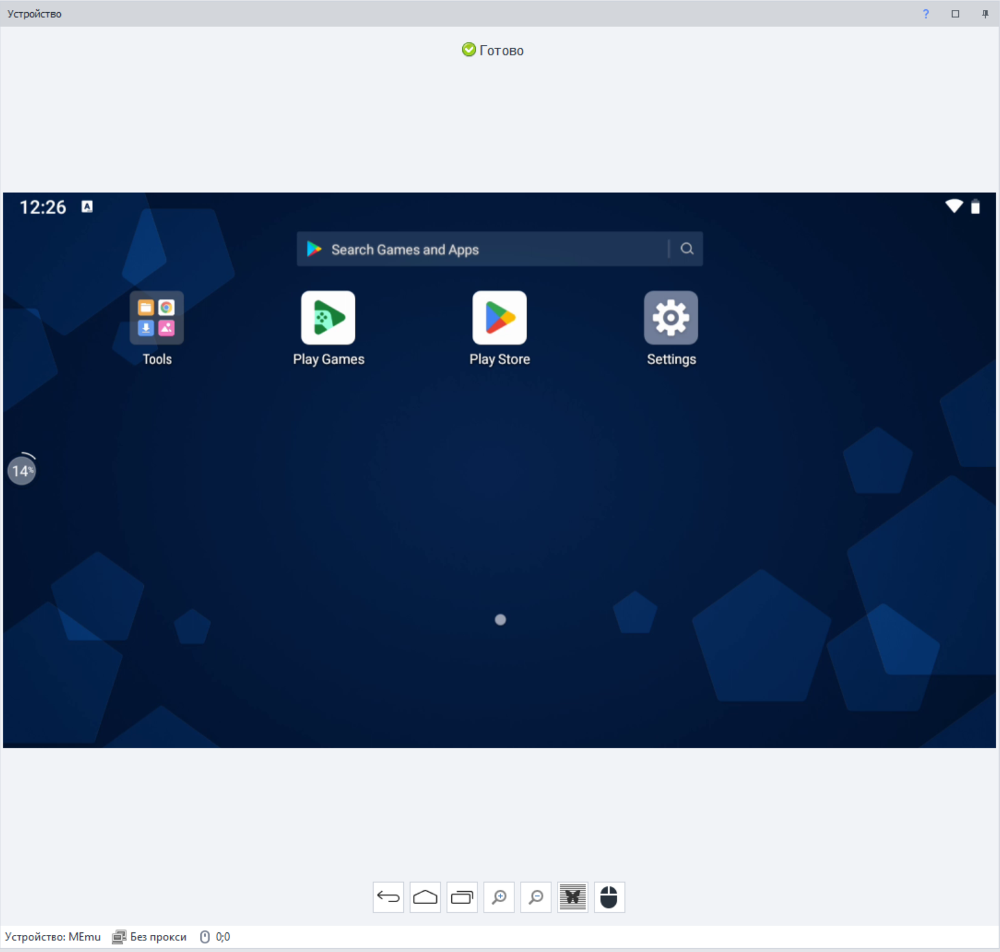
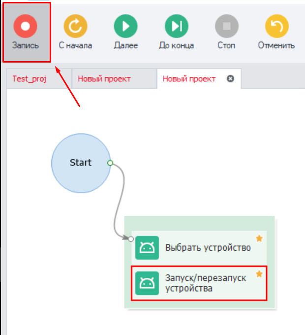

:::info **Пожалуйста, ознакомьтесь с [*Правилами использования материалов на данном ресурсе*](../Disclaimer).**
:::
_______________________________________________
## Описание.
Здесь и далее мы будем называть одну открытую виртуальную машину **Инстансом**. Он становится доступным не сразу при запуске программы, а только после включения эмулятора. Рабочий инстанс является единым для всех открытых проектов.  

### Запуск Memu.  
Из всех эмуляторов ZennoDroid поддерживает работу только с Memu. Поэтому показывать на примерах будем именно его.  

  

В **Окне устройства** нажимаем на кнопку **Запустить устройство** и ждём, когда эмулятор будет готов к работе:  

 

После успешного запуска вы увидите главный экран виртуальной Android-машины:  

  

:::tip **Перед нажатием кнопки запуска можно сразу включить Запись, чтобы ваши действия сохранились в шаблоне для будущего использования.**

:::
_______________________________________________
## Полезные ссылки.  
- [**Установка Memu**](../Installation/Memu_Install).  
- [**Окно устройства**](../pm/Interface/DeviceWindow).  
- [**Отладка проектов**](../pm/Debugging).