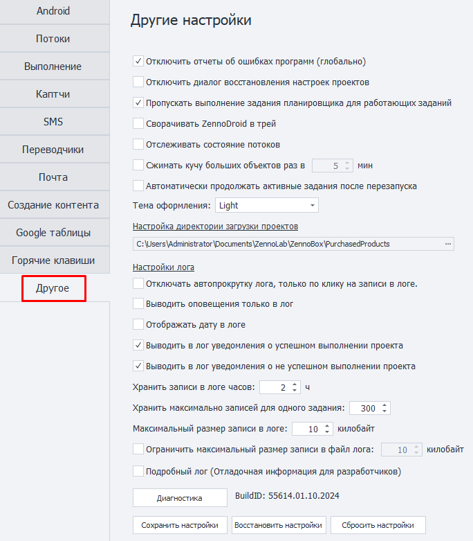
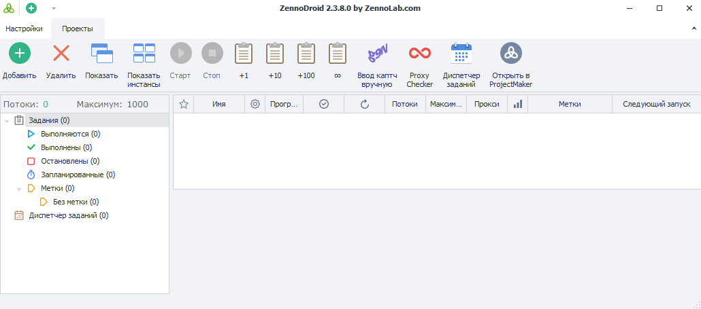
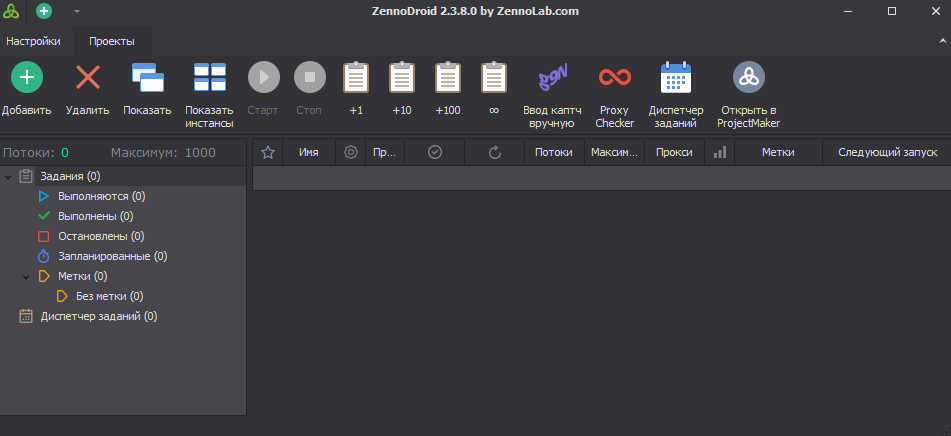

:::info **Пожалуйста, ознакомьтесь с [*Правилами использования материалов на данном ресурсе*](../Disclaimer).**
:::
_______________________________________________
## Настройки из вкладки «Другое».  

  
### Отключить отчёты об ошибках программ (глобально).  
В некоторых случаях из-за сбоя в работе какого-либо приложения эмулятор зависает. ZennoDroid отслеживает это и старается восстановить работу. Если при краше эмулятора будет висеть окно с информацией о случившейся ошибке, то высока вероятность, что он уже не перезапустится.    
_______________________________________________
### Отключить диалог восстановления настроек проектов.  
Отключает возможность восстановления настроек в случае аварийного завершения программы. Мы не рекомендуем ставить галочку на этой настройке. Однако в некоторых случаях она может быть полезна. Например, если окно восстановления блокирует автозапуск ZennoPoster.  
_______________________________________________
### Пропускать выполнение задания планировщика для работающих заданий.  
При включении данной опции сначала будет выполняться работающий проект (он становится приоритетным в очереди), а затем уже задание планировщика, если по каким-либо причинам их работа произошла одновременно.  
_______________________________________________
### Сворачивать ZennoDroid в трей.  
При сворачивании окна программы она будет выгружаться в трей.  
:::tip **Что такое трей?**
***Трей** — элемент панели задач в Windows, который открывается нажатием на стрелочку в правом крае панели. Используется для длительно запущенных, но при этом не постоянно используемых программ.* 
:::  
_______________________________________________
### Отслеживать состояние потоков.  
Эта функция нужна только для сбора статистики, которая, например, может пригодиться при обращении [в поддержку](https://helpdesk.zennolab.com/ru/conversation/new). Она запускает отслеживание состояния потоков в программе.  
_______________________________________________
### Сжимать кучу больших объектов.  
Устанавливает время в минутах, через которое *куча больших объектов* будет сжиматься. Настройка полезна при обработке больших строковых данных. Например, при включенном автопоиске в ProxyChecker.  
_______________________________________________
### Автоматически продолжать активные задания после перезапуска.  
Управляет тем, нужно ли продолжать выполнение заданий, которые были активны до закрытия программы.  
_______________________________________________
### Тема оформления (Light/Dark)  
  

_______________________________________________
### Настройка директории загрузки проектов.  
В данную папку будут сохраняться проекты, которые вы получили от других пользователей. В качестве имени папок будут использоваться email разработчиков проекта, либо их ZennoLab ID.  
:::warning **Вручную копировать проекты в эту папку нельзя!**
::: 
_______________________________________________
## Настройки [Лога](../pm/Interface/Log_window).  
### Отключать автопрокрутку лога, только по клику на записи в логе. 
Автопрокрутка записей в логе будет отключаться только после клика по записи.  
_______________________________________________
### Выводить оповещение только в лог.  
Сообщения выводимые с помощью экшена **Оповещение** будут выводиться только в лог, без всплывающего окна и независимо от настроек экшена.  
_______________________________________________
### Отображать дату в логе.  
Дополнительно показывать в логе текущую дату.  
_______________________________________________
### Выводить в лог уведомления об успешном выполнении проекта.  
Оповещение в логе об успешном выполнении проекта.  
_______________________________________________
### Выводить в лог уведомления о не успешном выполнении проекта.  
Информация в логе о не успешном выполнении проекта.  
_______________________________________________
### Хранить записи в логе часов.  
Указывается максимальное время в часах, которое будут храниться записи в логе.  
_______________________________________________
### Хранить максимально записей для одного задания.  
Количество записей в логе для одного задания. **Максимальное значение - 9999**.  
_______________________________________________
### Максимальный размер записи в логе.  
Ограничение на максимальный размер записи в килобайтах, которая может быть *отображена* в окне лога.  
_______________________________________________
### Ограничить максимальный размер записи в файл лога.  
:::tip **Рекомендуем включить.**
*Пользователям, которые работают с большими данными, и которым не нужен полный лог, **рекомендуется включить ограничение**. Это повысит производительность и снизит потребление памяти.*  
:::   
Данная настройка ограничивает размер записи, которая может быть *сохранена* в файл лога.  
:::info **Logs.**
Файлы логов хранятся в директории с установленным ZennoDroid в папке - **Logs**.  
Возможный путь - `C:\Program Files\ZennoLab\RU\ZennoDroid Pro\2.3.8.0\Progs\Logs\`  
:::   

:::warning **Для вступления изменений требуется перезагрузка программы.**
:::  
_______________________________________________
### Подробный лог (Отладочная информация для разработчиков).  
Запускает подробную запись информации о работе. Может потребоваться при обращении в поддержку.  
_______________________________________________
### BuildID  
Комбинация букв и цифр в данной строке отображает текущую версию программы, а также дату релиза.  
:::tip **Значение в этом поле можно выделить и скопировать с помощью контекстного меню.**
:::  

_______________________________________________
## Доступные кнопки.  
### Диагностика.  
Открывает утилиту для диагностики `diagnostic.exe`, которая отображает информацию при возникновении проблем. После выполнения в директории установленного ZennoDroid будет создан файл `report.zip`  
_______________________________________________
### Сохранить настройки.  
Сохраняет текущие настройки программы. Для использования нужно сначала нажать на кнопку, а затем закрыть программу.  
_______________________________________________
### Восстановить настройки.  
Позволяет восстановить настройки, которые были сохранены последними. Опять же нужно сначала нажать на эту кнопку, а затем перезапустить программу.  
_______________________________________________
### Сбросить настройки.  
Сброс текущих настроек на значения по умолчанию.  
_______________________________________________
## Полезные ссылки.    
- [**Окно лога**](../pm/Interface/Log_window).  
- [**Какие есть настройки?**](../category/настройки)  