:::info **Пожалуйста, ознакомьтесь с [*Правилами использования материалов на данном ресурсе*](../Disclaimer).**
:::
_______________________________________________
## Что такое **ZennoProxyChecker**?
Это наш продукт, предназначенный для загрузки прокси, их хранения, автоматической перепроверки и предоставления их разными способами в соответствии с гибкими критериями.  
Он существует как в виде отдельного приложения, так и **прямо внутри ZennoDroid**.  
### Основные возможности:

**Добавление**

<!--All you need is a blank line-->

Добавление прокси возможно различными способами: как вручную, прямой вставкой адресов прокси, так и автоматически, когда программа сама ищет и собирает (парсит) адреса прокси с web-страниц или локальных файлов со списками прокси.

 

**Проверка**

<!--All you need is a blank line-->

ProxyChecker может проверять прокси примерно по 20 параметрам, отфильтровывая опасные и выбирая самые лучшие и быстрые. Кроме того, в программе можно делать проверку на URL, отбирая прокси для работы с нужными web-ресурсами.

 

**Выдача**

<!--All you need is a blank line-->

Программа позволяет настроить несколько каналов выдачи прокси, так, чтобы разным шаблонам предоставлялись прокси с разными параметрами. Списки прокси также можно сохранять в локальные файлы и выкладывать на сетевые ресурсы, выдавая свежие прокси с определенной периодичностью.

  
_______________________________________________
## Быстрый старт.
Основная задача программы — проверить прокси и отобрать из них рабочие для использования в проектах.  
Рассмотрим основные шаги, которые для этого требуются:   

**1.** Открываем вкладку **Источники** → **Добавить прокси**.  
Формат адреса прокси - `ip:port` для обычных прокси, и `login:password@ip:port` для прокси с авторизацией.

<!--All you need is a blank line-->

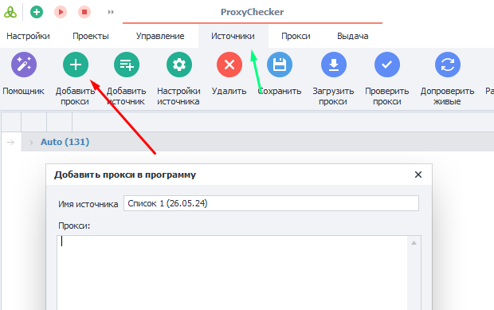

**2.** Переходим на вкладку **Управление** → нажимаем на кнопки **Загружать прокси** и **Проверять прокси** → запускаем кнопкой **Старт**.

<!--All you need is a blank line-->

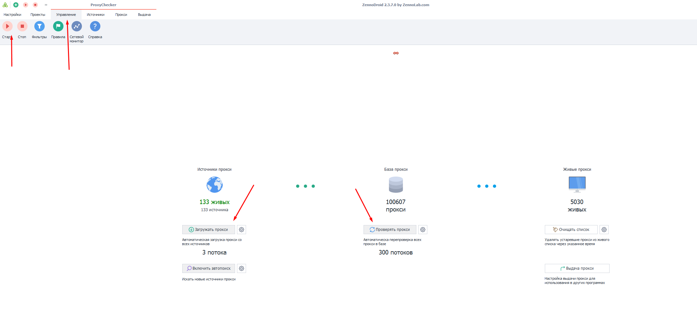

  

**3.** Получим проверенные прокси на вкладке **Прокси**. Там же можно задать *Правила* для отбора подходящих прокси.

<!--All you need is a blank line-->

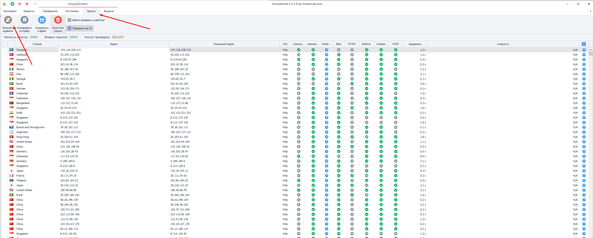

**4.** Полученные прокси можно **Cкопировать в буфер** или **Cохранить в файл**.

<!--All you need is a blank line-->

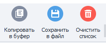

_______________________________________________
## Настройки ProxyChecker.
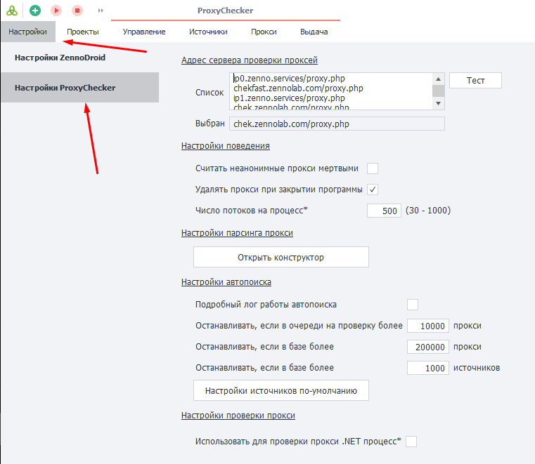
### Адрес сервера проверки проксей.  
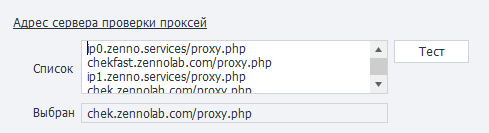  

Здесь мы выбираем сервера из списка, которые будут проверять наши прокси.  
#### Список.
URL адреса, которые программа использует для проверки прокси. По умолчанию здесь указаны пять адресов, но вы можете добавить свои.  
#### Кнопка **Тест**.
После её нажатия программа последовательно будет проверять адреса из **Списка** на работоспособность. Тест завершится, когда будет найден первый рабочий сервер проверки. Либо когда кончатся адреса в списке.  
#### Выбран.
Здесь будет указан адрес, с помощью которого будут проверяться все прокси на предмет того живы они или нет. Сюда попадает первый рабочий адрес из **Списка**.  
_________________
### Настройки поведения.  
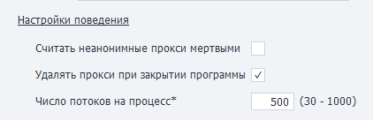
#### Считать неанонимные прокси мёртвыми.
Программа будет фильтровать неанонимные прокси и выдавать только анонимные.
#### Удалить прокси при закрытии программы.
Очистка списка прокси при закрытии программы.
#### Число потоков на процесс.
Задаёт число потоков, используемых для проверки.  
:::warning **Для применения изменений нужно перезапустить программу.**
:::  
_______________________________________________
### Настройки парсинга прокси.  
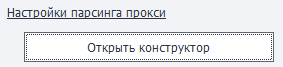  
С помощью конструктора можно добавить новые структуры (регулярные выражения) для парсинга прокси или отредактировать существующие. Нажмите **Открыть конструктор**, чтобы начать работу.  

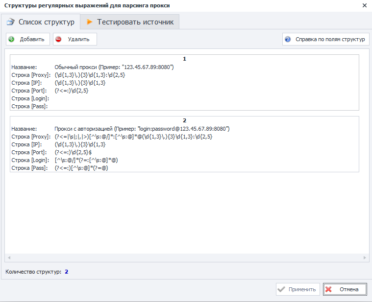 
#### Вкладка **Список структур**.
По умолчанию сюда уже внесены 2 регулярных выражения. Также можно **Добавить (1)** или **Удалить(2)** свои структуры. А с помощью кнопки **Справка по полям структур (3)** можно получить описание используемых полей.

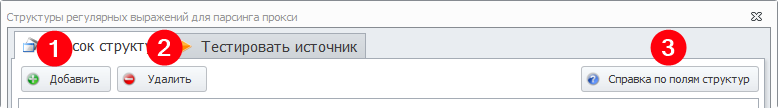  

На некоторых сайтах может встретиться своя разметка прокси, поэтому, при необходимости, можно создать свою структуру парсинга практически для любого вида и протестировать на конкретном источнике с помощью тестера.  
#### Вкладка **Тестировать источник**.
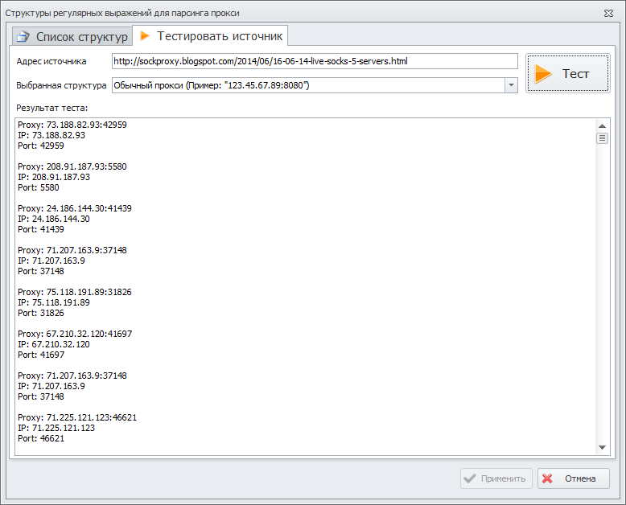 
- **Адрес источника**. Tут нужно указать адрес сайта, с которого будет происходить парсинг проксей.  
- **Выбранная структура**. Необходимо выбрать добавленное ранее условие для парсинга из вкладки **Список структур**.
- Кнопка **Тест**. Запускает тестирование.
- Окно **Результат теста**. Здесь вы увидите полученные в соответствии с условиями парсинга прокси.  
:::warning **Результаты парсинга не сохраняются.**
После закрытия окна **Конструктора** или нажатии кнопки **Отмена**.
:::  
_______________________________________________
### Настройки автопоиска. 
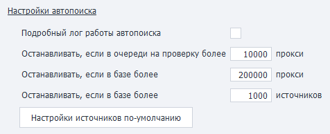
#### Подробный лог работы автопоиска.
Поставив здесь галочку, вы будете видеть подробный отчет о работе ZennoProxyChecker в режиме автопоиска.  
#### Останавливать, если в очереди на проверку более *XXX* прокси.  
При превышении данного количества прокси в очереди, автопоиск будет остановлен.  
#### Останавливать, если в базе более *XXX* прокси.
При превышении данного количества прокси в базе, автопоиск будет остановлен.  
#### Останавливать, если в базе более *XXX* источников
При превышении данного количества источников, автопоиск будет остановлен.
#### Настройки источников по-умолчанию.
Здесь указываются настройки, которые будут применены ко всем вновь добавленным источникам. 
_________________
### Настройки проверки прокси.
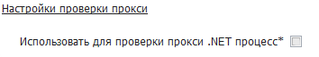
#### Использовать для проверки прокси .NET процесс.
Если параметр установлен, то прокси будут проверяться с помощью .NET реализации CheckingProcessor (***требуется перезапуск***).  
_________________
## Как получить актуальную базу GeoIP?  
### 1. [Зарегистрироваться на сайте](https://www.maxmind.com/en/account/login)  
### 2. Выбрать раздел «Downloads».  
  
### 3. Скачать базу «GeoLite2 City».

### 4. Разархивировать и положить файл `GeoLite2-City.mmdb` в папку:  
`C:\Users\{имя_пользователя}\AppData\Roaming\ZennoLab\ZennoDroid\2\Data\`  
### 5. Задать файлу `GeoLite2-City.mmdb` права только на чтение.  
  
_________________
## Полезные ссылки.  
- [**Главная страница ZennoProxyChecker**](https://zennolab.com/ru/products/zennoproxychecker/)  
- [**Что такое прокси? Для самых маленьких**](https://habr.com/ru/articles/866406/).  
- [**Подробная справка по ZennoProxyChecker**](https://zennolab.atlassian.net/wiki/spaces/RU/pages/475365507/ZennoProxyChecker).