---
sidebar_position: 7
title: Диспетчер заданий
description: Настройка выполнения заданий
---  
:::info **Пожалуйста, ознакомьтесь с [*Правилами использования материалов на данном ресурсе*](../Disclaimer).**
:::
_______________________________________________
Эта утилита позволяет настроить выполнение проектов по расписанию или по заданному триггеру. Принцип работы схож с **Планировщиком**, однако он позволяет настраивать расписание не для каждого проекта отдельно, а создавать задание сразу для нескольких проектов. Они при этом будут выполняться последовательно, сверху вниз.  
_______________________________________________
## Главное меню.  
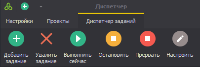  
### Доступные кнопки:
- **Добавить задание**. С нуля создает новое задание.  
- **Удалить задание**. Удаляет выделенное задание.  
- **Выполнить сейчас**. Однократное выполнение выбранного задания.  
- **Остановить**. Происходит плавная остановка. Текущий работающий шаблон доходит до логического конца и задание останавливается, даже если дальше в очереди есть проекты для выполнения.  
:::info **Расписание при этом тоже отключиться.**
Чтоб снова запустить его, нужно повторно включить чекбокс напротив нужного задания в колонке ***Включить***.  
:::  
- **Прервать**. Резкая остановка работы, выполнение проекта немедленно прерывается.  
- **Настроить**. Открывает настройки выделенного задания.  
_______________________________________________
## Создание нового задания.  
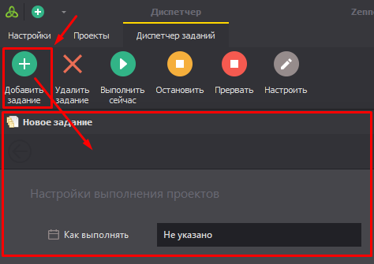  
_______________________________________________
## Окно с настройкой расписания.
Нажимаем на кнопку **Добавить задание** → откроется новое окно с настройками расписания → кликаем по кнопке **Next** после установки расписания.  

**Можно гибко задать периодичность выполнения:**  
- *Один раз в день;*  
- *Каждый день;*   
- *Каждую неделю (можно выбрать конкретные дни недели);*  
- *Каждый месяц (позволяет задать диапазон дней);*  
- *А также по сигналу (нужно прикрепить файл-триггер).*  
 
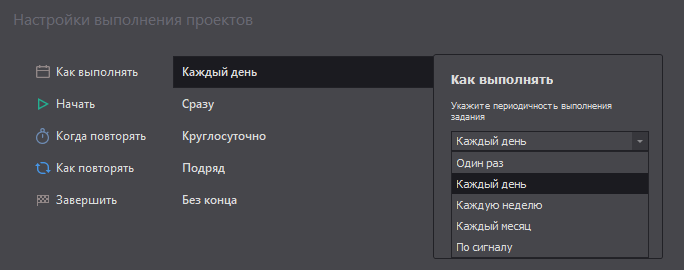 
     
_______________________________________________
## Окно добавления проектов.  
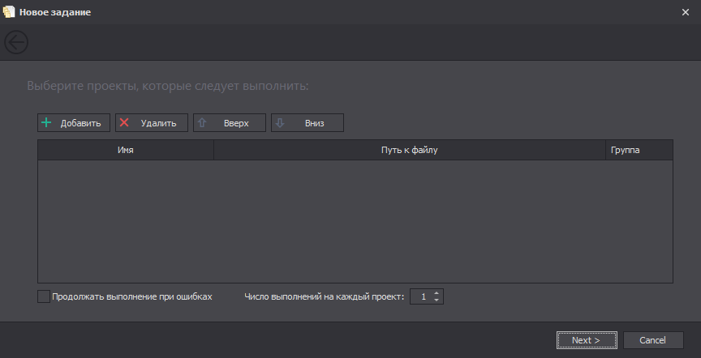   
### Доступные кнопки:  
- **Добавить**. Открывает стандартное окно выбора файла. Можно выбрать сразу несколько шаблонов.  
- **Удалить**. Удаляет выбранный шаблон из задания.  
- **Вверх/вниз**. Меняют порядок шаблонов в очереди. Чем выше, тем приоритетнее.  
- **Продолжать выполнение при ошибках**. Если эта настройка включена, то выполнение перейдёт к следующему шаблону в очереди даже если текущий завершил работу с ошибками.  
- **Число выполнений на каждый проект**. Указывает количество раз, которое каждый проект в задании будет выполняться подряд.  

### Столбец «Группа»:  
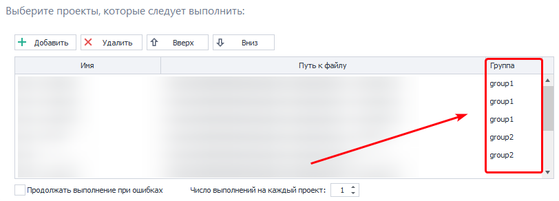

Позволяет группировать проекты внутри задания. Шаблоны с одинаковым названием группы и находящиеся по соседству друг с другом будут выполняться одновременно. Управление перейдёт к следующей группе (или шаблону) только после того, как закончат работу все проекты внутри текущей группы.  
:::info **Имейте в виду.**
*В данную колонку можно вручную внести любое текстовое значение.*  
::: 
_______________________________________________
## Таблица заданий.
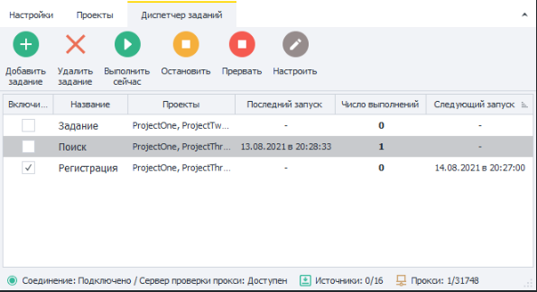 
### Колонки.
Все добавленные задания отображаются в Таблице заданий, которая состоит из следующих колонок:  
- **Включить**. Включает или отключает выполнение задания по расписанию.  
- **Название**. Имя задания. По умолчанию каждое называется «Задание».  
- **Проекты**. Список проектов, которые входят в это задание.  
- **Последний запуск**. Время последнего запуска данного задания.  
- **Число выполнений**. Показывает, сколько раз уже было выполнено данное задание.  
- **Следующий запуск**. Время, в которое произойдет следующий запуск по настроенному расписанию.  
- **Значок сортировки**. Задания можно сортировать по каждой из колонок, для этого достаточно кликнуть по её названию.  
_______________________________________________
## Настройки задания.  
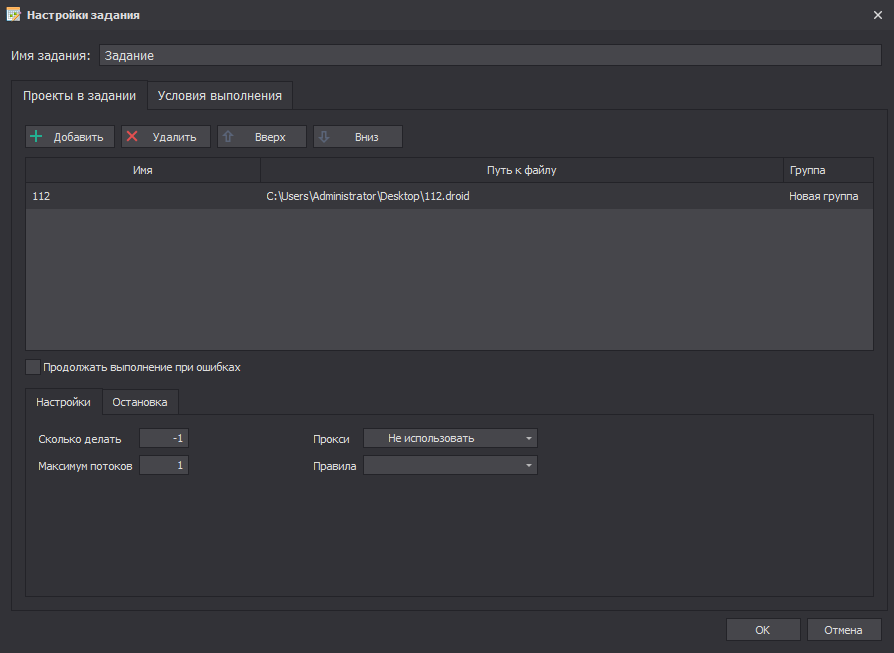   

### Как их открыть?  
Есть несколько способов:  
- Выделить задание и нажать кнопку **Настроить** в главном меню.  
- Вызвав нажатием правой кнопки мыши контекстное меню.  
- Двойной клик по заданию.  

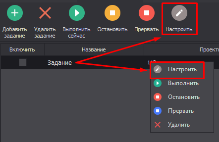 

### Имя задания.  
В этой строке можно указать новое имя.  

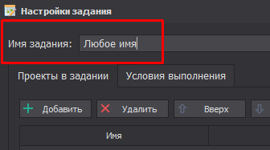  

### Вкладка «Проекты в задании»  
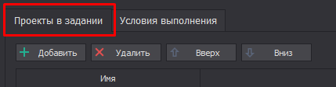  
- **Редактирование списка заданий**. Здесь, как и прежде, можно **Добавить** или **Удалить** проекты, а также изменить их очередность и назначить группы.  
:::tip **Если дважды кликнуть по проекту, то откроются его Входные настройки.**
:::  

### Вкладка «Настройки».  
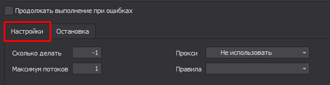   
:::warning **Эти параметры настраиваются отдельно для каждого проекта, а НЕ для всего задания!** 
:::  
- **Сколько делать**. Количество выполнений проекта. Если стоит `-1`, то это означает бесконечное выполнение. То есть шаблон будет выполнен столько раз, сколько указано в настройке **Количество успехов** во вкладке **Остановка**.  
- **Максимум потоков**. Сколько максимум потоков могут работать в контексте данного шаблона.  
- **Прокси**. Стоит ли использовать прокси из встроенного **ProxyChecker**.  
- **Правила**. По ним будут браться прокси.  

### Вкладка «Остановка».  
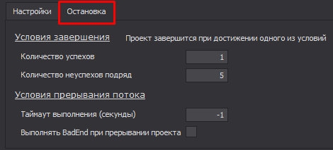   
- **Количество успехов**.  
По умолчанию здесь будет находиться число, которое вы указали в настройке **Число выполнений на каждый проект** при создании задания. Если стоит `-1`, то это означает бесконечное выполнение. То есть шаблон будет выполнен столько раз, сколько указано в **Сколько делать** во вкладке **Настройки**.  
- **Количество неуспехов подряд.**  
Сколько подряд может быть допущено ошибок, после которых выполнение перейдет к следующему шаблону в очереди. Задание также может быть остановлено, если не стоит галочка возле пункта **Продолжать выполнение при ошибках**.  
:::warning **Не ставьте в этой настройке значение `-1`.**
Так как в случае возникновения ошибки шаблон никогда не сможет завершиться.     
:::  
- **Таймаут выполнения (секунды)**.  
Если проект не выполнится в указанное время, то будет принудительно прерван.  
- **Выполнить BadEnd при прерывании проекта**.  
**BadEnd** — это экшен в **ProjectMaker**, который используется для выполнения дополнительных действий в случае завершения шаблона с ошибкой. Данная настройка позволяет нам направлять прерывание проекта по этому экшену. Учитывается, как ручное прерывание, так и по таймауту.  
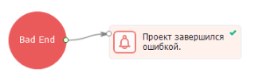  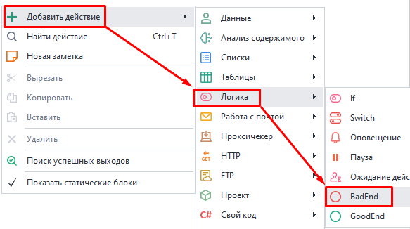   

### Вкладка «Условия выполнения».  
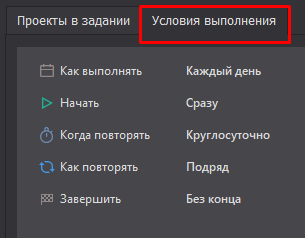  
Здесь можно отредактировать расписание, по которому будет выполняться проект.  
_______________________________________________
## Как посмотреть лог проекта?  
Откройте вкладку «Проекты» → выберите задание → выделите один или несколько проектов с зажатым Ctrl → после этого появится **Лог**.  

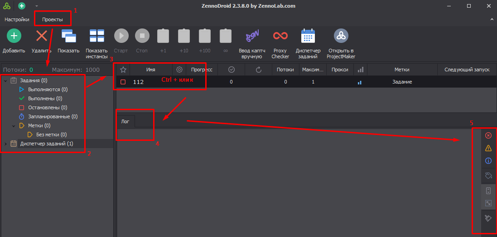  
_______________________________________________
## Полезные ссылки.  
- [**BadEnd**](../Project%20Editor/Logic/BadEnd).  
- [**Окно лога**](../pm/Interface/Log_window).  
