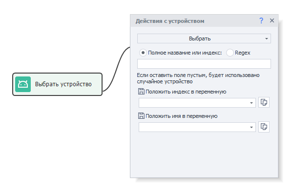
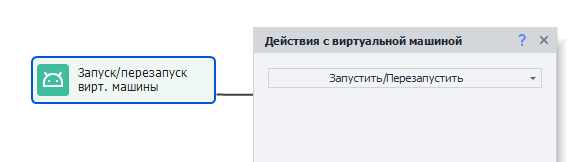

Познакомимся с тем, как правильно выбрать и запустить виртуальную машину при работе с Zennodroid. 
_______________________________________________
## Принцип работы с виртуальными машинами в ZD.  
Когда в действии **Выбрать** не указано имя или индекс, то ZennoDroid всегда выбирает рандомную виртуальную машину, которая не занята в этот момент. Указание конкретной ВМ позволяет избегать ситуаций, когда разные потоки выбирают одну и ту же машину одновременно.  
#### Пример:  
Доступна виртуальная машина с именем ***Memu_1*** и два проекта: ***Проект1*** и ***Проект2***, которые с ней работают.  
***Проект1*** стартует раньше, поэтому забирает ***Memu_1*** себе. Затем запускается ***Проект2***, который подождет 60 секунд и, если ВМ так и не освободится, то завершится с ошибкой. Но если вдруг за это время первый проект освободит машину, то второй заберет ее себе.  

Принцип также актуален в рамках одного проекта, который разделен на несколько потоков. Если для него указана одна конкретная машина, то ее займет поток, который стартует первым, последующие же выдадут ошибку.  
_______________________________________________
## Выбор виртуальной машины.  
   
Прежде всего нужно выбрать ВМ, с которой будет работать текущий поток. Сделать это можно с помощью действия **Выбрать**, которое показано на скриншоте выше.         
_______________________________________________
### Как правильно выбрать ВМ.  
Самым простым вариантом будет случайный выбор. Для этого в настройках действия **Выбрать** нужно оставить пустым поле *«Полное название или индекс»*. А в полях для имени и индекса нужно указать переменные, в которые они сохранятся.  

При таком подходе ZennoDroid ищет ВМ среди всех доступных, которые не заняты в данный момент.  
:::warning **Важно.**
Виртуальная машина, которая в **Настройках** выбрана **по умолчанию** всегда считается занятой, поэтому будет пропускаться при случайном выборе.
:::    
_______________________________________________
## Запуск виртуальной машины.  
   
Когда ВМ выбрана, её нужно запустить. Для этого используется действие **Запустить\Перезапустить**.   