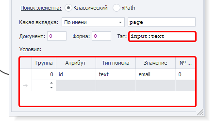
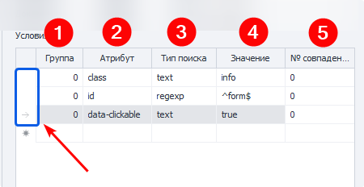
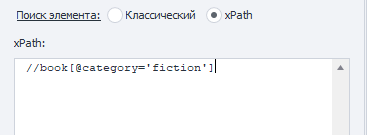

:::info **Пожалуйста, ознакомьтесь с [*Правилами использования материалов на данном ресурсе*](../../Disclaimer).**
:::
_______________________________________________  
## Описание.  
Вам понадобится найти элемент, прежде чем начать с ним взаимодействовать.   

В этой статье мы расскажем не про конкретный экшен, а про раздел поиска, который присутствует в различных действиях программы. Таких как:  
- ***Взятие значения***;  
- ***Установка значения***;  
- ***Выполнить событие***.   
_______________________________________________
## Классический поиск.  
Поиск происходит по параметрам HTML элемента: тэг, атрибут и его значение.  

  

### Условия поиска.  
  

**1. Группа**. Она определяет приоритет конкретного условия. Чем выше число, тем ниже приоритет. То есть **0** — самое значимое условие.  

Если не был найден элемент по наивысшему приоритету, то поиск переходит далее по списку. И так продолжается, пока не найдётся элемент, либо пока не закончатся все условия поиска.  

Можно добавить несколько условий с одинаковым приоритетом, тогда они будут использоваться одновременно.  

**2. Атрибут**. Тут указывается атрибут HTML-тега, по которому выполняется поиск.  
**3. Тип поиска**:  
    - *text*. Поиск по полному или частичному совпадению текста;  
    - *notext*. Ищем элементы, в которых не будет указанного текста;  
    - *regexp*. Выполняем поиск через ***регулярные выражения***.  
    *Последний тип поиска по умолчанию зависит от регистра.  
    Чтобы он не учитывался, добавьте в начало выражения `(?-i)`*  
**4. Значение**. Записываем содержание соответствующего атрибута HTML-тега.  
**5. № совпадения**. Порядковый номер найденного элемента, нумерация с нуля! Здесь можно использовать ***Диапазоны*** и ***Макросы переменных***.  

:::info **Мы рекомендуем подбирать условия поиска таким образом.**  
Чтобы в его результате оставался только один элемент, который будет с порядковым номером `0`.
:::  

**Удалить условие** поиска можно, кликнув ЛКМ слева от таблицы (выделено синим на скриншоте выше), а затем Delete на клавиатуре.  

Для поиска нужного элемента иногда может потребоваться сразу **несколько условий**.  
_______________________________________________
## xPath (XML Path Language).  
  

Поиск выполняется с помощью ***xPath выражений***. Данный вариант является более универсальным и устойчивым к изменениям структуры сайтов и приложений.  

:::tip **Это язык для поиска и извлечения данных из XML-документов.**  
Он позволяет искать и выбирать узлы в XML-документе на основе их иерархической структуры, используя путь или выражения. XPath широко применяется для автоматизации, веб-скрапинга, тестирования и обработки данных.
:::  

### Преимущества xPath.  
- **Гибкость**.  
Позволяет точно выбирать элементы и атрибуты, а также применять сложные фильтры и условия.  
- **Широкое использование**.  
Поддерживается многими инструментами и языками программирования, а также используется в таких библиотеках, как Selenium.  
- **Комплексные запросы**.  
Может извлекать данные, учитывая иерархию, атрибуты и текстовые значения.   
- **Экономия времени**.  
Сокращает время, необходимое для извлечения нужных данных из сложных документов.  
_______________________________________________