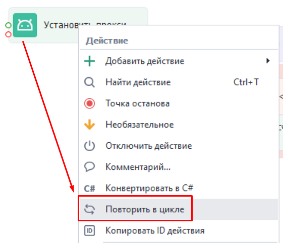
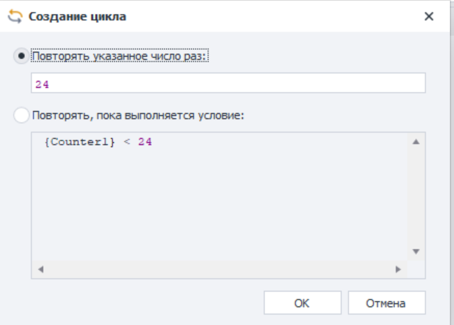
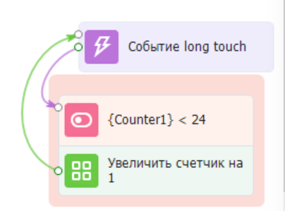
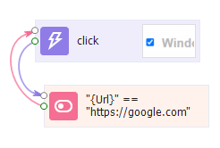
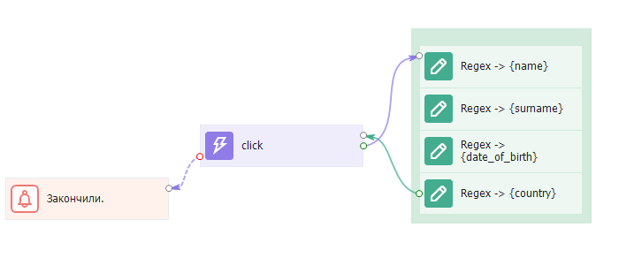

---
sidebar_position: 5
title: Циклы в ZD
description: Использование циклов в ZennoDroid
--- 
:::info **Пожалуйста, ознакомьтесь с [*Правилами использования материалов на данном ресурсе*](../../Disclaimer).**
:::

**Циклы** — это программная конструкция, которая повторяет набор инструкций некоторое количество раз, пока выполняется определенное условие.  
:::tip **Не используйте циклы часто.**  
Это сложная конструкция, в которой может возникнуть ряд непредвиденных ошибок. Особенно, если вы не разбираетесь в программировании.  
:::
_______________________________________________   
## Автоматическое создание.  
Нажимаем ПКМ на любой экшен (или выделяем группу экшенов) → ***Повторить в цикле***.  

 

Затем появится окно с выбором причины завершения цикла:  

   
_______________________________________________ 
### Повторять указанное число раз.  
При выборе этого варианта нужно будет ввести желаемое число повторений действия. После подтверждения будут созданы ***переменная-счетчик***, ***экшен сравнения*** с указанным числом и ***экшен прибавления*** к значению счетчика.  

 
_______________________________________________ 
### Повторять, пока выполняется условие.  
Здесь же надо указать условие, в рамках которого цикл будет продолжать выполняться *(True)*. Как только условия не совпадут и вернут значение *False*, цикл прервется.  
После клика на *Ок* данные из поля с условиями перенесутся в ***экшен IF***, так что нужно соблюдать правила построения выражений.  

   
*Пока текущий URL равен https://google.com будет происходить клик.*  
_______________________________________________ 
## Создание вручную.  
Два верхних вариант относятся к автоматическому созданию циклов. Но можно также делать это вручную.  

***Пример:*** необходимо достать данные из сайта, на котором много страниц. Для перехода на каждую следующую страницу необходимо кликнуть по кнопке ***Далее***. Однако когда страницы кончаются, то этой кнопки нет.  

В данном случае условием для завершения цикла станет ошибка при поиске элемента ***Далее***. То есть как только кнопка пропадает, цикла останавливается.  

  
_______________________________________________ 
:::warning **Не создавайте вечные циклы и не зацикливайте весь проект целиком.**  
Обязательно добавляйте счетчик в циклы. Иначе шаблон может зависнуть из-за бесконечного выполнения.  
А помещение в цикл всего проекта может привести к непредсказуемым ошибкам.
:::  

