:::info **Пожалуйста, ознакомьтесь с [*Правилами использования материалов на данном ресурсе*](../../Disclaimer).**
:::

Данное действие позволяет произвести нажатие на элемент, используя визуальный поиск.  
Мы рекомендуем использовать его, когда не получается найти элемент другими способами,  
так как <mark>данная операция использует много ресурсов компьютера</mark>. Также это действие используется  
для клика по элементу, к которому нельзя подобраться с помощью экшена **Выполнить событие**. 
_______________________________________________ 
## Как работать с этим действием?  
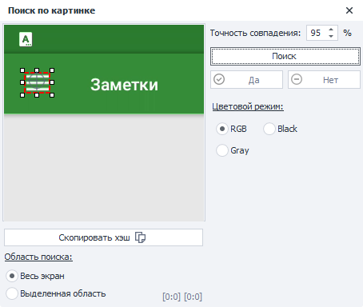
_______________________________________________   
### Добавление в проект.  
В Окне эмулятора наводим курсор мыши на элемент **→ нажимаем ПКМ → Поиск по картинке**.  

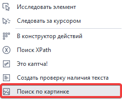  
_______________________________________________ 
### Область поиска.  
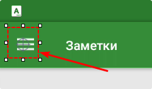  

Ее можно регулировать специальным пунктирным квадратом. Наводите курсор на белые точки, зажимаете и меняете размер под свои нужды. Чем больше область поиска, тем больше ресурсов требуется для выполнения. <mark>Выделять необходимо уникальную часть элемента</mark>, которая отличается по цвету. Так, например, если выделяете кнопку, то не нужно выделять её всю, потому что она содержит много монотонного цвета.  

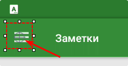  

**Круглым прицелом** также можно задать **место совершения клика** со случайным отклонением. Он может находиться вне области поиска.  
_______________________________________________    
### Скопировать хэш.  
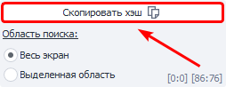   

Кнопка позволяет скопировать хэш изображения в буфер обмена. Его можно использовать в C# методах для поиска по изображению.  
_______________________________________________ 
### Способ поиска.  
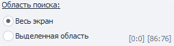  

Тут можно выбрать, как именно будет искаться изображение:  
- **Весь экран**. Поиск осуществляется по всему экрану.  
- **Выделенная область**. Данный режим позволяет выбрать область поиска в Окне эмулятора, как мы уже видели ранее в статье. Можно использовать, когда точно известно, что элемент появится в определённой части экрана.  
:::tip **Советуем.**
*Поиск в заданной области происходит быстрее и снижает нагрузку на CPU*
:::
_______________________________________________  
### Поиск.  
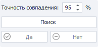  
- **Точность совпадения**. Данная настройка регулирует точность поиска. Чем выше точность, тем больше нужно ресурсов и времени для распознавания.  
- **Кнопка «Поиск»**. Тестирование операции поиска.  
- **Да**. Нажать в случае удачного поиска.  
- **Нет**. Нажмите, если не получилось найти. Затем измените параметры поиска и попробуйте снова.  
_______________________________________________  
 ### Цветовой режим.  
 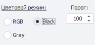  

 Выбор цветового режима, в котором будет происходить поиск картинки.  
 - **RGB**. Поиск по цветному изображению.    
 - **Gray**. Картинка только с оттенками серого.    
 - **Black**. Черно-белый режим. Для него рекомендуется выставлять *Точность совпадения* не выше 90%.  
:::tip **Интересно.**
*Поиск в режимах Gray и Black происходит быстрее и меньше нагружает CPU.*
::: 
  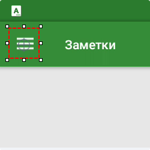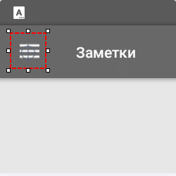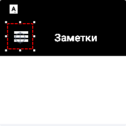  
:::info **Полезно знать.**
Пункт **Порог**. Картинка переводится в формат GrayScale, в котором каждой точке соответствует значение **от 0 - черный, до 255 - белый**. Пиксели с яркостью выше порога считаются белыми, ниже порога - чёрными. Этот параметр доступен только **в режиме Black**.
:::     
 _______________________________________________ 
  ### Тип клика.  
  - **Touch**. Быстрое нажатие на элемент.  
  - **Long touch**. Удержание пальцем по элементу.   
  - **None**. Не совершать никакого действия, а только проверить наличие элемента в Окне эмулятора. 
  _______________________________________________  
## Тестирование поиска.  
 После того, как выделили необходимую область нажмите кнопку «Поиск». Если искомый фрагмент будет найден, то возле кнопки появится зеленая галочка, свидетельствующая об успехе, а элемент будет подсвечен в Окне эмулятора.  

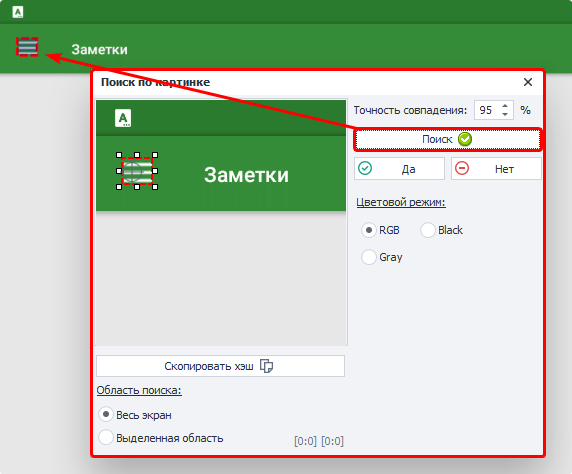  
 

Если же поиск завершился неуспехом, то появится красный крестик.
  

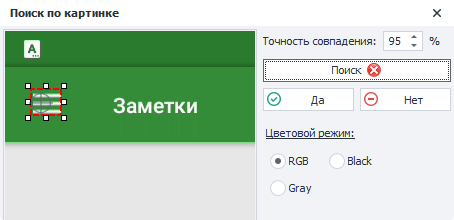

 
 ### Скрытие части изображения.  
 Чтобы убедиться, что поиск не будет находить ничего лишнего, есть возможность закрыть часть изображения. Для этого нужно кликнуть **по кнопке с изображением бабочки** в нижней части Окна эмулятора, а затем нажать по области, которую нужно скрыть, и снова выполнить поиск.  
 
 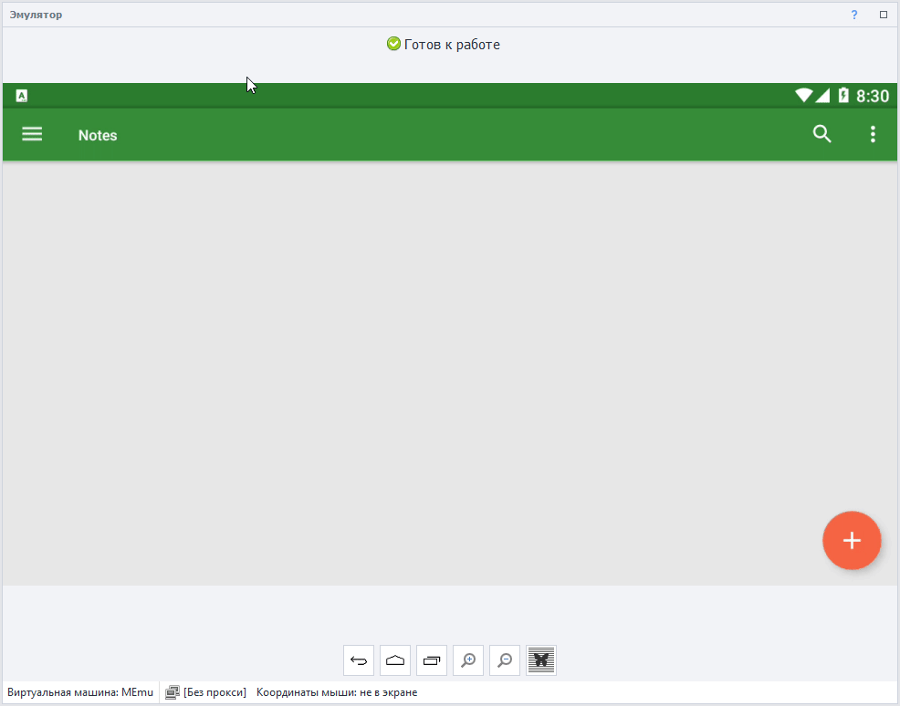 
## Вкладка «Дополнительно».  
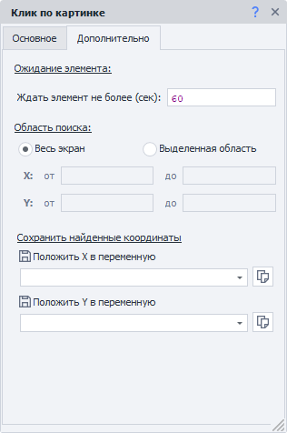  
Эта вкладка появляется после добавление экшена в проект. Параметры:  
- **Ждать элемент не более**. Время в секундах, в течение которого экшен будет ожидать появление элемента. В *Настройках записи* можно задать время поиска по умолчанию для всех создаваемых экшенов.  
- **Область поиска**. Здесь можно вручную или с помощью переменных задать область для поиска.  
- **Сохранить найденные координаты.** Данная секция позволяет сохранить в переменные координаты верхнего левого угла найденного элемента.  
_______________________________________________
## Пример использования.  
Представим, что нам нужно создать новую запись в приложении **Заметки**:    
1. Выделяем уникальную область на кнопке создания заметки. На левом скриншоте пример правильного выделения, а на правом то, как делать не нужно.    
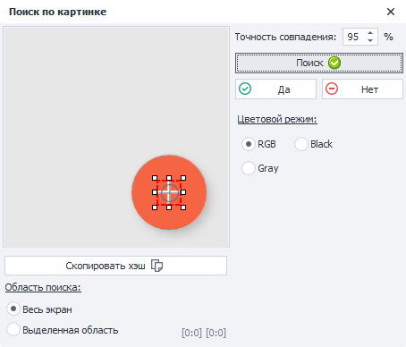 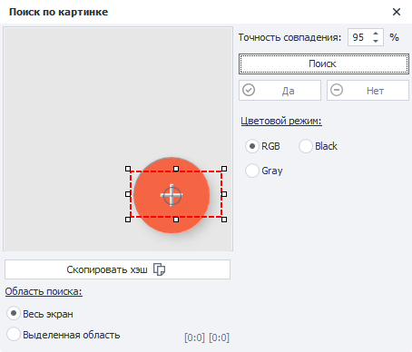  
2. С помощью кнопки **«Поиск»** тестируем нахождение объекта. Нажимаем **«Да»** в случае успеха.  
3. Добавляем экшен в проект.  
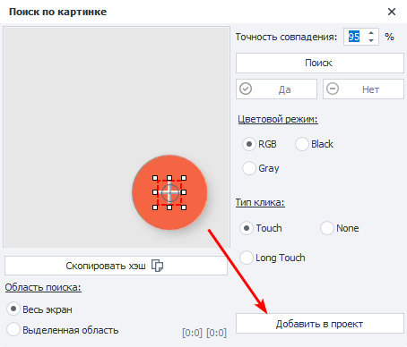  
:::warning **Важно.**
*Поиск по картинке может сломаться, если экшен был записан, например, в режиме рендеринга OpenGL, а затем сменён на DirectX.*
:::
  

  
