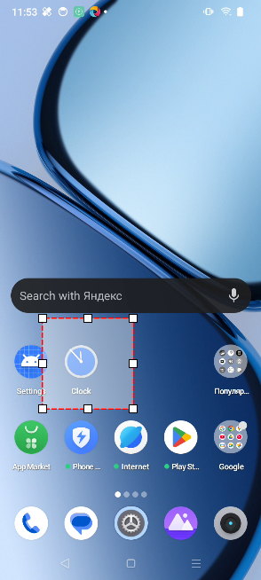

:::info **Пожалуйста, ознакомьтесь с [*Правилами использования материалов на данном ресурсе*](../../Disclaimer).**
:::
_______________________________________________  
## Описание.  
Позволяет произвести нажатие на элемент, используя визуальный поиск по цвету пикселя. Рекомендуем использовать, когда не получается [**найти элемент**](./ElementSearch) другими способами.  

  

:::warning **Действие использует много ресурсов компьютера.**
:::

#### Для чего это нужно?   
Чтобы совершить клик по элементу, к которому нельзя подобраться через экшен [**Выполнить событие**](../../Android/RunEvent).  

### Как добавить в проект?  
Для добавления этого действия нужно в [Окне устройства](../Interface/DeviceWindow) навести курсор мыши на нужную часть изображения, вызвать контекстное меню правой кнопкой мыши и выбрать пункт **Поиск по пикселю**.  

  

_______________________________________________

## Элементы окна.  
  

### Цвет пикселя.  
  

Это поле автоматически заполняется при *Поиске по пикселю* из контекстного меню. Сам цвет задаётся в [формате HTML](https://ru.wikipedia.org/wiki/HTML-%D1%86%D0%B2%D0%B5%D1%82%D0%B0).  

Если необходимо искать **одновременно** несколько пикселей разного цвета, сразу же здесь указываем эти цвета. Для этого, не закрывая это окно, нужно еще раз нажать в контекстном меню **Поиск по пикселю** в другом месте экрана. Новый цвет добавится в таблицу.  

### Область поиска.  
  

В данном блоке можно задать область, внутри которой будет выполнен поиск пикселя.  

- **Весь экран**. Ищем пиксель по всему доступному экрану.  
- **Выделенная область**. При активации данного режима в [Окне устройства](../Interface/DeviceWindow) можно будет выбрать область для ограничения поиска. Используйте его, когда точно известно, что элемент появится в определённой части экрана.  

:::tip **Поиск в заданной области происходит намного быстрее и снижает нагрузку на CPU.**
:::

Выбрать область поиска по умолчанию можно в [**Настройках Записи**](../../Settings/Record_and_InputMethods#область-поиска).  

#### Как происходит установка области?  
После выбора режима **Выделенная область** в [Окне эмулятора](../Interface/DeviceWindow) появится рамка. С помощью неё можно выбрать область, внутри которой будет произведён поиск.  

  

### Поиск.  
**Отклонение цвета**. Эта настройка регулирует точность поиска. Чем выше значение, тем сильнее допускается отличие от нужного цвета.  

Если же установить значение *0*, то будет выполнен поиск абсолютно идентичного цвета.  

  

Нажатие по кнопке **Поиск** выполняет тестирование поиска. Если всё в порядке, то нажимайте **Да**.  

Когда поиск выполнен неверно, вам нужно кликнуть на **Нет**, обновить параметры поиска и попробовать снова.  

Если нужный пиксель был найден, то возле кнопки **Поиск** появится символ галочки, свидетельствующий об успехе, а элемент в окне устройства будет подсвечен крестиком.  

  

В случае завершения поиска с ошибкой возле кнопки **Поиск** появится красный крестик.  

  

### Скрытие части изображения.  
Существует возможность закрыть часть изображения, чтобы убедиться, что поиск не будет находить ничего лишнего. Для этого нужно кликнуть по кнопке с изображением бабочки, в нижней части [Окна устройства](../Interface/DeviceWindow). Затем нажмите по области, которую хотите скрыть, и снова на **Поиск**.  

Для выхода из этого режима повторно кликните по кнопке с изображением бабочки.  
_______________________________________________

## Добавление в проект.  
После нахождения нужного пикселя и нажатия на кнопку **Да** появится дополнительное меню:  

### Тип клика.  
  

- *Обычное нажатие* — быстрый клик на выбранный элемент.  
- *Долгое нажатие* — длительное удержанием по элементу.  
- *Без нажатия* — не совершать никакого действия, а только проверить наличие элемента.  

Если фрагмент будет найден, то экшен выйдет по зелёной ветке, а если ничего не найдётся — по красной.

### Смещение нажатия.  
  

Используется, когда необходимо совершить нажатие с отклонением от координат найденного пикселя (например, выше или ниже).  

### Тестировать.  
В зависимости от выбранных настроек будет осуществлено нажатие на экран по найденным координатам (с учетом заданного смещения).  

### Добавить в проект.  
После того как всё было настроено, можно нажимать данную кнопку для добавления в проект этого экшена.  
_______________________________________________
## Вкладка «Дополнительно».  
Эта вкладка появляется после добавления экшена в проект.  

  

### Доступные настройки:  
#### Ожидание элемента.  
Указывается время в секундах, в течение которого экшен будет ожидать появление элемента.  

В [**настройках Записи**](../../Settings/Record_and_InputMethods) можно задать время поиска по умолчанию для всех следующих создаваемых экшенов.  

#### Область поиска.  
Тут можно вручную (или с помощью переменных) задать область, в пределах которой будет произведён поиск.  

#### Сохранить найденные координаты.  
Данная секция позволяет сохранить в отдельные переменные координаты найденного пикселя по X и Y.  
_______________________________________________
## Полезные ссылки.  
- [**Поиск по картинке**](./SearchByPic)  
- [**Запуск эмулятора**](../../get-started/Memu_Start)
- [**Выполнить событие**](../../Android/RunEvent)