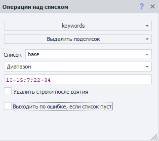
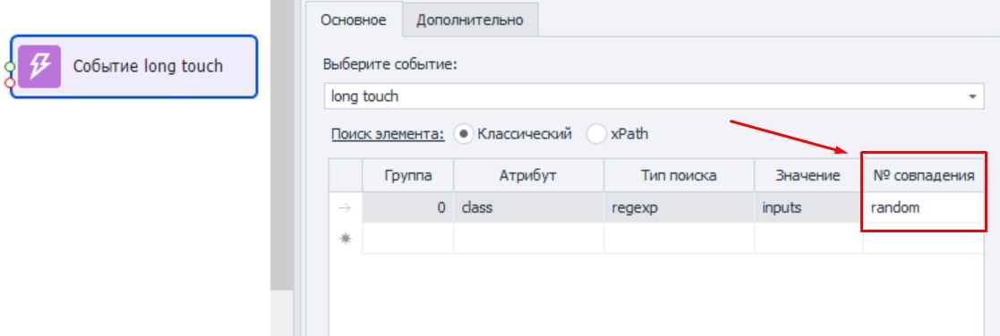
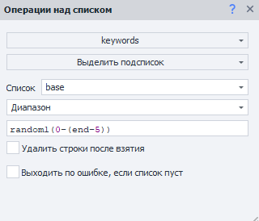

---
sidebar_position: 3
title: Диапазоны значений
description: Как использовать диапазоны?
--- 
:::info **Пожалуйста, ознакомьтесь с [*Правилами использования материалов на данном ресурсе*](../../Disclaimer).**
:::
_______________________________________________  
## Описание.
Довольно часто при настройке проекта встречаются места, где при поиске нужно указать номера совпадений, строк, ячеек и т.д. Причём, не всегда получается указать конкретный номер. Так вот диапазоны нужны для более гибкой нумерации таких перечислений.  

Далее в статье будут приведены примеры для списков, но помните, что они также применимы для всех случаев, где нужно указать какой-либо номер.  

### В каких случаях применяются диапазоны?  
- Получение интервала строк. Например, с пятой по седьмую и т.д.;  
- Взять последнюю строку, не зная их общее количество;  
- Нужно взять случайную строку или несколько случайных строк просто/из указанного интервала;      
- Получить чётные/нечётные строки из указанного интервала;  
- Взятие случайных строк из чётных/нечётных строк из указанного интервала;  
- В качестве номера совпадения при выполнении экшенов ***Выполнить событие***, ***Установка значений***, ***Взятие значений***.  
_______________________________________________  
## Подробнее про каждый. 
### Взять строки из одного или нескольких интервалов.  
    

Если нужно взять строки с пятой по седьмую, например, то пишется в номере строки так:

**`4-6`** *(на 1 меньше, т.к. нумерация строк начинается с 0)*.  

Можно указать несколько интервалов через знак **`;`** или **`,`**  
Например, **`10-15; 7; 22-34`**   
_______________________________________________ 
### Выбрать случайный элемент.  
Это нужно в тех случаях, когда на странице несколько одинаковых элементов, и вам неважно с каким из них взаимодействовать. Чтобы кликнуть по одному из них в случайном порядке, необходимо в качестве номера совпадения указать слово **`random`**.  

  
_______________________________________________ 
### Длина списка неизвестна, но нужно взять его до конца.  
Конец списка обозначается ключевым словом **`end`**. Так что просто указываем необходимый интервал в таком формате: например, **`10-end`**, чтобы взять строки с 11 до конца файла.  
:::info **Взять все строки из списка.**
Взять все строки можно с помощью ключевого слова **`all`**.
:::  
_______________________________________________ 
### Взять случайную строку или несколько случайных строк из интервала.  
Для этого в номере строки пишем слово **`random`** и количество строк, которые нужно взять. Затем в скобках добавляем из каких конкретно строк брать.  
:::tip **ПРИМЕРЫ.**
**`random1(1, 12-15, 35-end)`** - взятие ***одной строки*** из указанных;  
**`random15(1, 12-15, 35-end)`** - получить ***15 строк*** из указанных;  
**`randomAll(1, 12-15, 35-end)`** - чтобы взять ***все строки*** из указанных в случайном порядке.
:::
_______________________________________________ 
### Исключающие диапазоны.  
Иногда требуется не учитывать последние варианты. Например, чтобы исключить последние 5 строк и взять 1 случайный элемент, это будет выглядеть вот так: **`random1(0-(end-5))`**.  

  
_______________________________________________ 
### Получить только чётные или наоборот нечётные значения.  
#### Чётные (*на англ. even*):  
- **`even(1,12-15,35-end)`** или **`even1(1,12-15,35-end)`**.  
Получить первое чётное значения из диапазона.  
- **`even5(1,12-15,35-end)`**.  
Взять 5 первых чётных значений из диапазона.  
- **`evenAll(1,12-15,35-end)`**.  
Достать все чётные значения из диапазона.  
#### Нечётные (*на англ. odd*):  
- **`odd(1,12-15,35-end)`**.  
Получить первое нечётное значения из диапазона.  
- **`odd5(1,12-15,35-end)`**.  
Взять 5 первых нечётных значений из диапазона.  
- **`oddAll(1,12-15,35-end)`**.  
Достать все нечётные значения из диапазона.   
_______________________________________________ 
### Комбинирование операторов.  
Операторы **`random`**, **`even`** и **`odd`** можно комбинировать.  
Например, чтобы взять все чётные строки в случайном порядке из диапазона:  
**`randomAll(evenAll(1,12-15,35-end))`**.  
_______________________________________________
## Полезные ссылки.    
- [**Основные понятия**](../../get-started/BasicTerms).

 
