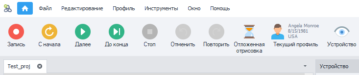
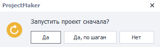
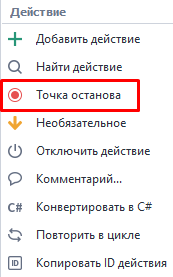
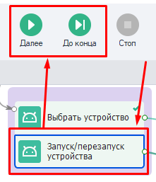
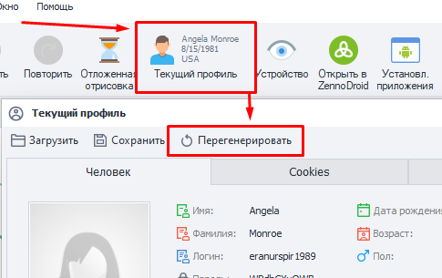
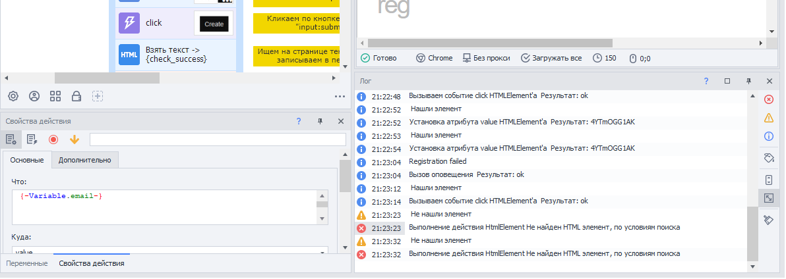
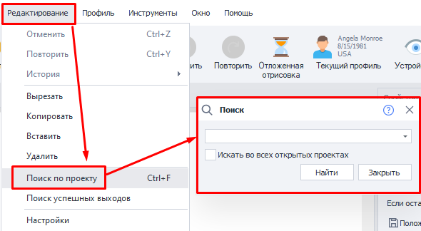
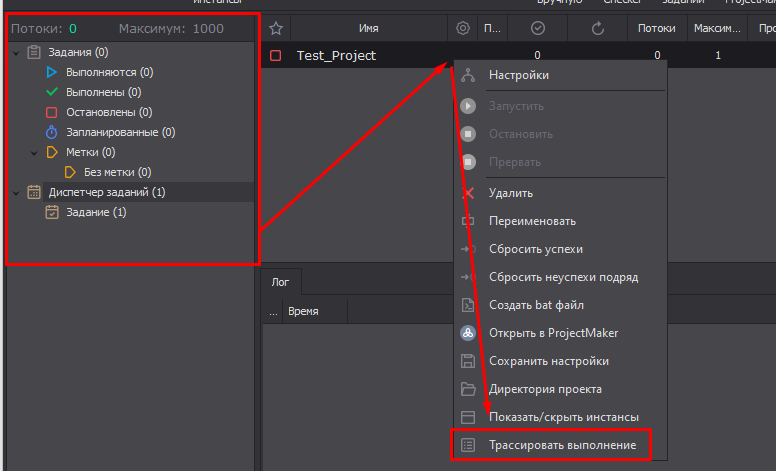

---
sidebar_position: 3
title: Отладка проектов
description: Ошибки при отладке и Трассировка.
---  
:::info **Пожалуйста, ознакомьтесь с [*Правилами использования материалов на данном ресурсе*](../Disclaimer).**
:::

## Запуск отладки.  
  

Рассмотрим детальнее панель записи и отладки.  
_______________________________________________ 
### С начала.   
Нажатие этой кнопки приводит к запуску проекта с самого начала. При этом будет сгенерирован новый профиль.  
_______________________________________________ 
### По шагам.  
При старте *С начала* будет предложено пройти весь проект *По шагам*. Тогда каждое последующее действие будет выполняться только после кнопки ***Далее***.  

 

Если вместо **«Да, по шагам»** нажать просто **«Да»**, то проект выполнится сразу до конца или до следующей *Точки останова (от англ. Breakpoint)*. Это точку можно установить, нажав ПКМ по любому экшену.  

   

Вы можете переключаться между двумя этими режимами, используя во время отладки попеременно кнопки ***Далее*** (по шагам)  и ***До конца*** (до останова).
_______________________________________________ 
### С курсора.  
Также можно нажать на любой экшен в проекте, а затем на вышеописанные кнопки, и тогда выполнение шаблона начнется именно с него. Это особенно удобно при поиске проблемной части проекта во время отладки. Вы изменяете настройки экшена, а затем сразу тестируете его, без необходимости выполнять весь шаблон целиком.  

   
_______________________________________________ 
### Перегенерация профиля.  
Во время тестирования шаблона можно заново сгенерировать значения личности, нажав на специальную кнопку. Так, например, можно проверить, как сайт или приложение реагируют на определенные значения.  

  
_______________________________________________ 
##  Ошибки при отладке.  
При создании и редактировании проекта иногда встречаются ошибки. Чтобы их исправить потребуется произвести *Отладку*, то есть внести изменения в какие-то действия в шаблоне. Отыскать проблемные места поможет *Лог*, про который мы уже ранее рассказывали.   

  

Ошибка помечается в *Логе* красным цветом. Найти конкретный экшен, который работает неправильно, можно дважды кликнув по сообщению в *Логе*. После этого фокус сразу сместится на него.   

Либо можно кликнуть по ошибке ПКМ и скопировать ID экшена. А затем найти его через ***Редактирование → Поиск по проекту → вставить ID в поле ввода***.  

   

Когда экшен найден, можно исправить его настройки и начать *Отладку* с этого места.  
_______________________________________________ 
## Трассировка проектов.  
> *Слово "трассировка" происходит от французского "tracer", что означает "отслеживать".*  

В нашем случае данная функция обозначает процесс отслеживания работы проекта, запись или отображение последовательности шагов, выполняемых программой. Она нужны для исследования работы шаблона: отладки, замера скорости выполнения, поиска места ошибки.  

Трассировка запускается в ZennoDroid через панель заданий, нужно нажать ПКМ по нужному заданию → ***Трассировать выполнение***.  

    

Трассирование начинает работать сразу после включения, записывая все действия по порядку.  
_______________________________________________ 
### Дополнительная информация.  
#### Путь к файлам с результатами.  
Файлы находятся в каталоге пользователя: `C:\Users\<ИМЯ ЮЗЕРА>\Documents\ZennoLab\Traces` и сгруппированы по заданиям.  
:::info **Формат записи имеет такой вид**
`<Время события>|<Статус сообщения>|<ID действия>|<Время выполнения (мс)>`
:::  
#### Возможные статусы сообщения.  
- **`Info`** - информационное сообщение;  
- **`In`** - означает начало выполнения действия с указанным ID;  
- **`Good`** - удачное выполнение действия с указанным ID и переход по зелёной ветке;  
- **`Bad`** - неудачное выполнение действия с указанным ID и переход по красной ветке.

<details>
<summary>**Пример содержимого файла трассировки**</summary>
<!--All you need is a blank line-->
    ```
    23-02-2021 06:08:59.3600|Info|---Project Start Execute---|
    23-02-2021 06:09:17.9110|In  |cca-1035|
    23-02-2021 06:09:20.5203|Good|cca-1035|2520
    23-02-2021 06:09:20.5525|In  |8c7d7d95-d574-43a5-a677-6ebc17490caf|
    23-02-2021 06:09:27.3366|Good|8c7d7d95-d574-43a5-a677-6ebc17490caf|6721
    23-02-2021 06:09:27.3571|In  |03aa3431-0d85-4374-ad32-2821d22f1674|
    23-02-2021 06:09:27.3708|Good|03aa3431-0d85-4374-ad32-2821d22f1674|3
    23-02-2021 06:09:27.3893|In  |re-2884|
    23-02-2021 06:09:28.3229|Good|re-2884|918
    23-02-2021 06:09:28.3356|In  |00b6f04c-711c-4362-9404-f8fb2fdf5a51|
    23-02-2021 06:09:28.3463|Good|00b6f04c-711c-4362-9404-f8fb2fdf5a51|0
    23-02-2021 06:09:28.3571|In  |re-4835|
    23-02-2021 06:09:29.0290|Good|re-4835|661
    23-02-2021 06:09:29.0455|In  |67c9448b-ebbe-4f54-8206-868f8ddc38c3|
    23-02-2021 06:09:29.0612|Good|67c9448b-ebbe-4f54-8206-868f8ddc38c3|2
    23-02-2021 06:09:29.3509|Info|---Project Executed---|  
    ```
</details>   

#### Пример использования.  
Бывают случаи, когда выполнение задания зависло на каком-то действии. При этом визуально невозможно определить, какое именно действие не может выполниться. В этот момент достаточно включить трассировку, и текущее действие сразу запишется в файл.
